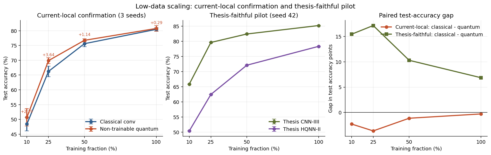

# Fair Benchmarking and Engineering Lessons for Quanvolutional Neural Networks on Ottoman-Turkish Handwritten Character Recognition

## Authors

Necati Incekara

---

## Abstract

We present a reproducible benchmark and engineering study of quanvolutional neural networks for Ottoman-Turkish handwritten character recognition, a 44-class low-data OCR task with 3,894 grayscale samples. The study separates five evidence axes: thesis-faithful reproductions, current-local matched-budget ablations, a stronger modern-classical upper bound, low-data scaling, and a trainable-quantum engineering case-study. Across three-seed full-data evaluation, the strongest reproduced evidence favors classical baselines. The best thesis-faithful model, `thesis_cnniiii`, reaches **85.26 ± 0.97%** test accuracy, while the best thesis-faithful quantum reproduction, `thesis_hqnn2`, reaches **78.61 ± 0.69%**. In the current-local matched-budget family, `classical_conv` reaches **81.40 ± 1.06%**, `param_linear` reaches **81.12 ± 2.27%**, and the Henderson-style non-trainable quantum baseline reaches **80.40 ± 0.69%**. A stronger modern-classical baseline, `resnet18_cifar_gray`, reaches **88.13 ± 0.82%**. The May 2026 low-data confirmation adds a narrower result: within the current-local family, the non-trainable quantum baseline exceeds `classical_conv` on three-seed mean test accuracy across 10/25/50/100% training fractions, while the thesis-faithful low-data pilot remains classical-favored. April 2026 reruns of the stabilized trainable V7 path place the single-run trainable-quantum case-study range at **65.88--72.53%** test accuracy. We therefore do not claim generic quantum advantage. The contribution is instead an artifact-backed benchmark with family separation, a specific low-data competitiveness signal for one non-trainable quantum baseline, and concrete engineering lessons about information bottlenecks, gradient collapse, and AMP precision failures at the quantum boundary.

**Keywords:** Quantum Machine Learning, Quanvolutional Neural Networks, Hybrid Quantum-Classical Computing, Ottoman Script Recognition, Variational Quantum Circuits, Gradient Stabilization, Barren Plateaus

---

## 1. Introduction

Quantum machine learning (QML) has emerged as a promising paradigm for leveraging quantum computational properties in pattern recognition tasks [1,2]. Among various QML architectures, quanvolutional neural networks---which replace or augment classical convolutional filters with parameterized quantum circuits (PQCs)---have attracted significant research attention since their introduction by Henderson et al. [3]. However, the practical deployment of quanvolutional layers faces substantial engineering and theoretical challenges that are often underreported in the literature.

Recent QML benchmarking work warns that experimental design, small simulation scales, and performance narratives can make quantum model comparisons difficult to interpret [11]. In this work, we adopt a reproducibility-first methodology, documenting architectural failures alongside the configurations that eventually train.

We apply quanvolutional neural networks to Ottoman-Turkish handwritten character recognition, a historically significant and technically challenging classification problem. The Ottoman script comprises 44 distinct character classes with significant morphological variation and limited training data (3,894 samples), making it an ideal testbed for evaluating quantum feature extractors under resource-constrained conditions.

### 1.1 Contributions

Our contributions are fourfold:

1. **Reproducible Benchmark Structure.** We organize the study into analytically separate evidence axes: thesis-faithful reproductions, current-local matched-budget ablations, a modern-classical upper bound, low-data scaling, and the trainable-quantum engineering case-study. This prevents misleading direct comparisons between differently sized or differently motivated models and yields an artifact-backed benchmark picture for the repository.

2. **Negative-Result Benchmark Evidence With A Low-Data Nuance.** We show that the strongest multi-seed full-data evidence on this 44-class task currently favors classical baselines. The best thesis-faithful model is classical (`thesis_cnniiii`), the best full-data current-local matched-budget model is also classical (`classical_conv`), and a stronger modern-classical upper bound (`resnet18_cifar_gray`) extends that conclusion further. A separate low-data confirmation produces a specific current-local non-trainable quantum competitiveness signal, which is scientifically useful but still not sufficient for a headline generic quantum-win narrative.

3. **Information Bottleneck and Gradient Stabilization Analysis.** Through the V1--V7 trainable-quantum path, we identify an empirical spatial threshold below which quantum feature extraction collapses, and we show that learnable scaling, residual routing, and channel attention are sufficient to transform a non-learning hybrid architecture into a trainable one.

4. **AMP--PennyLane Incompatibility Documentation.** We identify and document a concrete failure mode in which PyTorch AMP float16 autocasting corrupts variational quantum circuit backpropagation unless float32 is restored at the quantum boundary and optimizer stepping remains GradScaler-aware.

### 1.2 Relation To The Thesis

This paper should be read as a continuation and formalization of the master's-thesis study, not as a repudiation of it. The thesis established the dataset framing, the OCR problem formulation, and the initial CNN/HQNN comparison space. The present paper extends that foundation in four ways:

1. it re-runs key thesis models under a unified and reproducible protocol,
2. it separates thesis-faithful reproductions from newer matched-budget ablations,
3. it adds multi-seed reporting instead of relying on single highlighted runs, and
4. it incorporates the later V1--V7 engineering path for trainable quantum layers.

Under this framing, the thesis remains scientifically valuable as the origin of the task definition and the first model family, while the paper provides the stricter reproducibility, benchmarking, and engineering analysis needed for publication.

### 1.3 Paper Organization

Section 2 reviews related work. Section 3 describes the dataset, architectures, and training pipelines. Section 4 presents the benchmark results, separating thesis-faithful reproductions, current-local matched-budget ablations, low-data scaling, and the trainable-quantum engineering case-study. Section 5 discusses the scientific implications and limitations. Section 6 concludes with future work.

---

## 2. Related Work

### 2.1 Quanvolutional Neural Networks

Henderson et al. [3] introduced quanvolutional neural networks, demonstrating that random non-trainable quantum circuits can be used as fixed feature extractors before a classical classifier. That formulation remains important because it motivates the non-trainable preprocessing baselines used both in our thesis-faithful reproductions and in our current-local Henderson-style comparisons. Later work such as Hur et al. [4] explored trainable quantum convolutional variants for classical data classification, while broader reviews summarize the wider quantum-classifier and image-classification landscape [5,6]. This opens the practical question of whether learned or fixed quantum parameters provide measurable benefit over random or classical replacements.

Our study differs from most one-family quanvolution papers in that it does not treat all quantum models as interchangeable. Instead, it distinguishes between: (1) thesis-faithful reproductions of earlier CNN/HQNN designs, (2) current-local matched-budget ablations designed for fair comparison, and (3) a trainable-quantum engineering case-study. This separation is necessary because different quanvolutional setups answer different scientific questions.

### 2.2 Benchmarking, Reproducibility, and Quantum Claims

Recent work has raised critical questions about quantum-advantage claims in the classical simulation regime. Bowles et al. [11] showed that several claimed quantum improvements disappear when stronger or more carefully tuned classical baselines are used. This criticism is especially relevant for small-data image classification tasks, where modest implementation differences can dominate the apparent contribution of a quantum block.

Our paper adopts this more conservative benchmark philosophy. Instead of asking only whether a quantum model can beat a weak historical baseline, we ask a stricter question: what remains true after multi-seed reruns, artifact-backed reporting, family separation, and comparison against matched classical alternatives? This places the present work closer to a reproducibility and failure-analysis contribution than to a pure performance-claim paper.

### 2.3 Quantum Circuit Training and Hybrid Engineering

The barren plateau phenomenon [7] poses a fundamental challenge for training parameterized quantum circuits: gradient magnitudes can decrease sharply with system size and circuit structure, making optimization difficult. For shallow 4-qubit circuits as used in this work, barren plateaus are less severe but optimization pathologies still remain [8]. Data re-uploading [10] has been proposed as a circuit design strategy to increase expressibility without increasing qubit count, which we adopt as the primary trainable circuit family in the V7 line.

The engineering side of hybrid classical-quantum training is much less standardized than the theoretical side. Mixed precision training, optimizer scheduling, gradient scaling, and skip-routing are routine concerns in classical deep learning but remain underreported in hybrid pipelines. Our work contributes in this space by treating the V1--V7 line as an explicit engineering study: which design choices make quanvolution trainable, which ones cause collapse, and which precision assumptions silently break the entire run.

### 2.4 Ottoman Script Recognition and Thesis Context

Ottoman script recognition is an active research area given the historical significance of Ottoman documents, with prior work spanning online handwritten character recognition and printed-document OCR [9,12]. The script's 44 character classes with significant intra-class variation and limited training data (~88 samples/class average) present challenges representative of real-world QML deployment scenarios with data-scarce settings.

This paper builds directly on a master's-thesis study conducted on the same OCR problem. The thesis established the task framing and the initial CNN/HQNN comparison space; the present work extends it by introducing reproducible reruns, multi-seed reporting, stricter model-family separation, and a trainable-quantum engineering analysis. In that sense, the thesis is the foundation of the paper rather than a discarded precursor.

---

## 3. Methodology

### 3.1 Dataset

The Ottoman-Turkish Handwritten Character Dataset consists of 32x32 grayscale character images across 44 classes. The original directory structure contains 3,428 training files and 466 test files. Under the current parser, one malformed training filename is skipped, so the effective loaded benchmark uses 3,427 training samples and 466 test samples. The original thesis train/test separation is preserved rather than re-sampled from scratch, allowing direct continuity between thesis-era results and the present paper.

| Property | Value |
|----------|-------|
| Classes | 44 Ottoman-Turkish characters |
| Total files | 3,894 |
| Effective loaded train set | 3,427 images |
| Test set | 466 images |
| Image dimensions | 32x32 grayscale |
| Avg. samples/class | ~88 (training) |
| Random baseline | 2.27% (1/44) |

The class distribution is substantially imbalanced, so the benchmark should be interpreted as a challenging small-data heritage OCR problem rather than as a balanced large-scale vision benchmark. This is one reason we report multi-seed performance and keep benchmark families analytically separate.

#### 3.1.1 Publication Protocol

To support reproducibility, the publication benchmark uses the following rules:

- the thesis train/test split remains fixed,
- validation is derived deterministically from the training split,
- runs are tracked with explicit train seed and split seed,
- key benchmark rows are reported with three seeds,
- artifact-backed JSON logs are treated as the primary result source.

#### 3.1.2 Benchmark Families

The methodology separates five evidence axes:

1. **Thesis-faithful reproductions:** reruns of the thesis-era CNN/HQNN models under the current publication protocol.
2. **Current-local matched-budget ablations:** smaller local models designed to compare classical replacements against non-trainable quantum preprocessing under similar parameter budgets.
3. **Modern-classical upper bound:** a stronger contemporary classical baseline used as a reviewer-resilience check.
4. **Low-data scaling:** deterministic label-stratified reductions of the training split while validation and test splits remain fixed.
5. **Trainable-quantum engineering case-study:** the V1--V7 development path used to study gradient flow, bottlenecks, and precision failures.

This separation is methodologically important. A thesis-faithful HQNN model and a current-local Henderson-style non-trainable quantum baseline are both "quantum" models, but they do not answer the same question and should not be merged into a single ranking row.

#### 3.1.3 Model Nomenclature

The repository retains implementation-oriented model identifiers for reproducibility. In the results, these identifiers correspond to the following paper-level roles:

| Repository identifier | Paper-level role | Benchmark family |
|---|---|---|
| `thesis_cnniiii` | strongest thesis-faithful classical CNN reproduction | thesis-faithful |
| `thesis_cnn3` | weaker thesis-faithful classical CNN anchor | thesis-faithful |
| `thesis_hqnn2` | strongest thesis-faithful quantum reproduction | thesis-faithful |
| `classical_conv` | current-local classical convolutional matched-budget baseline | current-local |
| `param_linear` | current-local linear classical replacement for the quantum block | current-local |
| `non_trainable_quantum` | current-local Henderson-style non-trainable quantum preprocessing baseline | current-local |
| `resnet18_cifar_gray` | stronger grayscale ResNet-18 classical upper bound | modern-classical |
| V7 trainable quantum | stabilized trainable-quantum engineering case-study | trainable-quantum |

### 3.2 Quantum Circuit Design

We employ small parameterized quantum circuits as the core computational units of the quanvolutional blocks. Different benchmark families use different circuit roles:

- thesis-faithful HQNN models use fixed non-trainable quantum preprocessing,
- current-local Henderson-style baselines use cached non-trainable quantum filters,
- the V7 engineering line uses a 4-qubit trainable circuit with data re-uploading.

The primary trainable circuit uses the data re-uploading strategy [10]:

#### 3.2.1 Data Re-uploading Circuit (Primary)

```
For each layer l in {1, 2}:
    AngleEmbedding(x, wires=[0,1,2,3])        # encode 4 input values
    For each qubit q in {0,1,2,3}:
        Rot(theta_l,q,0, theta_l,q,1, theta_l,q,2, wires=q)   # trainable
    CNOT(0->1), CNOT(1->2), CNOT(2->3), CNOT(3->0)            # entanglement ring
Measure: <Z_0>, <Z_1>, <Z_2>, <Z_3>
```

**Trainable parameters:** 24 (2 layers × 4 qubits × 3 Euler angles per Rot gate) + 1 learnable gradient scaling parameter = **25 total quantum parameters**.

#### 3.2.2 Strongly Entangling Circuit (Ablation)

Uses PennyLane's `StronglyEntanglingLayers` template with 3 layers, providing 36 trainable parameters with guaranteed expressibility bounds.

#### 3.2.3 Hardware-Efficient Circuit (Ablation)

RY and RZ rotations with CZ entangling gates: 16 trainable parameters. Designed for compatibility with near-term NISQ devices.

### 3.3 Hybrid Architecture: V7 (EnhancedQuanvNet)

The V7 architecture is described in detail because it is the main trainable-quantum engineering case-study in the paper. It is not the strongest benchmark model overall, but it is the most informative architecture for analyzing how trainable quanvolution behaves under realistic optimization constraints.

#### 3.3.1 Classical Preprocessing

```
Input: 32x32x1
  -> Conv2d(1, 8, stride=2) + GroupNorm(8) + GELU    -> 16x16x8
  -> ResidualBlock(8, 8)  [Conv-GN-GELU-Conv-GN + skip]  -> 16x16x8
  -> Conv2d(8, 4, stride=2) + GroupNorm(4) + GELU    -> 8x8x4
Output: 8x8x4  [64 spatial values per channel]
```

GroupNorm is used throughout instead of BatchNorm for stability with small effective batch sizes in the quantum regime.

#### 3.3.2 Quantum Processing (TrainableQuanvLayer)

The quanvolutional layer applies 2x2 patch extraction with stride 2 to the 8x8 feature map, yielding 16 patches per channel. Each patch's 4 values are encoded into the 4-qubit PQC via AngleEmbedding.

**Key precision boundary:** Before quantum processing, inputs are explicitly cast to float32 regardless of the AMP autocast context:
```python
patches = patches.float()   # prevent AMP float16 from entering PQC
quantum_output = self.qlayer(patches) * self.gradient_scale
```

Output dimensions: 4×4 spatial × 4 expectation values × 4 input channels = 4×4×16.

**Quantum computational cost:** 16 circuit evaluations per image (93.75% reduction from V1's 256).

#### 3.3.3 Gradient Stabilization

Three mechanisms prevent gradient vanishing at the quantum-classical interface:

1. **Learnable Gradient Scaling (α):** Initialized to 0.1, scales quantum outputs: `y_q = α · f_quantum(x)`. Prevents early training instability from large quantum output magnitudes.

2. **Residual Skip Connection (β):** A 1×1 convolution adapter (`Conv2d(4, 16, 1×1)`) with learnable weight β (init=0.1) provides a gradient highway bypassing the quantum layer: `y = y_q + β · W_skip(x_classical)`.

3. **Channel Attention (SE-Block):** Squeeze-and-excitation attention recalibrates channel-wise responses post-quantum, allowing the network to weight informative quantum measurements.

#### 3.3.4 Classical Post-processing

```
4x4x16
  -> Conv2d(16, 32, 3×3) + GroupNorm(8) + GELU
  -> Conv2d(32, 64, 3×3) + GroupNorm(16) + GELU + Dropout(0.3)
  -> AdaptiveAvgPool2d(1)  -> 64-dim vector
  -> Linear(64, 44)
Output: 44-class logits
```

**Total parameters:** 87,798 (25 quantum + 87,773 classical).

### 3.4 Training Pipeline

#### 3.4.1 Dual Optimizer Strategy

Quantum and classical parameters are optimized separately to account for their different loss landscape geometries:

| Optimizer | Parameters | LR | Weight Decay | Grad Clip |
|-----------|-----------|-----|-------------|-----------|
| Adam | Quantum (25) | 0.0005 | 1e-5 | max_norm=0.5 |
| AdamW | Classical (87,773) | 0.002 | 1e-4 | max_norm=1.0 |

Schedulers: `CosineAnnealingWarmRestarts(T_0=5)` for quantum; `CosineAnnealingLR(T_max=10)` for classical.

#### 3.4.2 Regularization

- **Label smoothing:** ε=0.1 in cross-entropy loss
- **Mixup augmentation:** Applied with 50% probability, α=0.2
- **Dropout:** 0.3 in post-processing layers
- **GroupNorm:** Replaces BatchNorm throughout

#### 3.4.3 AMP Integration

Standard AMP (float16) is used for classical computations. The quantum boundary requires explicit handling:

```python
# GradScaler-aware optimizer stepping (prevents NaN weight corruption)
scaler.scale(loss).backward()
scaler.unscale_(quantum_optimizer)
scaler.unscale_(classical_optimizer)
torch.nn.utils.clip_grad_norm_(quantum_params, max_norm=0.5)
torch.nn.utils.clip_grad_norm_(classical_params, max_norm=1.0)
scaler.step(quantum_optimizer)
scaler.step(classical_optimizer)
scaler.update()
```

Using `optimizer.step()` directly (bypassing `scaler.step()`) caused irreversible model corruption in V7 Run 1 by applying NaN gradients to all parameters.

### 3.5 Computational Infrastructure

- **Primary trainable-quantum training:** NVIDIA L4 GPU (Google Colab Pro, ~2-3 compute units/hour)
- **Initial exploratory runs:** NVIDIA A100-SXM4-80GB (Google Colab Pro, ~7-8 units/hour)
- **Reproducibility and benchmark reruns:** Apple M4 Mac Mini (CPU, `default.qubit`) for all M4-feasible thesis-faithful and matched-budget models
- **Quantum simulator:** PennyLane `lightning.gpu` with adjoint differentiation
- **Framework:** PyTorch 2.x, PennyLane 0.44, NumPy ≥ 2.0
- **Batch size / epochs:** configuration depends on benchmark family; the April 2026 V7 Colab reruns shown in this paper use batch size 128 and report after a 10-epoch budget on L4

---

## 4. Experimental Results

### 4.1 Benchmark Snapshot

The benchmark picture must be read in separate layers rather than as a single flat leaderboard:

1. **Thesis-faithful family:** reproductions of the thesis-era classical and quantum models.
2. **Current-local matched-budget family:** smaller parameter-matched ablations designed for fair local comparison.
3. **Modern-classical upper bound:** a stronger classical model that tests reviewer risk beyond thesis-era architectures.
4. **Low-data scaling axis:** a validation axis that reduces only the training split and keeps validation/test fixed.
5. **Trainable-quantum case-study:** the V1--V7 engineering path, which is valuable scientifically even though it is not the strongest benchmark family.

### 4.2 Thesis-Faithful Family

| Model | Runs | Best Val | Test | Params | Interpretation |
|-------|---:|---:|---:|---:|---|
| `thesis_cnniiii` | 3 | **92.11 ± 0.30** | **85.26 ± 0.97** | 1,378,124 | strongest thesis-faithful reproduction; above thesis table reference |
| `thesis_cnn3` | 3 | 85.38 ± 0.77 | 79.33 ± 1.26 | 769,804 | weaker classical thesis-faithful anchor |
| `thesis_hqnn2` | 3 | 83.72 ± 2.23 | 78.61 ± 0.69 | 248,428 | best thesis-faithful quantum reproduction, but below `thesis_cnniiii` and below thesis table reference |

This family is the most relevant when asking whether the thesis-era quantum claim remains competitive under reproducible reruns. The answer is mixed: `thesis_hqnn2` remains competitive with `thesis_cnn3`, but the strongest thesis-faithful reproduced evidence clearly favors the classical `thesis_cnniiii` model.

### 4.3 Current-Local Matched-Budget Family

| Model | Runs | Best Val | Test | Params | Interpretation |
|-------|---:|---:|---:|---:|---|
| `classical_conv` | 3 | 86.26 ± 1.76 | **81.40 ± 1.06** | 88,045 | strongest matched-budget local model by mean test accuracy |
| `param_linear` | 3 | **86.45 ± 0.61** | 81.12 ± 2.27 | 87,798 | matched classical replacement, nearly tied with `classical_conv` on mean test |
| `non_trainable_quantum` | 3 | 85.77 ± 0.94 | 80.40 ± 0.69 | 88,488 | stable Henderson-style non-trainable quantum baseline, but not the strongest local model |

This family asks a narrower question: if the parameter budget is kept close to the current V7-style local models, do quantum layers beat classical replacements? Under the present `publication_v1` protocol, the answer is no. The Henderson-style non-trainable quantum baseline is stable, but it does not exceed the strongest classical matched-budget alternatives.

### 4.4 Modern-Classical Upper Bound

The modern-classical upper bound is not thesis-faithful and not matched-budget; it is included to test whether the study remains credible against a stronger contemporary classical vision baseline. Under the same fixed data split, `resnet18_cifar_gray` reaches **92.98 ± 0.29%** best validation accuracy and **88.13 ± 0.82%** test accuracy across three seeds.

| Model | Runs | Best Val | Test | Params | Interpretation |
|-------|---:|---:|---:|---:|---|
| `resnet18_cifar_gray` | 3 | **92.98 ± 0.29** | **88.13 ± 0.82** | 11,190,252 | strongest reproduced model; modern-classical upper bound, not a thesis-faithful or matched-budget row |

This result strengthens the paper's negative-result framing. It shows that the classical-favored hierarchy is not an artifact of comparing only against weak or outdated classical baselines.

### 4.5 Low-Data Scaling Confirmation

The low-data axis asks whether the quantum variants become more competitive when only the training split is reduced. Validation and test splits remain fixed; only the training subset is selected deterministically with label stratification. The seed-42 pilot uses `low_data_pilot_v1`; the current-local confirmation adds Colab L4 seeds 43 and 44 under `low_data_confirm_v1`. Aggregate summaries are stored in `experiments/low_data_summary.json` and `docs/LOW_DATA_SUMMARY.md`.



**Figure 1.** Low-data scaling results by benchmark family. The current-local panel reports three-seed means with standard deviations for `classical_conv` and `non_trainable_quantum`; the thesis-faithful panel reports the available seed-42 pilot for `thesis_cnniiii` and `thesis_hqnn2`. The gap panel uses classical minus quantum test accuracy, so negative current-local gaps indicate the non-trainable quantum baseline is ahead for that paired comparison.

| Family | Fraction | Classical Test | Quantum Test | Interpretation |
|---|---:|---:|---:|---|
| current-local | 0.10 | `classical_conv`: 48.42 ± 2.31% | `non_trainable_quantum`: 50.71 ± 2.93% | quantum ahead by 2.29 points |
| current-local | 0.25 | `classical_conv`: 66.24 ± 1.78% | `non_trainable_quantum`: 69.88 ± 0.99% | quantum ahead by 3.64 points |
| current-local | 0.50 | `classical_conv`: 75.61 ± 1.02% | `non_trainable_quantum`: 76.75 ± 0.50% | quantum ahead by 1.14 points |
| current-local | 1.00 | `classical_conv`: 80.47 ± 0.57% | `non_trainable_quantum`: 80.76 ± 0.99% | quantum ahead by 0.29 points |
| thesis-faithful | 0.10 | `thesis_cnniiii`: 65.88% | `thesis_hqnn2`: 50.43% | seed-42 pilot; classical ahead by 15.45 points |
| thesis-faithful | 0.25 | `thesis_cnniiii`: 79.61% | `thesis_hqnn2`: 62.45% | seed-42 pilot; classical ahead by 17.16 points |
| thesis-faithful | 0.50 | `thesis_cnniiii`: 82.40% | `thesis_hqnn2`: 72.10% | seed-42 pilot; classical ahead by 10.30 points |
| thesis-faithful | 1.00 | `thesis_cnniiii`: 85.19% | `thesis_hqnn2`: 78.33% | seed-42 pilot; classical ahead by 6.86 points |

This low-data result is narrow. It does not overturn the multi-seed full-data hierarchy and does not support a generic quantum-advantage claim. It does, however, provide a specific low-data competitiveness signal for the current-local non-trainable quantum baseline. The effect is clearest at 10-50% training fractions and becomes very small at full data.

### 4.6 Trainable-Quantum Engineering Case-Study

The V1--V7 line remains scientifically useful as an engineering case-study rather than as the main benchmark winner. Its value lies in showing what failed, what became trainable, and why. The April 2026 Colab reruns show that the stabilized V7 path can train without NaN collapse, but they also show meaningful single-run variability. We therefore analyze V7 using the older documented run, the April 6 resumed rerun, and the April 27 clean non-resumed rerun.

#### 4.6.1 Architectural Evolution Summary

| Version | Feature Map | Q-Calls/img | Epoch Time | Best Val Acc. | Outcome |
|---------|------------|-------------|------------|--------------|---------|
| V1 | 32×32 | 256 | >8h | 2.3% | Computationally infeasible |
| V2 | 32×32 | 256 (GPU) | ~8h | 3.3% | LR scheduler bug |
| V3 | 16×16 | 64 | ~5.5h | 6.4% | First learning signal |
| V4 | 8×8 | 16 | ~1.5h | 8.75% | Stable non-trainable baseline |
| V5 | 4×4 | 4 | ~51s/batch | 2.04% | Information bottleneck |
| V6 | 6×6 | 9 | ~117s/batch | 0.00% | Gradient collapse |
| V7-Run1 | 8×8 | 16 | ~5.4min/batch | NaN | AMP float16 bug |
| **V7-Run2** | **8×8** | **16** | **~2.3h/epoch** | **67.35%** | **stabilized trainable-quantum case-study** |
| **V7-Run3** | **8×8** | **16** | **~13.1h / 10-epoch budget** | **72.89%** | **April 6 resumed Colab L4 rerun; 72.53% test** |
| **V7-Run4** | **8×8** | **16** | **21h 43m / 10 epochs** | **69.97%** | **April 27 clean non-resumed Colab L4 rerun; 65.88% test** |

#### 4.6.2 April 6 Resumed Colab Rerun

April 6 epoch-by-epoch V7 rerun results for the `data_reuploading` circuit on an L4 GPU:

| Epoch | Train Loss | Train Acc. | Val Acc. | Q-Grad Mean | C-Grad Mean | gradient_scale α |
|-------|-----------|-----------|---------|-------------|-------------|-----------------|
| 1 | 3.5086 | 9.33% | 23.62% | 8.21e-04 | 2.03e-02 | 0.1000 |
| 2 | 2.9550 | 24.55% | 41.69% | 1.19e-01 | 1.17e-01 | 0.1001 |
| 3 | 2.5890 | 35.57% | 50.15% | 8.07e-02 | 1.99e-01 | 0.1014 |
| 4 | 2.3812 | 42.34% | 57.43% | 1.36e-01 | 1.98e-01 | 0.1009 |
| 5 | 2.1245 | 53.84% | 64.43% | 8.98e-02 | 2.34e-01 | 0.1006 |
| 6 | 1.9752 | 60.14% | 67.06% | 2.72e-01 | 2.33e-01 | 0.1002 |
| 7 | 1.8574 | 62.84% | 69.97% | 8.81e-02 | 3.08e-01 | 0.1000 |
| 8 | 1.7413 | 68.64% | 72.30% | 4.09e-02 | 2.25e-01 | 0.1004 |
| 9 | 1.8931 | 64.72% | **72.89%** | 5.47e-01 | 2.09e-01 | 0.1000 |
| 10 | 1.7960 | 68.08% | **72.89%** | 2.08e-01 | 1.61e-01 | 0.1000 |

**April 6 rerun test accuracy:** `72.53%`

This rerun resumed from a Drive-backed checkpoint at epoch 4 after an earlier target-triggered stop, then continued cleanly through epoch 10. The result does not overtake the strongest classical baselines, but it materially strengthens the trainable-quantum engineering case-study by showing that the stabilized V7 path can improve substantially over the older documented `65.02%` test result. At the time of writing, the local repository now contains the synced Drive-backed checkpoint files for this rerun; the remaining housekeeping gap is the remote `experiments/v7_*` directory rather than the core checkpoint artifacts themselves.

#### 4.6.3 April 27 Clean Non-Resumed Colab Rerun

A later clean Colab L4 run removed local V7 checkpoints before launch and trained for the full 10-epoch budget without resume. The run reached `69.97%` best validation accuracy and `65.88%` test accuracy in `21h 43m`. Its JSON row is stored as `experiments/v7_trainable_quantum_clean_20260427_l4.json`, but it is explicitly marked as reconstructed from captured `colab_v7_rerun_clean.ipynb` output because the Colab runtime disconnected before the artifact-copy cell copied the emitted JSON to Drive. The linked Drive folder contains `best_v7_model.pth` and `checkpoint_latest_v7.pth`, while its `experiments/` subfolder is empty.

This clean non-resumed run confirms that V7 trains without the earlier NaN failure, but it should not be used to claim stable high performance. Instead, the April 2026 evidence now supports a conservative single-run V7 range of `65.88--72.53%` test accuracy, reinforcing the decision to frame V7 as an engineering case-study rather than a benchmark leader.

### 4.7 Information Bottleneck Analysis

Systematic reduction of feature-map dimensions reveals a critical spatial threshold:

| Feature Map | Spatial Values/Channel | Q-Calls/img | Val Acc. | Gradient Status |
|------------|----------------------|-------------|---------|----------------|
| 8×8 | 64 | 16 | 8.75% (V4) / 72.89% (April 6 V7) / 69.97% (April 27 clean V7) | Healthy |
| 6×6 | 36 | 9 | 0.00% | Complete collapse |
| 4×4 | 16 | 4 | 2.04% | Below random baseline |

**Finding:** For 44-class Ottoman character recognition with 4-qubit circuits, feature maps must maintain ≥8×8 spatial resolution before the quantum layer. Below this threshold, the quantum output standard deviation approaches zero regardless of circuit expressivity or training duration---the quantum component cannot learn.

This establishes an empirical lower bound on classical preprocessing aggressiveness in hybrid architectures: faster quantum evaluation (fewer spatial patches) comes at the cost of information bottleneck failure below the threshold.

### 4.8 Gradient Flow Analysis

#### V6 Failure Case (6×6 Feature Maps)

- Quantum output standard deviation: <1e-6 (effectively constant)
- No gradient signal through quantum layer
- Model converged to constant predictions (0% accuracy)
- Root cause: Insufficient spatial information combined with fixed 12-parameter quantum circuit and no gradient stabilization

#### V7 Gradient Health

Quantum gradient magnitude across the fresh 10-epoch rerun ranged from 8.21e-04 to 5.47e-01. The early transition from very small gradients in epoch 1 to substantially larger values in later epochs again suggests a characteristic "cold start" dynamics in variational quantum circuits within hybrid architectures: the quantum block does not appear to contribute strongly at initialization, but becomes trainable after several warm-up epochs once the surrounding classical layers and scaling parameters move into a better regime.

### 4.9 AMP--PennyLane Incompatibility

**Mechanism:** Under PyTorch AMP autocast, the forward pass automatically downcasts tensor operations to float16. The PennyLane quantum circuit processes these float16 inputs during unitary evolution in a 2^4=16 dimensional Hilbert space. Adjoint differentiation computes quantum gradients via matrix inversion of the unitary; float16 precision is insufficient for this operation, causing overflow.

**Cascade failure sequence:**
1. float16 input enters `qlayer()`
2. Adjoint differentiation overflows → NaN quantum gradients
3. `optimizer.step()` called directly (bypassing GradScaler protection) → NaN gradients applied to weights
4. All 87,798 parameters corrupted with NaN within epoch 1
5. All subsequent computations produce NaN

**Timeline:** The model appeared to train normally for 13 batches (loss: 3.786→3.604, accuracy: 0→10.94%) before NaN cascade propagated.

**Fix:** Two lines of code:
```python
patches = patches.float()         # at quantum boundary in forward()
scaler.step(quantum_optimizer)    # in training loop, not optimizer.step()
```

**Diagnostic note:** GradScaler inflates gradient magnitudes by its scale factor (~65,536). Debug outputs of "quantum grad mean=2.09e+02" in Run 1 appeared alarming but represented unscaled magnitude ~0.003 (healthy). Moving gradient logging after `scaler.unscale_()` is essential for accurate diagnostics in hybrid AMP pipelines.

### 4.10 Quantum Computational Efficiency

| Transition | Technique | Q-Call Reduction | Epoch Speedup |
|-----------|-----------|-----------------|---------------|
| V1→V2 | Vectorization + GPU | 0% | ~0% |
| V2→V3 | Classical preprocessing (32→16) | 75% | ~31% |
| V3→V4 | Aggressive preprocessing (16→8) | 75% | ~73% |
| **V1→V4/V7** | **Combined** | **93.75%** | **>80%** |

### 4.11 Comparative Interpretation

| Variant | Quantum Params | Val Acc. | Test Acc. | Notes |
|---------|---------------|---------|---------|-------|
| V4 (non-trainable, old arch.) | 0 trainable | 8.75% | — | Original baseline |
| V7 (trainable, data_reuploading, April 6 resumed rerun) | 25 | 72.89% | 72.53% | strongest single V7 result, but still not current benchmark leader |
| V7 (trainable, data_reuploading, April 27 clean rerun) | 25 | 69.97% | 65.88% | clean non-resumed run reconstructed from captured notebook output after runtime disconnect |
| V7 (older documented run) | 25 | 67.35% | 65.02% | older documented trainable result retained for historical comparison |
| `classical_conv` | 0 | 86.26 ± 1.76 | **81.40 ± 1.06** | strongest current-local matched-budget baseline |
| `non_trainable_quantum` | 0 trainable | 85.77 ± 0.94 | 80.40 ± 0.69 | Henderson-style cached quantum baseline |
| `param_linear` | 0 | **86.45 ± 0.61** | 81.12 ± 2.27 | matched classical replacement for the quantum block |
| `thesis_hqnn2` | 0 trainable | 83.72 ± 2.23 | 78.61 ± 0.69 | best thesis-faithful quantum reproduction |
| `thesis_cnniiii` | 0 | **92.11 ± 0.30** | **85.26 ± 0.97** | strongest thesis-faithful reproduced model |

---

## 5. Discussion

### 5.1 What The Benchmark Now Shows

The most important scientific update in the repository is no longer the V4-to-V7 jump alone. The stronger conclusion is that, once the benchmark is organized fairly and run with multi-seed reporting, the strongest reproduced evidence currently favors classical baselines. This is true in both benchmark families considered here:

- in the thesis-faithful family, `thesis_cnniiii` clearly exceeds `thesis_hqnn2`,
- in the current-local matched-budget family, `classical_conv` and `param_linear` both slightly exceed the Henderson-style non-trainable quantum baseline on mean test accuracy.

This does not make the quantum experiments uninformative. It simply constrains the valid claim: the current evidence supports an honest comparative benchmark and engineering analysis, not a quantum-win narrative.

The May 2026 low-data confirmation adds nuance to this conclusion without overturning it. In the current-local family, `non_trainable_quantum` exceeds `classical_conv` on 3-seed mean test accuracy at every tested train fraction. In the thesis-faithful family, the seed-42 low-data pilot remains clearly classical-favored, with `thesis_hqnn2` behind `thesis_cnniiii`. This supports a specific low-data competitiveness signal for the current-local non-trainable quantum baseline, not a broad statement that quantum models dominate the task.

The April 2026 V7 reruns strengthen this conclusion rather than overturning it. The trainable quantum path is meaningfully trainable compared with earlier failed V1--V6 attempts, but even the strongest April run remains well below the strongest thesis-faithful and matched-budget classical anchors, and the clean non-resumed run is close to the older documented V7 result. That makes V7 more useful as evidence about trainability and engineering than as evidence about benchmark leadership.

### 5.2 The Quantum Preprocessing Trade-off

Our experiments still reveal a fundamental design tension in hybrid quantum-classical architectures: reducing quantum computational overhead through classical preprocessing simultaneously reduces the spatial information available to the quantum feature extractor. The 8×8 threshold identified in the V4--V7 path suggests a minimum information density requirement for 4-qubit circuits on this 44-class task.

This finding has practical value beyond Ottoman script recognition. Hybrid QML designers must balance:

1. computational feasibility, which favors fewer quantum evaluations, and
2. information sufficiency, which favors larger pre-quantum feature maps.

### 5.3 Engineering Challenges In Hybrid Pipelines

The AMP incompatibility documents an underreported class of hybrid-QML failures: modern classical optimization defaults are not always safe when a variational quantum circuit sits inside the forward and backward path. In this study, float16 autocasting at the quantum boundary was sufficient to destroy the trainable V7 run until explicit float32 restoration and GradScaler-aware optimizer stepping were enforced.

Our recommendation for hybrid QML practitioners is therefore concrete:

1. maintain explicit float32 casting at quantum boundaries,
2. treat optimizer stepping and gradient logging carefully under AMP,
3. verify gradient health empirically rather than assuming that shallow circuits will train cleanly.

### 5.4 Why Thesis-Faithful Reproduction Still Matters

The repository now contains two distinct quantum baselines: the current-local Henderson-style cached baseline and the thesis-faithful HQNN-II reproduction. Keeping them separate is essential. They differ in architecture, parameter count, and motivation, so combining them into a single "quantum" row would be scientifically misleading.

The thesis-faithful path matters because it answers a narrower historical question: does the thesis-era best quantum baseline remain credible under modern reproducible reruns? Our current answer is that it remains competitive with one weaker thesis-era classical reference (`thesis_cnn3`), but it does not surpass the strongest reproduced thesis-faithful classical model.

This interpretation should not be misread as "the thesis was wrong." A more accurate reading is that the thesis identified a promising comparison space, while the paper extends it with stricter protocols, clearer family separation, and more demanding evidence standards. Under those stricter rules, some thesis-era headline numbers are not recovered exactly, but the thesis remains the scientific foundation of the present study.

### 5.5 Limitations And Scope

1. **No quantum advantage claimed.** The benchmark evidence does not support a claim that quantum variants outperform the strongest reproduced classical baselines on this dataset.

2. **Simulator-based evaluation.** All quantum experiments rely on classical simulation. This is acceptable for methodology research, but it prevents any hardware-side performance claim.

3. **Single dataset.** Results remain specific to Ottoman handwritten character recognition. A second dataset or robustness axis would materially strengthen the paper.

4. **Single-run trainable-quantum evidence.** The April 2026 V7 evidence consists of individual Colab reruns rather than a multi-seed remote study. The clean non-resumed run was reconstructed from captured notebook output after runtime disconnect; Drive checkpoint files exist, but the copied JSON/experiment metadata is missing from the Drive `experiments/` subfolder.

---

## 6. Conclusion

We presented a reproducible benchmark and engineering study of quanvolutional neural networks for Ottoman-Turkish handwritten character recognition. The strongest current evidence in the repository favors classical baselines rather than quantum variants: the best thesis-faithful reproduced model is `thesis_cnniiii` with **85.26 ± 0.97%** test accuracy, and the strongest current-local matched-budget model is `classical_conv` with **81.40 ± 1.06%**. The thesis-faithful quantum reproduction `thesis_hqnn2` reaches **78.61 ± 0.69%**, while April 2026 trainable V7 Colab reruns span **65.88--72.53%** test accuracy.

The May 2026 low-data confirmation identifies a narrower current-local competitiveness signal for the Henderson-style non-trainable quantum baseline: it exceeds `classical_conv` on 3-seed mean test accuracy across the tested training fractions. The thesis-faithful low-data comparison remains classical-favored in the available seed-42 pilot.

We therefore do not claim quantum superiority. The value of the study lies elsewhere:

1. **Fair benchmark evidence:** classical baselines remain stronger under the current reproduced evidence.
2. **Engineering lessons:** trainable hybrid quanvolution can be stabilized, but only when information flow, gradient routing, and precision boundaries are handled carefully.
3. **Negative-result clarity:** honest separation of thesis-faithful and matched-budget benchmark families prevents misleading conclusions.

Future work should focus on strengthening the benchmark rather than chasing an unsupported generic quantum-advantage claim: (1) test whether the low-data signal transfers to a second dataset or robustness axis, (2) consider a transfer-learning-style classical upper bound only if reviewer pressure justifies it, and (3) only consider extra trainable-quantum seeds if they are justified by paper impact and remaining compute budget.

---

## References

[1] Biamonte, J., et al. "Quantum machine learning." *Nature* 549.7671 (2017): 195-202.

[2] Schuld, M., & Petruccione, F. *Machine Learning with Quantum Computers.* Springer (2021).

[3] Henderson, M., et al. "Quanvolutional neural networks: powering image recognition with quantum circuits." *Quantum Machine Intelligence* 2.1 (2020): 1-9.

[4] Hur, T., Kim, L., & Park, D. K. "Quantum convolutional neural network for classical data classification." *Quantum Machine Intelligence* 4.1 (2022): 1-18.

[5] Li, W., & Deng, D. L. "Recent advances for quantum classifiers." *Science China Physics, Mechanics & Astronomy* 65.2 (2022): 220301.

[6] Senokosov, A., et al. "Quantum machine learning for image classification." *arXiv:2304.09224* (2023).

[7] McClean, J. R., et al. "Barren plateaus in quantum neural network training landscapes." *Nature Communications* 9.1 (2018): 4812.

[8] Cerezo, M., et al. "Cost function dependent barren plateaus in shallow parametrized quantum circuits." *Nature Communications* 12.1 (2021): 1791.

[9] Nalbant, M., Burunkaya, M., & Eroglu, Y. "Online Handwritten Ottoman Character Recognition." *Engineering Sciences* 4.2 (2009): 148-164. https://doi.org/10.12739/nwsaes.v4i2.5000067152

[10] Perez-Salinas, A., et al. "Data re-uploading for a universal quantum classifier." *Quantum* 4 (2020): 226.

[11] Bowles, J., Ahmed, S., & Schuld, M. "Better than classical? The subtle art of benchmarking quantum machine learning models." *arXiv:2403.07059* (2024). https://doi.org/10.48550/arXiv.2403.07059

[12] Dolek, I., & Kurt, A. "Ottoman Optical Character Recognition with Deep Neural Networks." *Journal of the Faculty of Engineering and Architecture of Gazi University* 38.4 (2023): 2579-2593. https://doi.org/10.17341/gazimmfd.1062596

---

## Appendix A: Experimental Configuration And Artifacts

Complete hyperparameter settings, debug output, and per-version configurations are documented in `docs/EXPERIMENTS.md`. The main machine-readable artifacts used by this draft are:

| Artifact | Purpose |
|---|---|
| `experiments/benchmark_summary.json` | aggregate full-data benchmark summary |
| `experiments/low_data_summary.json` | aggregate low-data scaling summary |
| `experiments/low_data_drive_manifest_20260502.json` | Drive provenance manifest for Colab low-data confirmation rows |
| `experiments/v7_trainable_quantum_rerun_20260406_l4.json` | April 6 resumed V7 Colab rerun row |
| `experiments/v7_trainable_quantum_clean_20260427_l4.json` | April 27 clean V7 Colab rerun row reconstructed from captured notebook output |
| `paper/figures/low_data_scaling.png` and `.pdf` | paper figure generated from the low-data aggregate summary |

The principal local verification commands are:

```bash
python scripts/aggregate_benchmarks.py
python scripts/plot_low_data_results.py
```

The low-data confirmation aggregate was generated in the Drive-backed Colab context after all seed-42/43/44 raw JSON rows were present. Re-running `scripts/aggregate_low_data.py` locally requires first syncing the Drive-only confirmation JSON rows listed in `experiments/low_data_drive_manifest_20260502.json`.

## Appendix B: Reproducibility

- **Code:** https://github.com/necatiincekara/Quanvolutional-Neural-Network
- **Training notebooks:** `train_v7_colab.ipynb`, `colab_v7_rerun_clean.ipynb`, and `colab_low_data_confirm.ipynb`
- **Framework versions:** PyTorch 2.x, PennyLane 0.44, NumPy ≥ 2.0, CUDA 12.1
- **Hardware:** NVIDIA L4 / A100-SXM4-80GB (Google Colab Pro); Apple M4 Mac Mini (development)
- **Random seeds:** full-data publication benchmarks use seeds 42, 43, and 44 with split seed 42; the low-data current-local confirmation uses seeds 42, 43, and 44 with split seed 42 and fraction seed 42; the thesis-faithful low-data rows are seed-42 pilot evidence.
- **Dataset:** local repository split under `set/train` and `set/test`; publication use should include dataset access instructions or an archive link.
