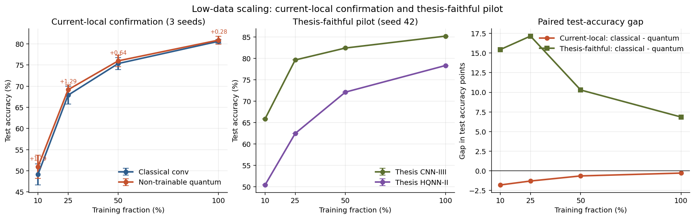

# Revisiting Quanvolution for Ottoman-Turkish Handwritten Character Recognition: A Reproducible Benchmark and Engineering Study

## Authors

Necati Incekara¹ and Erdem Bilgili²

¹ Affiliation, e-mail, ORCID, and corresponding-author status to be confirmed.<br>
² Faculty of Engineering, Piri Reis University, Istanbul, Türkiye.

---

## Abstract

This study extends a 2024 master's thesis on quanvolutional neural networks for Ottoman-Turkish handwritten character recognition. We evaluate 44 classes drawn from a dataset of 3,894 grayscale images, reporting thesis-faithful reproductions, current-local matched-budget controls, a modern classical upper bound, low-data scaling, and a trainable-quantum engineering study as separate experiment groups. Across three full-data seeds, `thesis_cnniiii` reaches **85.26 ± 0.97%** test accuracy, compared with **78.61 ± 0.69%** for `thesis_hqnn2`; grayscale ResNet-18 reaches **88.13 ± 0.82%**. Within the current-local family, `classical_conv`, `param_linear`, and fixed quanvolution obtain **81.40 ± 1.06%**, **81.12 ± 2.27%**, and **80.40 ± 0.69%**, respectively. Checkpoint inference gives macro-F1 values of **81.85 ± 1.53%** for ResNet-18, **79.73 ± 1.22%** for `thesis_cnniiii`, and **72.76 ± 1.52%** for fixed quanvolution. In the six-seed, near-matched low-data experiment, fixed quanvolution leads `classical_conv` by **0.28--1.79** mean accuracy points, although every paired 95% confidence interval crosses zero and all Holm-adjusted p-values are 1.0. Single-run V7 test accuracy ranges from **65.88%** to **72.53%** in the April 2026 reruns. These findings do not support the broad quantum-advantage hypothesis posed at the start of the work. Instead, they provide a reproducible comparison across model families, identify a limited low-data pattern for further testing, and document the trainability and numerical problems encountered in a hybrid quantum-classical pipeline.

**Keywords:** Quantum Machine Learning, Quanvolutional Neural Networks, Hybrid Quantum-Classical Computing, Ottoman Script Recognition, Variational Quantum Circuits, Gradient Stabilization

---

## 1. Introduction

Quanvolutional neural networks insert small quantum circuits into an image-processing pipeline, either as fixed feature extractors or as trainable components. Since the architecture was introduced by Henderson et al. (2020), it has become one of the more widely studied approaches to quantum machine learning (QML) for vision (Biamonte et al. 2017; Schuld and Petruccione 2021). Its practical value, however, remains difficult to assess. Simulated circuits are costly, trainable circuits can be numerically fragile, and performance comparisons are sensitive to the strength and capacity of the classical baseline.

These concerns are especially important in small-scale QML studies. Choices of split, seed, model size, and experimental protocol can have effects comparable to the reported difference between quantum and classical models (Huang et al. 2021). Accordingly, we record unsuccessful architectures and numerical failures alongside the models that completed training, and we avoid pooling results from models built to answer different questions.

The application considered here is Ottoman-Turkish handwritten character recognition. The dataset contains 3,894 grayscale images from 44 character classes, with considerable morphological variation and relatively few examples. This combination makes the task relevant to cultural-heritage OCR while providing a demanding setting in which to examine quantum feature extraction under limited data and compute.

### 1.1 Research Questions

The study is organized around three research questions:

1. **RQ1:** Under a reproducible full-data protocol, do thesis-faithful or matched-budget quantum variants outperform their strongest classical counterparts on this Ottoman-Turkish OCR task?
2. **RQ2:** Does reducing only the training split reveal a low-data regime in which a quantum variant becomes competitive with its paired classical baseline?
3. **RQ3:** Which architecture, gradient-flow, and numerical-precision constraints determine whether a trainable quanvolutional model can learn at all?

### 1.2 Contributions

The paper makes four contributions:

1. It establishes a reproducible protocol that reports thesis-faithful reproductions, current-local matched-budget ablations, a modern classical upper bound, low-data scaling, and the V1--V7 engineering history separately.

2. It reports a classical-favored full-data result across multiple seeds, together with a more limited low-data pattern in which one fixed quantum preprocessor remains competitive with its paired classical baseline.

3. It traces the V1--V7 development path and shows that trainability returned only after several architectural and optimization changes were introduced together. Since residual routing, output gain, squeeze-and-excitation attention, normalization, and precision handling changed at the same time, their individual effects cannot be separated from the available runs.

4. It documents a precision-boundary failure in which float16 values reached the variational circuit while optimizer updates bypassed GradScaler. Stable training returned after float32 boundary handling, GradScaler-aware updates, and the other V7 changes were introduced together.

### 1.3 Relation To The Thesis

This work began with a master's thesis submitted in 2024. The thesis defined the OCR task, established the dataset and preprocessing choices, and provided the first CNN/HQNN comparisons. The experiments carried out in 2025--2026 retain that foundation but apply a more demanding protocol: key thesis models are rerun under common conditions, thesis-faithful reproductions are separated from newer matched-budget ablations, and results are reported across multiple seeds. The later work also adds the V1--V7 development history of the trainable quantum layer.

The stronger controls changed the direction of the study. Rather than continuing to test a broad claim of quantum superiority, the paper asks whether fixed quanvolution remains competitive when training data are scarce and what engineering conditions allow a trainable hybrid model to learn. The low-data experiment was designed after the full-data ordering was known, so it is treated as hypothesis-generating rather than as preregistered confirmation. In this way, the paper develops the thesis question without detaching the later conclusions from their original context.

### 1.4 Paper Organization

Section 2 reviews related work, and Section 3 describes the dataset, benchmark families, architectures, and training procedure. Section 4 presents the full-data, low-data, and trainable-quantum results. Their implications and limitations are discussed in Section 5, followed by the conclusion in Section 6.

---

## 2. Related Work

### 2.1 Quanvolutional Neural Networks

Henderson et al. (2020) introduced quanvolutional neural networks using random, non-trainable quantum circuits as feature extractors before a classical classifier. Hur et al. (2022) later examined trainable quantum convolution for classical data. More recently, ResQuNN combined residual learning with quanvolution for medical-image classification (Jaderberg et al. 2025). Against this background, the present study focuses on a different set of questions: how quanvolution behaves in Ottoman-Turkish OCR, whether its results hold against stronger classical controls, and what can be learned from the failed as well as the successful runs.

The term *quanvolutional* also covers models with quite different roles. We distinguish thesis-faithful CNN/HQNN reproductions from current-local matched-budget ablations and from the trainable V7 model. The groups are reported separately because they differ in architecture, parameter count, and experimental purpose.

### 2.2 Benchmarking, Reproducibility, and Quantum Claims

The strength and capacity of the classical control are central to the interpretation of QML results. Huang et al. (2021) formalize how data access and model class constrain possible learning advantages, while Ceschini et al. (2025) show empirically that parameter count and baseline choice can change the apparent outcome of a hybrid comparison. On a small image dataset, the effects of the split, random seed, capacity, and tuning may be as important as the quantum block itself.

For this reason, performance is assessed here through multi-seed reruns, matched classical alternatives, and a stronger modern classical model. We also report unsuccessful runs when they clarify why a hybrid architecture failed to learn.

### 2.3 Quantum Circuit Training and Hybrid Engineering

Training parameterized quantum circuits is complicated by barren plateaus, in which gradient magnitudes can decrease sharply with system size and circuit structure (McClean et al. 2018). Although this risk is less pronounced in shallow four-qubit circuits, small circuits are not free from optimization pathologies (Cerezo et al. 2021). The V7 model uses data re-uploading, which increases the expressive capacity of a circuit without adding qubits (Perez-Salinas et al. 2020).

Hybrid training also brings practical problems that are less standardized than the circuit design itself. Mixed precision, optimizer scheduling, gradient scaling, and skip routing are routine in classical deep learning, but their interaction with a quantum layer is not always reported. The V1--V7 sequence allows us to examine these interactions directly, including runs that collapsed and a precision error that produced non-finite model parameters.

Reviews of quantum classifiers and QCNNs describe a rapidly expanding set of architectures (Li and Deng 2022; Wei et al. 2026), while simulation studies show that depth and noise can materially change model behavior (Ahmed et al. 2025). We accordingly report circuit scale, simulation status, and engineering interventions for each relevant experiment.

### 2.4 Ottoman Script Recognition and Thesis Context

Ottoman script recognition has been studied in both online handwriting and printed-document OCR settings (Nalbant et al. 2009; Dolek and Kurt 2023). The 44-class task considered here has substantial within-class variation and relatively few examples per class, conditions that remain difficult for conventional OCR and are also relevant to data-limited QML experiments.

The master's thesis on which this paper is based established the task and the initial CNN/HQNN comparison. The present study keeps that experimental lineage visible while adding reproducible reruns, multi-seed reporting, clearer model-family separation, and a detailed account of trainable-quantum development.

---

## 3. Methodology

### 3.1 Dataset

The publicly available *Ottoman Turkish Characters* dataset contains 32x32 grayscale images from 44 classes (Özer and Uzun 2020). Kaggle lists the dataset license as “GPL 2.” Its original directories contain 3,428 training files and 466 test files. One training filename is malformed and is skipped by the current parser, leaving 3,427 loaded training samples and 466 test samples. We retain the thesis train/test split to preserve continuity with the earlier experiments. A checksum audit performed on August 9, 2026 found all 3,894 local PNG files to be content-identical to the official Kaggle version-1 archive (archive SHA-256 `35b68d7f7e677e591d2305c573ce350914042f0f7e5b2fa79d2cb16415563885`).

**Table 1.** Dataset summary under the current parser and fixed thesis-era train/test split.

| Property | Value |
|----------|-------|
| Classes | 44 Ottoman-Turkish characters |
| Total files | 3,894 |
| Effective loaded train set | 3,427 images |
| Test set | 466 images |
| Image dimensions | 32x32 grayscale |
| Avg. files/class | ~88 (all files) |
| Random baseline | 2.27% (1/44) |

The class distribution is substantially imbalanced. We treat the task as a small-data heritage OCR problem and report performance across seeds and within clearly defined benchmark families.

#### 3.1.1 Publication Protocol

The publication benchmark follows five rules:

- the thesis train/test split remains fixed,
- validation is derived deterministically from the training split,
- runs are tracked with explicit train seed and split seed,
- key benchmark rows are reported with three seeds,
- structured JSON result records are treated as the primary source for reported metrics.

#### 3.1.2 Benchmark Families

Experiments are grouped into five families:

1. **Thesis-faithful reproductions:** reruns of the thesis-era CNN/HQNN models under the current publication protocol.
2. **Current-local matched-budget ablations:** smaller local models designed to compare classical replacements against non-trainable quantum preprocessing under similar parameter budgets.
3. **Modern-classical upper bound:** a stronger contemporary classical baseline used to determine whether the findings depend on weak historical comparators.
4. **Low-data scaling:** deterministic label-stratified reductions of the training split while validation and test splits remain fixed.
5. **Trainable-quantum engineering study:** the V1--V7 development path used to study gradient flow, bottlenecks, and precision failures.

A thesis-faithful HQNN and a current-local Henderson-style fixed quantum preprocessor are both quantum models, but they address different comparisons. We do not combine their results into a single ranking.

#### 3.1.3 Model Nomenclature

Repository model identifiers are retained so that each result can be traced to its implementation. Table 2 gives the corresponding role of each model in the paper.

**Table 2.** Mapping from repository model identifiers to paper-level benchmark roles.

| Repository identifier | Paper-level role | Benchmark family |
|---|---|---|
| `thesis_cnniiii` | strongest thesis-faithful classical CNN reproduction | thesis-faithful |
| `thesis_cnn3` | weaker thesis-faithful classical CNN anchor | thesis-faithful |
| `thesis_hqnn2` | strongest thesis-faithful quantum reproduction | thesis-faithful |
| `classical_conv` | current-local classical convolutional matched-budget baseline | current-local |
| `param_linear` | current-local linear classical replacement for the quantum block | current-local |
| `non_trainable_quantum` | current-local Henderson-style non-trainable quantum preprocessing baseline | current-local |
| `resnet18_cifar_gray` | stronger grayscale ResNet-18 classical upper bound | modern-classical |
| V7 trainable quantum | stabilized trainable-quantum engineering study | trainable-quantum |

### 3.2 Quantum Circuit Design

The quanvolutional blocks use small quantum circuits, but their role varies by benchmark family:

- thesis-faithful HQNN models use fixed non-trainable quantum preprocessing,
- current-local Henderson-style baselines use cached non-trainable quantum filters,
- the V7 engineering line uses a 4-qubit trainable circuit with data re-uploading.

The trainable V7 circuit follows the data re-uploading strategy of Perez-Salinas et al. (2020):

#### 3.2.1 Data Re-uploading Circuit (Primary)

```
For each layer l in {1, 2}:
    AngleEmbedding(x, wires=[0,1,2,3])        # encode 4 input values
    For each qubit q in {0,1,2,3}:
        RY(theta_l,q,0); RZ(theta_l,q,1)      # trainable
    CNOT(0->1), CNOT(1->2), CNOT(2->3), CNOT(3->0)            # entanglement ring
    For each qubit q in {0,1,2,3}:
        RY(theta_l,q,2)                       # trainable
Measure: <Z_0>, <Z_1>, <Z_2>, <Z_3>
```

**Trainable parameters:** 24 circuit angles (2 layers × 4 qubits × 3 angles implemented as RY/RZ/RY) + 1 learnable quantum-output gain = **25 trainable quantum-path parameters**.

#### 3.2.2 Strongly Entangling Circuit (Implemented Option)

PennyLane's three-layer `StronglyEntanglingLayers` template is implemented with 36 trainable parameters, but it was not evaluated in the reported experiments. No claim is made about its expressibility or accuracy.

#### 3.2.3 Hardware-Efficient Circuit (Implemented Option)

An alternative hardware-efficient circuit with RX/RY rotations, alternating CZ entanglement, and 16 trainable parameters is also implemented but not evaluated. No hardware-performance conclusion is drawn from this option.

### 3.3 Hybrid Architecture: V7 (EnhancedQuanvNet)

V7 is the main source of evidence about trainable quanvolution in this study. Although it is not the strongest recognition model, its development history reveals how architecture and optimization choices affected whether the quantum path learned at all.

#### 3.3.1 Classical Preprocessing

```
Input: 32x32x1
  -> Conv2d(1, 8, stride=2) + GroupNorm(8) + GELU    -> 16x16x8
  -> ResidualBlock(8, 8)  [Conv-GN-GELU-Conv-GN + skip]  -> 16x16x8
  -> Conv2d(8, 4, stride=2) + GroupNorm(4) + GELU    -> 8x8x4
Output: 8x8x4  [64 spatial values per channel]
```

GroupNorm is used throughout instead of BatchNorm for stability with small effective batch sizes in the quantum regime.

#### 3.3.2 Quantum Processing (TrainableQuanvLayer)

The quanvolutional layer applies 2x2 patch extraction with stride 2 to the 8x8 feature map, yielding 16 patches per channel. Each patch's 4 values are encoded into the 4-qubit PQC via AngleEmbedding.

Before quantum processing, inputs are explicitly returned to float32, regardless of the surrounding AMP autocast context:
```python
patches = patches.float()   # keep the quantum boundary in float32
quantum_output = self.qlayer(patches) * self.gradient_scale
```

Output dimensions: 4×4 spatial × 4 expectation values × 4 input channels = 4×4×16.

The layer submits 16 spatial patches for each of four input channels, giving **64 circuit input instances per image**. This is 75% fewer than the 256 instances used by V1. Because the simulator can vectorize a batch of instances, this number describes the architectural workload rather than the number of hardware calls.

#### 3.3.3 Gradient Stabilization

V7 combines three interface mechanisms. They were introduced and evaluated together, which prevents a component-wise causal interpretation:

1. **Learnable quantum-output gain (α):** Initialized to 0.1 and applied as `y_q = α · f_quantum(x)`. It also rescales gradients by the chain rule, but is not a separate gradient-only operation.

2. **Residual Skip Connection (β):** A 1×1 convolution adapter (`Conv2d(4, 16, 1×1)`) with learnable weight β (init=0.1) provides a gradient highway bypassing the quantum layer: `y = y_q + β · W_skip(x_classical)`.

3. **Classical channel attention (SE-Block):** A squeeze-and-excitation block recalibrates post-quantum channels. It is classical attention, not a quantum-attention mechanism.

#### 3.3.4 Classical Post-processing

```
4x4x16
  -> Conv2d(16, 32, 3×3) + GroupNorm(8) + GELU
  -> ResidualBlock(32, 32)
  -> Conv2d(32, 64, 3×3) + GroupNorm(8) + GELU
  -> AdaptiveAvgPool2d(2) -> 256-dim vector
  -> Linear(256, 128) + GELU + Dropout(0.5)
  -> Linear(128, 64) + GELU + Dropout(0.3)
  -> Linear(64, 44)
Output: 44-class logits
```

**Total parameters:** 87,798 (25 quantum + 87,773 classical).

### 3.4 Training Pipeline

#### 3.4.1 Dual Optimizer Strategy

Quantum and classical parameters are assigned separate optimizers and learning rates:

**Table 3.** Optimizer configuration for the trainable V7 engineering study.

| Optimizer | Parameters | LR | Weight Decay | Grad Clip |
|-----------|-----------|-----|-------------|-----------|
| Adam | Quantum (25) | 0.0005 | 1e-5 | max_norm=0.5 |
| AdamW | Classical (87,773) | 0.002 | 1e-4 | max_norm=1.0 |

For a 10-epoch run, the quantum scheduler is `CosineAnnealingWarmRestarts(T_0=10, T_mult=2)` and the classical scheduler is `CosineAnnealingLR(T_max=10)`.

#### 3.4.2 Regularization

- **Label smoothing:** ε=0.1 in cross-entropy loss
- **Mixup augmentation:** Applied with 50% probability, α=0.2
- **Dropout:** 0.5 and 0.3 in the classification head
- **GroupNorm:** Replaces BatchNorm throughout

#### 3.4.3 AMP Integration

Standard AMP (float16) is used for classical computations. The quantum boundary requires explicit handling:

```python
# GradScaler-aware optimizer stepping
scaler.scale(loss).backward()
scaler.unscale_(quantum_optimizer)
scaler.unscale_(classical_optimizer)
torch.nn.utils.clip_grad_norm_(quantum_params, max_norm=0.5)
torch.nn.utils.clip_grad_norm_(classical_params, max_norm=1.0)
scaler.step(quantum_optimizer)
scaler.step(classical_optimizer)
scaler.update()
```

In V7 Run 1, `optimizer.step()` was called directly rather than through GradScaler. Non-finite gradients were then applied to the model parameters, and the run did not recover. Because this occurred alongside float16 values at the quantum boundary, the run does not isolate either condition as the sole cause.

### 3.5 Computational Infrastructure

- **Primary trainable-quantum training:** NVIDIA L4 GPU (Google Colab Pro)
- **Initial exploratory runs:** NVIDIA A100-SXM4-80GB (Google Colab Pro)
- **Reproducibility and benchmark reruns:** Apple M4 Mac Mini (CPU, `default.qubit`) for all M4-feasible thesis-faithful and matched-budget models
- **Quantum simulator:** PennyLane `lightning.gpu` with adjoint differentiation
- **Framework:** PyTorch 2.x, PennyLane 0.44, NumPy ≥ 2.0
- **Batch size / epochs:** configuration depends on benchmark family; the April 2026 V7 Colab reruns shown in this paper use batch size 128 and report after a 10-epoch budget on L4

---

## 4. Experimental Results

### 4.1 Benchmark Overview

Results are reported according to the role of each experiment rather than as a single leaderboard:

1. **Thesis-faithful family:** reproductions of the thesis-era classical and quantum models.
2. **Current-local matched-budget family:** smaller parameter-matched ablations designed for fair local comparison.
3. **Modern-classical upper bound:** a stronger classical model beyond the thesis-era architectures.
4. **Low-data scaling:** experiments that reduce only the training split while keeping validation and test sets fixed.
5. **Trainable-quantum engineering study:** the V1--V7 path used to study training behavior and implementation failures.

### 4.2 Thesis-Faithful Family

**Table 4.** Thesis-faithful full-data benchmark results across three seeds.

| Model (repository identifier) | Runs | Best Val | Test | Params | Interpretation |
|-------|---:|---:|---:|---:|---|
| `thesis_cnniiii` | 3 | **92.11 ± 0.30** | **85.26 ± 0.97** | 1,378,124 | strongest thesis-faithful reproduction; above thesis table reference |
| `thesis_cnn3` | 3 | 85.38 ± 0.77 | 79.33 ± 1.26 | 769,804 | weaker classical thesis-faithful anchor |
| `thesis_hqnn2` | 3 | 83.72 ± 2.23 | 78.61 ± 0.69 | 248,428 | best thesis-faithful quantum reproduction, but below `thesis_cnniiii` and below thesis table reference |

Within the thesis-faithful family, `thesis_hqnn2` remains close to `thesis_cnn3`, but it does not match the stronger classical architecture. The **85.26 ± 0.97%** test accuracy of `thesis_cnniiii` is 6.65 points above the **78.61 ± 0.69%** obtained by `thesis_hqnn2`.

### 4.3 Current-Local Matched-Budget Family

**Table 5.** Current-local matched-budget full-data benchmark results across three seeds.

| Model (repository identifier) | Runs | Best Val | Test | Params | Interpretation |
|-------|---:|---:|---:|---:|---|
| `classical_conv` | 3 | 86.26 ± 1.76 | **81.40 ± 1.06** | 88,045 | strongest matched-budget local model by mean test accuracy |
| `param_linear` | 3 | **86.45 ± 0.61** | 81.12 ± 2.27 | 87,798 | matched classical replacement, nearly tied with `classical_conv` on mean test |
| `non_trainable_quantum` | 3 | 85.77 ± 0.94 | 80.40 ± 0.69 | 88,488 | stable Henderson-style non-trainable quantum baseline, but not the strongest local model |

The current-local family isolates a narrower comparison under similar parameter budgets. Under the `publication_v1` protocol, the fixed quantum preprocessor is stable across seeds, but its **80.40 ± 0.69%** mean test accuracy remains below `classical_conv` (**81.40 ± 1.06%**) and `param_linear` (**81.12 ± 2.27%**).

### 4.4 Modern-Classical Upper Bound

The modern-classical upper bound is neither thesis-faithful nor parameter-matched. It is included to show how the task responds to a stronger contemporary vision model under the same fixed data split. Across three seeds, `resnet18_cifar_gray` reaches **92.98 ± 0.29%** best validation accuracy and **88.13 ± 0.82%** test accuracy.

**Table 6.** Modern-classical upper-bound result under the same fixed split.

| Model (repository identifier) | Runs | Best Val | Test | Params | Interpretation |
|-------|---:|---:|---:|---:|---|
| `resnet18_cifar_gray` | 3 | **92.98 ± 0.29** | **88.13 ± 0.82** | 11,190,252 | strongest reproduced model; modern-classical upper bound, not a thesis-faithful or matched-budget row |

Its result confirms that the classical-favored ordering is not limited to the smaller or older comparison models.

We also evaluated all 21 saved best-validation checkpoints using class-aware metrics. For each checkpoint, the regenerated top-1 accuracy had to match its source JSON record before the additional metrics were included.

**Table 7.** Class-aware full-data test metrics across three seeds.

| Family | Model | Macro-F1 | Balanced accuracy | Weighted-F1 |
|---|---|---:|---:|---:|
| modern-classical | `resnet18_cifar_gray` | **81.85 ± 1.53** | **85.17 ± 1.33** | **88.21 ± 0.85** |
| thesis-faithful | `thesis_cnniiii` | 79.73 ± 1.22 | 83.65 ± 0.49 | 85.26 ± 1.00 |
| thesis-faithful | `thesis_cnn3` | 72.76 ± 3.29 | 74.02 ± 2.92 | 79.01 ± 1.37 |
| thesis-faithful | `thesis_hqnn2` | 71.93 ± 1.44 | 73.33 ± 1.27 | 78.07 ± 0.76 |
| current-local | `classical_conv` | 71.09 ± 0.43 | 71.89 ± 0.31 | 80.98 ± 0.79 |
| current-local | `param_linear` | 71.29 ± 5.03 | 71.37 ± 5.21 | 80.40 ± 2.42 |
| current-local | `non_trainable_quantum` | 72.76 ± 1.52 | 74.86 ± 1.78 | 79.78 ± 0.91 |

The macro-F1 results leave the main ordering unchanged: ResNet-18 and `thesis_cnniiii` are still the strongest models in their respective groups. Fixed quanvolution nevertheless has a higher mean macro-F1 than the two current-local classical controls, despite its lower top-1 accuracy. This difference is descriptive and calls for class-level error analysis rather than a superiority claim. Several rare classes have zero or near-zero recall in every family; the full per-class results and confusion matrices are provided in `experiments/classification_metrics_20260728.json`.

### 4.5 Low-Data Scaling Confirmation

The low-data experiment reduces only the training split; validation and test samples remain fixed, and training subsets are selected deterministically with label stratification. The current-local comparison pairs seeds 42--47. Seed 42 used a parser state with 3,427 loaded training images, whereas the Colab runs for seeds 43--47 recorded 3,428. The resulting nested subsets differ by one image (308--309, 771--772, 1542--1543, and 3085--3086), so the design is described as near-matched rather than exactly matched. All 56 expected JSON records and best checkpoints are available locally. On August 9, 2026, the 40 current-local records for seeds 43--47 that had previously been reconstructed from notebook output were replaced with the original Drive JSON files; the reported result fields were identical.



**Figure 1.** Low-data scaling results by benchmark family. The current-local panel reports six-seed means with standard deviations for `classical_conv` and `non_trainable_quantum`; the thesis-faithful panel reports the available seed-42 pilot for `thesis_cnniiii` and `thesis_hqnn2`. The gap panel uses classical minus quantum test accuracy, so negative current-local gaps indicate the fixed-quantum mean is ahead for that paired comparison.

**Table 8.** Low-data scaling results. Current-local rows are six-seed means; thesis-faithful rows are seed-42 pilot evidence.

| Family | Fraction | Classical Test | Quantum Test | Interpretation |
|---|---:|---:|---:|---|
| current-local | 0.10 | `classical_conv`: 49.14 ± 2.49% | `non_trainable_quantum`: 50.93 ± 2.72% | quantum mean ahead by 1.79 points |
| current-local | 0.25 | `classical_conv`: 67.88 ± 2.13% | `non_trainable_quantum`: 69.17 ± 1.12% | quantum mean ahead by 1.29 points |
| current-local | 0.50 | `classical_conv`: 75.36 ± 1.43% | `non_trainable_quantum`: 76.00 ± 1.36% | quantum mean ahead by 0.65 points |
| current-local | 1.00 | `classical_conv`: 80.62 ± 0.44% | `non_trainable_quantum`: 80.90 ± 0.95% | quantum mean ahead by 0.28 points |
| thesis-faithful | 0.10 | `thesis_cnniiii`: 65.88% | `thesis_hqnn2`: 50.43% | seed-42 pilot; classical ahead by 15.45 points |
| thesis-faithful | 0.25 | `thesis_cnniiii`: 79.61% | `thesis_hqnn2`: 62.45% | seed-42 pilot; classical ahead by 17.16 points |
| thesis-faithful | 0.50 | `thesis_cnniiii`: 82.40% | `thesis_hqnn2`: 72.10% | seed-42 pilot; classical ahead by 10.30 points |
| thesis-faithful | 1.00 | `thesis_cnniiii`: 85.19% | `thesis_hqnn2`: 78.33% | seed-42 pilot; classical ahead by 6.86 points |

In the current-local comparison, fixed quanvolution has the higher mean at all four fractions, although the margin falls from 1.79 points at 10% of the training data to 0.28 points at the full fraction. The thesis-faithful pilot shows the opposite ordering, with `thesis_cnniiii` ahead at every fraction. The current-local pattern is therefore specific to one fixed quantum preprocessor and does not overturn the full-data results.

Paired seed-level tests give fixed quanvolution-minus-`classical_conv` differences of +1.79 points at 10% (95% CI [-2.93, 6.50]), +1.29 at 25% ([-1.88, 4.45]), +0.65 at 50% ([-1.43, 2.72]), and +0.28 at 100% ([-0.44, 1.00]). Every interval includes zero. Exact sign-flip p-values range from 0.375 to 0.469, and all Holm-adjusted p-values are 1.0. The full-data groups contain only three seeds, so their Welch comparisons are also treated as descriptive. The low-data ordering is thus an exploratory observation that requires independent confirmation.

Checkpoint inference for the 48 current-local low-data runs reproduced every recorded top-1 accuracy within tolerance and yielded the macro-F1 results in Table 9.

**Table 9.** Current-local low-data macro-F1 across six seeds.

| Training fraction | `classical_conv` | `non_trainable_quantum` | Quantum minus classical |
|---:|---:|---:|---:|
| 0.10 | 28.56 ± 2.14 | 31.56 ± 4.69 | +3.00 |
| 0.25 | 50.75 ± 3.20 | 51.50 ± 1.32 | +0.74 |
| 0.50 | 60.90 ± 2.56 | 61.25 ± 4.65 | +0.35 |
| 1.00 | 69.61 ± 0.82 | 72.07 ± 2.74 | +2.46 |

The macro-F1 means follow the same direction as the accuracy comparison. Because these metrics were generated after the primary accuracy analysis and were not subjected to a separate confirmatory test, they are reported as exploratory.

### 4.6 Trainable-Quantum Engineering Study

The V1--V7 sequence is examined as an engineering history rather than as the leading recognition result. It records the architectures that failed, the changes made in response, and the point at which the model began to train reliably. The April 2026 Colab reruns show that V7 can complete training without NaN collapse, but the spread between individual runs remains substantial. We consider the earlier documented run together with the resumed April 6 rerun and the clean April 27 rerun.

#### 4.6.1 Architectural Evolution Summary

**Table 10.** V1--V7 architectural evolution and trainability outcomes.

| Version | Feature Map | Q-Calls/img | Epoch Time | Best Val Acc. | Outcome |
|---------|------------|-------------|------------|--------------|---------|
| V1 | 32×32 | 256 | >8h | 2.3% | Computationally infeasible |
| V2 | 32×32 | 256 (GPU) | ~8h | 3.3% | LR scheduler bug |
| V3 | 16×16 | 64 | ~5.5h | 6.4% | First learning signal |
| V4 | 8×8 | 16 | ~1.5h | 8.75% | Historical reported baseline; trainability state not independently recoverable |
| V5 | 4×4 | 4 | ~51s/batch | 2.04% | Information bottleneck |
| V6 | 6×6 | 9 | ~117s/batch | 0.00% | Gradient collapse |
| V7-Run1 | 8×8×4 | 64 | ~5.4min/batch | NaN | AMP/optimizer precision-boundary failure |
| **V7-Run2** | **8×8×4** | **64** | **~2.3h/epoch** | **67.35%** | **stabilized trainable-quantum study** |
| **V7-Run3** | **8×8×4** | **64** | **~13.1h / 10-epoch budget** | **72.89%** | **April 6 resumed Colab L4 rerun; 72.53% test** |
| **V7-Run4** | **8×8×4** | **64** | **21h 43m / 10 epochs** | **69.97%** | **April 27 clean non-resumed Colab L4 rerun; 65.88% test** |

#### 4.6.2 April 6 Resumed Colab Rerun

Table 11 gives the epoch-level results of the April 6 V7 rerun using the `data_reuploading` circuit on an L4 GPU.

**Table 11.** April 6, 2026 resumed V7 Colab L4 rerun dynamics.

| Epoch | Train Loss | Train Acc. | Val Acc. | Q-Grad Mean | C-Grad Mean | gradient_scale α |
|-------|-----------|-----------|---------|-------------|-------------|-----------------|
| 1 | 3.5086 | 9.33% | 23.62% | 8.21e-04 | 2.03e-02 | 0.1000 |
| 2 | 2.9550 | 24.55% | 41.69% | 1.19e-01 | 1.17e-01 | 0.1001 |
| 3 | 2.5890 | 35.57% | 50.15% | 8.07e-02 | 1.99e-01 | 0.1014 |
| 4 | 2.3812 | 42.34% | 57.43% | 1.36e-01 | 1.98e-01 | 0.1009 |
| 5 | 2.1245 | 53.84% | 64.43% | 8.98e-02 | 2.34e-01 | 0.1006 |
| 6 | 1.9752 | 60.14% | 67.06% | 2.72e-01 | 2.33e-01 | 0.1002 |
| 7 | 1.8574 | 62.84% | 69.97% | 8.81e-02 | 3.08e-01 | 0.1000 |
| 8 | 1.7413 | 68.64% | 72.30% | 4.09e-02 | 2.25e-01 | 0.1004 |
| 9 | 1.8931 | 64.72% | **72.89%** | 5.47e-01 | 2.09e-01 | 0.1000 |
| 10 | 1.7960 | 68.08% | **72.89%** | 2.08e-01 | 1.61e-01 | 0.1000 |

**April 6 rerun test accuracy:** `72.53%`

The run resumed at epoch 4 from a Drive-backed checkpoint after an earlier target-triggered stop and then continued through epoch 10. Its `72.53%` test accuracy is 7.51 points above the older documented V7 result of `65.02%`, but remains below the strongest classical baselines. The Drive-backed checkpoints have been synchronized to the local repository; the corresponding remote `experiments/v7_*` directory has not been recovered.

#### 4.6.3 April 27 Clean Non-Resumed Colab Rerun

A later L4 run started after the local V7 checkpoints had been removed and trained for the full 10 epochs without resuming. It reached `69.97%` best validation accuracy and `65.88%` test accuracy in `21h 43m`. The result record, `experiments/v7_trainable_quantum_clean_20260427_l4.json`, was reconstructed from the captured output of `colab_v7_rerun_clean.ipynb` because the Colab session disconnected before its JSON file was copied to Drive. The Drive folder contains `best_v7_model.pth` and `checkpoint_latest_v7.pth`, but its `experiments/` subfolder is empty.

This clean run again completed without the earlier NaN failure, although its accuracy was close to the older documented V7 result and below the resumed April 6 run. Taken together, the April reruns give a single-run V7 test range of `65.88--72.53%`. They demonstrate trainability, but not stable high performance.

### 4.7 Information Bottleneck Analysis

Feature-map size and performance changed together across the historical versions, but so did the architecture and optimization procedure. Table 12 is descriptive rather than a controlled resolution ablation.

**Table 12.** Information bottleneck behavior as the pre-quantum feature map is reduced.

| Feature Map | Spatial Values/Channel | Q-Calls/img | Val Acc. | Gradient Status |
|------------|----------------------|-------------|---------|----------------|
| 8×8 (V4) | 64 | 16 | 8.75% | Historical reported baseline |
| 8×8×4 (V7) | 64/channel | 64 | 72.89% (April 6) / 69.97% (April 27) | Trainable composite configuration |
| 6×6 | 36 | 9 | 0.00% | Complete collapse |
| 4×4 | 16 | 4 | 2.04% | Below random baseline |

The V5 and V6 failures are consistent with an information bottleneck, but they do not establish 8×8 as a causal lower bound. Preprocessing, channel count, residual routing, circuit trainability, and the training procedure also differ. Establishing a resolution threshold would require an ablation in which those factors are held fixed.

### 4.8 Gradient Flow Analysis

#### V6 Failure Case (6×6 Feature Maps)

- Quantum output standard deviation: <1e-6 (effectively constant)
- No gradient signal through quantum layer
- Model converged to constant predictions (0% accuracy)
- Working explanation: insufficient or nearly constant features at the quantum boundary, confounded with architecture and training changes

#### V7 Gradient Health

Quantum gradient magnitude in the 10-epoch rerun ranged from 8.21e-04 to 5.47e-01. The increase from the small first-epoch value is compatible with a warm-up pattern, but a single run cannot establish a characteristic circuit dynamic or separate the quantum block from the surrounding classical optimization.

### 4.9 AMP Failure at the Quantum Interface

In the failed run, PyTorch AMP autocast allowed float16 values to reach the PennyLane boundary while direct optimizer updates bypassed GradScaler. Non-finite gradients appeared in the quantum backward path and were subsequently applied to the model parameters. The run did not recover after NaN values propagated during the first epoch.

The later configuration restored float32 at the quantum boundary and used GradScaler-aware optimizer stepping. Training then proceeded without the same failure. Because these corrections were introduced together, the available evidence supports an implementation-specific failure analysis but does not identify either condition as the sole cause.

The corrective changes at the quantum boundary and optimizer step were:
```python
patches = patches.float()         # at quantum boundary in forward()
scaler.step(quantum_optimizer)    # in training loop, not optimizer.step()
```

GradScaler multiplies gradient magnitudes by its scale factor (~65,536). The Run 1 debug value `quantum grad mean=2.09e+02` corresponds to an unscaled magnitude of about 0.003 rather than an unusually large gradient. Gradient diagnostics in this setting must be recorded after `scaler.unscale_()`.

### 4.10 Quantum Computational Efficiency

**Table 13.** Quantum-call reduction from classical preprocessing and vectorization.

| Transition | Technique | Q-Call Reduction | Epoch Speedup |
|-----------|-----------|-----------------|---------------|
| V1→V2 | Vectorization + GPU | 0% | ~0% |
| V2→V3 | Classical preprocessing (32→16) | 75% | ~31% |
| V3→V4 | Aggressive preprocessing (16→8) | 75% | ~73% |
| **V1→V4** | **Combined** | **93.75%** | **>80%** |
| **V1→V7** | **Four-channel 8×8 preprocessing** | **75%** | **not directly comparable across hardware/software** |

### 4.11 Comparative Interpretation

**Table 14.** Cross-family interpretation table. Rows are not a single flat leaderboard because families differ in protocol role and model size.

| Variant | Quantum Params | Val Acc. | Test Acc. | Notes |
|---------|---------------|---------|---------|-------|
| V4 (historical reported old architecture) | not independently recoverable | 8.75% | — | Current `src/model.py` is trainable; the historical parameter-state claim lacks a preserved snapshot |
| V7 (trainable, data_reuploading, April 6 resumed rerun) | 25 | 72.89% | 72.53% | strongest single V7 result, but still not current benchmark leader |
| V7 (trainable, data_reuploading, April 27 clean rerun) | 25 | 69.97% | 65.88% | clean non-resumed run reconstructed from captured notebook output after runtime disconnect |
| V7 (older documented run) | 25 | 67.35% | 65.02% | older documented trainable result retained for historical comparison |
| `classical_conv` | 0 | 86.26 ± 1.76 | **81.40 ± 1.06** | strongest current-local matched-budget baseline |
| `non_trainable_quantum` | 0 trainable | 85.77 ± 0.94 | 80.40 ± 0.69 | Henderson-style cached quantum baseline |
| `param_linear` | 0 | **86.45 ± 0.61** | 81.12 ± 2.27 | matched classical replacement for the quantum block |
| `thesis_hqnn2` | 0 trainable | 83.72 ± 2.23 | 78.61 ± 0.69 | best thesis-faithful quantum reproduction |
| `thesis_cnniiii` | 0 | **92.11 ± 0.30** | **85.26 ± 0.97** | strongest thesis-faithful reproduced model |

## 5. Discussion

### 5.1 Answers To The Research Questions

The three research questions lead to different conclusions. Full-data recognition accuracy favors the classical models; the low-data comparison shows a small, non-significant mean difference for one fixed quantum preprocessor; and the trainable V7 experiments are informative mainly because they expose the conditions under which the hybrid pipeline succeeds or fails.

**Table 15.** Summary answers to the research questions.

| Research question | Evidence | Answer |
|---|---|---|
| RQ1: Do quantum variants outperform their strongest classical counterparts under the full-data protocol? | Three-seed thesis-faithful and current-local results, plus the modern-classical upper bound | No. `thesis_cnniiii` exceeds `thesis_hqnn2`; `classical_conv` and `param_linear` exceed the current-local non-trainable quantum baseline; `resnet18_cifar_gray` is the strongest reproduced model. |
| RQ2: Does low-data scaling reveal a quantum-competitive regime? | Six-seed near-matched current-local analysis and seed-42 thesis-faithful pilot | Hypothesis-generating only. Fixed quanvolution has a higher mean at all fractions, but every paired confidence interval crosses zero and multiplicity-adjusted tests are non-significant; the thesis-faithful pilot is classical-favored. |
| RQ3: What determines whether trainable quanvolution learns? | V1--V7 engineering path, April 2026 V7 reruns, gradient diagnostics, and AMP failure analysis | The composite V7 configuration is associated with restored trainability. Its precision handling combines a float32 quantum boundary with GradScaler-aware updates; the available runs do not isolate either change or any architectural component. |

### 5.2 Interpreting The Benchmark Hierarchy

The full-data ordering favors classical models in both comparison families. Among the thesis-faithful models, `thesis_cnniiii` clearly exceeds `thesis_hqnn2`. Within the current-local family, `classical_conv` and `param_linear` both have slightly higher mean test accuracy than the Henderson-style fixed quantum preprocessor. The quantum experiments remain useful, but their contribution is comparative and diagnostic rather than evidence of a performance advantage.

The low-data experiment qualifies this result without reversing it. Across the six paired current-local seeds, `non_trainable_quantum` has the higher mean at every training fraction. None of the paired confidence intervals excludes zero, however, and all Holm-adjusted p-values are 1.0. The thesis-faithful seed-42 pilot remains classical-favored. The observed low-data pattern is thus a testable hypothesis about one fixed preprocessing design, not evidence that quantum models generally dominate this task.

The April 2026 reruns place V7 in a similar position. Compared with the failed V1--V6 attempts, the model is clearly trainable. Even its strongest April result remains below the leading thesis-faithful and current-local classical models, while the clean non-resumed run is close to the older documented V7 result. Its main contribution is consequently the evidence it provides about optimization and implementation constraints.

### 5.3 The Quantum Preprocessing Trade-off

The historical path suggests a practical tension. Stronger classical preprocessing reduces the number of circuit evaluations, but it can also remove information before the quantum feature extractor. Since several architectural and optimization choices changed from V4 to V7, the apparent association with an 8×8 feature map remains a design hypothesis rather than a demonstrated minimum resolution.

The same trade-off is likely to arise in other hybrid vision pipelines:

1. computational feasibility, which favors fewer quantum evaluations, and
2. information sufficiency, which favors larger pre-quantum feature maps.

### 5.4 Engineering Challenges In Hybrid Pipelines

The AMP-associated failure shows that standard classical training defaults cannot be assumed to behave safely when a variational circuit participates in both the forward and backward passes. The failed run allowed float16 values into the quantum layer and bypassed GradScaler during the optimizer update. Training resumed after float32 was restored at the boundary, GradScaler-aware stepping was introduced, and the remaining V7 changes were applied. Because these changes were bundled, the artifacts do not establish float16 as the sole cause.

Three practical precautions follow from this observation:

1. maintain explicit float32 casting at quantum boundaries,
2. treat optimizer stepping and gradient logging carefully under AMP,
3. verify gradient health empirically rather than assuming that shallow circuits will train cleanly.

### 5.5 Why Thesis-Faithful Reproduction Still Matters

The current-local Henderson-style baseline and the thesis-faithful HQNN-II reproduction differ in architecture, parameter count, and purpose. Combining them into one quantum category would obscure both comparisons. The thesis-faithful experiments address a specific historical question: whether the strongest quantum model from the thesis remains competitive when rerun under a common protocol. It remains close to the weaker classical `thesis_cnn3`, but does not surpass `thesis_cnniiii`.

The thesis identified the problem, established the first comparison, and motivated the subsequent experiments. The present paper tests that starting hypothesis with stronger controls and a broader set of baselines. Although some of the earlier headline values are not reproduced exactly, the thesis provides the scientific basis for the expanded study.

### 5.6 Contribution To The Literature

For quanvolutional neural networks, this study provides a reproducible comparison in which historical reproductions, matched-budget controls, a modern classical model, low-data experiments, and trainable-circuit diagnostics retain their distinct roles. This structure addresses a recurring problem in QML evaluation: an apparent improvement can depend more on the choice of classical comparator than on the quantum layer.

The V1--V7 history also contributes practical evidence about hybrid training. Aggressive preprocessing coincides with collapse in the earlier models; the bundled V7 changes coincide with restored trainability; and stable training follows the combined introduction of float32 boundary handling and GradScaler-aware updates after a precision failure. These observations do not isolate the contribution of each component, but they define specific failure modes and ablations that can be tested in later work.

For Ottoman-Turkish OCR, the paper extends a thesis-era comparison into a multi-seed benchmark on a small 44-class handwriting dataset. The overall result favors the classical models. The low-data experiment adds a limited, non-significant pattern for one fixed quantum preprocessor, while checkpoint-based metrics reveal class-specific error patterns that top-1 accuracy alone conceals. The contribution is therefore a more precise account of how the initial quantum hypothesis changes under stronger evaluation.

### 5.7 Limitations And Scope

1. **No quantum advantage claimed.** The benchmark evidence does not support a claim that quantum variants outperform the strongest reproduced classical baselines on this dataset.

2. **Simulator-based evaluation.** All quantum experiments rely on classical simulation; no conclusion is drawn about hardware performance.

3. **Single dataset.** Results remain specific to Ottoman handwritten character recognition. A second dataset, a handwriting-style transfer test, or a corruption/robustness axis would materially strengthen the paper.

4. **Limited trainable-quantum statistics.** The April 2026 V7 evidence consists of individual Colab reruns rather than a multi-seed remote study. The clean non-resumed run was reconstructed from captured notebook output after runtime disconnect; Drive checkpoint files exist, but the copied JSON/experiment metadata is missing from the Drive `experiments/` subfolder.

5. **Low-data claim scope.** The six-seed current-local mean signal is not statistically conclusive and has a one-image parser drift across environments. Although byte-original JSON and checkpoints are now local and class-aware metrics were regenerated, the result should not be generalized to thesis-faithful HQNN models, trainable V7, other datasets, or hardware.

6. **Legacy V7 evaluation protocol.** The reported V7 runs predate the deterministic `v7_enhanced_v2_deterministic` path. Their data ordering and split seed were not fully captured, and final test evaluation used the then-current in-memory weights rather than explicitly restoring the best-validation checkpoint. V7 is therefore discussed as an engineering study rather than a benchmark leader.

7. **Dataset and redistribution scope.** The source dataset is publicly accessible on Kaggle under the dataset-page license label “GPL 2,” and the local snapshot matches the official archive. The study therefore links to the source rather than repackaging the images; any downstream redistribution must preserve the applicable license and attribution obligations.

---

## 6. Conclusion

This study revisited quanvolution for Ottoman-Turkish handwritten character recognition under a reproducible protocol. On the full dataset, the leading model in the thesis-faithful family is the classical `thesis_cnniiii` at **85.26 ± 0.97%** test accuracy, while `thesis_hqnn2` reaches **78.61 ± 0.69%**. In the current-local matched-budget family, `classical_conv` leads with **81.40 ± 1.06%**. The trainable V7 reruns fall between **65.88%** and **72.53%**, placing them below the principal classical baselines.

The six-seed low-data experiment gives a more qualified result. Fixed quanvolution has the higher mean accuracy at each tested fraction, but all paired 95% confidence intervals include zero and the multiplicity-adjusted tests are non-significant. The available thesis-faithful low-data pilot continues to favor the classical model. This pattern is worth testing independently, but it does not constitute evidence of quantum advantage.

The V1--V7 sequence provides a separate engineering result. The composite V7 configuration trains where several earlier versions collapsed, and the failed run shows why the numerical-precision boundary needs explicit attention in this implementation. Since the architectural and optimization changes were introduced together, the present evidence cannot assign the improvement to any one component.

Further work should test whether the low-data pattern persists on another dataset or under a robustness shift, and whether it survives additional matched classical controls. Additional trainable-quantum seeds would be useful if stronger estimates of V7 variability are required. The central result of the present study is the benchmark itself: classical models remain stronger, while the quantum experiments delimit a narrower low-data question and provide concrete lessons about hybrid-model training.

---

## Declarations And Availability

**Code availability.** The source code, benchmark entrypoints, aggregation scripts, manuscript, and SHA-256 artifact manifest are maintained at https://github.com/necatiincekara/Quanvolutional-Neural-Network.

**Data availability.** The *Ottoman Turkish Characters* dataset by Alperen Özer and Alp Bintuğ Uzun is publicly available at https://www.kaggle.com/datasets/alpbintuuzun/ottoman-turkish-characters under the dataset-page license label “GPL 2.” The experiments use its original train/test directories. On August 9, 2026, all 3,894 local PNG files were verified content-identical to the official version-1 archive. To preserve source attribution and license context, the research package directs users to Kaggle rather than redistributing the images.

**Ethics.** This study performs secondary analysis of a public dataset of isolated character images and collected no new human-participant data.

**Funding.** This research received no external funding.

**Competing interests.** The authors declare no competing interests.

**Author contributions.** Necati Incekara: Conceptualization, Methodology, Software, Validation, Formal analysis, Investigation, Data curation, Visualization, Writing—original draft. Erdem Bilgili: Supervision, Methodology, Writing—review and editing, Project administration.

---

## References

Ahmed S et al (2025) Impact of noise and circuit depth on quantum machine learning models. *Scientific Reports* 15. https://doi.org/10.1038/s41598-025-17769-6

Biamonte J et al (2017) Quantum machine learning. *Nature* 549:195--202. https://doi.org/10.1038/nature23474

Cerezo M et al (2021) Cost function dependent barren plateaus in shallow parametrized quantum circuits. *Nature Communications* 12:1791. https://doi.org/10.1038/s41467-021-21728-w

Ceschini A et al (2025) A systematic comparison of hybrid quantum-classical neural networks and classical neural networks. *Quantum Machine Intelligence*. https://doi.org/10.1007/s42484-025-00241-z

Dolek I, Kurt A (2023) Ottoman optical character recognition with deep neural networks. *Journal of the Faculty of Engineering and Architecture of Gazi University* 38:2579--2593. https://doi.org/10.17341/gazimmfd.1062596

Henderson M et al (2020) Quanvolutional neural networks: powering image recognition with quantum circuits. *Quantum Machine Intelligence* 2:1--9. https://doi.org/10.1007/s42484-020-00012-y

Huang H-Y et al (2021) Power of data in quantum machine learning. *Nature Communications* 12:2631. https://doi.org/10.1038/s41467-021-22539-9

Hur T, Kim L, Park DK (2022) Quantum convolutional neural network for classical data classification. *Quantum Machine Intelligence* 4:1--18. https://doi.org/10.1007/s42484-021-00061-x

Jaderberg B et al (2025) ResQuNN: a hybrid quantum-classical residual neural network for medical image classification. *Scientific Reports* 15. https://doi.org/10.1038/s41598-025-06035-4

Li W, Deng DL (2022) Recent advances for quantum classifiers. *Science China Physics, Mechanics & Astronomy* 65:220301. https://doi.org/10.1007/s11433-021-1793-6

McClean JR et al (2018) Barren plateaus in quantum neural network training landscapes. *Nature Communications* 9:4812. https://doi.org/10.1038/s41467-018-07090-4

Nalbant M, Burunkaya M, Eroglu Y (2009) Online handwritten Ottoman character recognition. *Engineering Sciences* 4:148--164. https://doi.org/10.12739/nwsaes.v4i2.5000067152

Özer A, Uzun AB (2020) Ottoman Turkish Characters. Kaggle, version 1. https://www.kaggle.com/datasets/alpbintuuzun/ottoman-turkish-characters (accessed 9 August 2026)

Perez-Salinas A et al (2020) Data re-uploading for a universal quantum classifier. *Quantum* 4:226. https://doi.org/10.22331/q-2020-02-06-226

Schuld M, Petruccione F (2021) *Machine learning with quantum computers*. Springer. https://doi.org/10.1007/978-3-030-83098-4

Wei S et al (2026) Quantum convolutional neural networks: a survey. *IEEE Transactions on Neural Networks and Learning Systems*. https://doi.org/10.1109/TNNLS.2026.3677762

---

## Appendix A: Experimental Configuration And Artifacts

Complete hyperparameter settings, debug output, and per-version configurations are documented in `docs/EXPERIMENTS.md`. The main machine-readable artifacts used by this draft are:

**Table 16.** Machine-readable artifacts backing the manuscript claims.

| Artifact | Purpose |
|---|---|
| `experiments/benchmark_summary.json` | aggregate full-data benchmark summary |
| `experiments/low_data_summary.json` | aggregate low-data scaling summary |
| `experiments/statistical_evidence_2026-05-17.json` | generated confidence-interval and exploratory pairwise comparison report |
| `docs/STATISTICAL_EVIDENCE_2026-05-17.md` | human-readable statistical evidence summary |
| `experiments/classification_metrics_20260728.json` | checkpoint-derived full-data macro-F1, balanced accuracy, per-class metrics, and confusion matrices |
| `experiments/low_data_classification_metrics_20260809.json` | checkpoint-derived low-data macro-F1, balanced accuracy, per-class metrics, and confusion matrices |
| `experiments/drive_artifact_reconciliation_20260809.json` | checksum inventory and reconciliation record for all 138 downloaded Drive files |
| `experiments/low_data_reconstruction_manifest_20260728.json` | superseded historical record of the former notebook reconstructions |
| `experiments/v7_trainable_quantum_rerun_20260406_l4.json` | April 6 resumed V7 Colab rerun row |
| `experiments/v7_trainable_quantum_clean_20260427_l4.json` | April 27 clean V7 Colab rerun row reconstructed from captured notebook output |
| `experiments/submission_artifact_manifest_20260728.json` | SHA-256 byte-identity manifest for current evidence, checkpoints, notebooks, figures, and dataset snapshot |
| `paper/figures/low_data_scaling.png` and `.pdf` | paper figure generated from the low-data aggregate summary |

The low-data files for seeds 43--47 are the original JSON records downloaded from Drive. The April V7 rows remain separately labeled according to whether they were reconstructed from notebook or log output.

## Appendix B: Reproducibility

- **Code:** https://github.com/necatiincekara/Quanvolutional-Neural-Network
- **Training notebooks:** `train_v7_colab.ipynb`, `colab_v7_rerun_clean.ipynb`, and `colab_low_data_confirm.ipynb`
- **Audited local environment:** Python 3.13.7, PyTorch 2.10.0, torchvision 0.25.0, PennyLane 0.44.0, NumPy 2.4.2, scikit-learn 1.8.0; exact local evidence dependencies are in `requirements-publication-lock.txt`.
- **Legacy Colab environment:** CUDA/L4 details are recorded in captured notebooks, but a complete exact package lock was not preserved and is treated as a limitation.
- **Hardware:** NVIDIA L4 / A100-SXM4-80GB (Google Colab Pro); Apple M4 Mac Mini (development)
- **Random seeds:** full-data publication benchmarks use seeds 42, 43, and 44 with split seed 42; the low-data current-local analysis uses seeds 42--47 with split seed 42 and fraction seed 42; thesis-faithful low-data rows are seed-42 pilot evidence.
- **Dataset:** public Kaggle source at https://www.kaggle.com/datasets/alpbintuuzun/ottoman-turkish-characters, license label “GPL 2”; the 3,894 local PNG files were content-hash matched to the official version-1 archive on August 9, 2026.
- **V7 protocol note:** the reported legacy V7 runs did not fully capture deterministic ordering/split seeds and tested the final in-memory state. The current `v7_enhanced_v2_deterministic` code path sorts filenames, seeds split and loader generators, records seeds, and restores the best-validation checkpoint before final test; no result in this paper is attributed to that repaired protocol.
