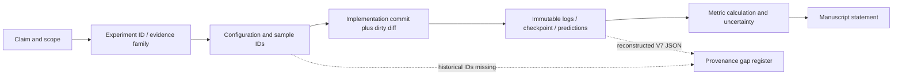
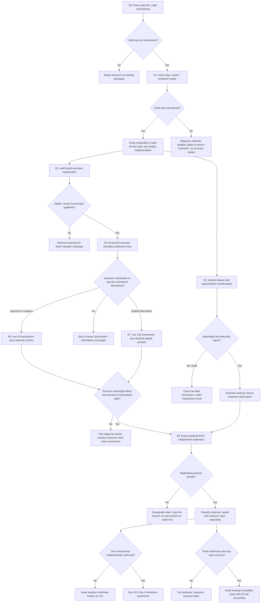

# ASTRA quantum research program

**Audit date:** 8 September 2026, Europe/Istanbul. **Status:** research design and limited numerical verification; no new training campaign and no manuscript rewrite. **Decision:** fund identifiability, classical equivalence, and controlled interface experiments first. Do not start a larger V9 or V10 merely because V7 trains.

The most consequential finding of this audit is that the repository's current fixed four-qubit feature map has an **exact, linear-in-qubit-count classical trigonometric/product implementation**. Its outputs and input/parameter derivatives were numerically checked against the actual source functions. This closes the computational-advantage route for that particular measured map. It opens a better research question: which useful interaction structure, regularization, or optimization geometry survives when quantum implementation is separated from function class?

This result does **not** establish an equivalent product formula for V7's interleaved data re-uploading circuit. It does mean that a fixed-feature accuracy, minority-class, or robustness gain cannot by itself establish an irreducibly quantum mechanism. The proposed program treats exact classical reproduction as a first-class result, then investigates the remaining mechanisms under stronger controls.

Evidence labels throughout: **observed** = recorded experimental artifact; **verified here** = the small diagnostic accompanying this report; **derived** = analysis of executable code or algebra; **hypothesis** = requires new experiments; **unknown** = provenance insufficient. Portfolio scores and plausibility assessments are judgments, not estimated frequencies of success.

## 1. Current scientific state of the repository

The repository supports a reproducible-benchmark and hybrid-engineering study. It currently supports **Level 0 for a controlled quantum-advantage claim**. There are exploratory class-aware and low-data signals worth dissecting, but none yet survives the full comparison protocol proposed here.

| Evidence family | Model | Parameters | Test accuracy, mean ± sample SD (%) | Interpretation |
|---|---|---:|---:|---|
| Modern classical, three seeds | `resnet18_cifar_gray` | 11,190,252 | 88.13 ± 0.82 | Strongest recorded classifier; larger budget, trained from scratch |
| Thesis-faithful, three seeds | `thesis_cnniiii` | 1,378,124 | 85.26 ± 0.97 | Strongest thesis-family reproduction |
| Thesis-faithful, three seeds | `thesis_cnn3` | 769,804 | 79.33 ± 1.26 | Separate architecture/budget |
| Thesis-faithful, three seeds | `thesis_hqnn2` | 248,428 | 78.61 ± 0.69 | Fixed two-qubit preprocessing; reproduction assumptions remain |
| Current-local, three seeds | `classical_conv` | 88,045 | 81.40 ± 1.06 | Best current-local accuracy |
| Current-local, three seeds | `param_linear` | 87,798 | 81.12 ± 2.27 | Parameter-matched affine patch control; insufficient nonlinear opposition |
| Current-local, three seeds | `non_trainable_quantum` | 88,488 | 80.40 ± 0.69 | Fixed feature map, different front-end and augmentation location |
| V7 documented single run, 5 March 2026 notebook | trainable quantum | 87,798 | 65.02 | Best validation 67.35%; historical case study |
| V7 resumed single run, 6 April 2026 | trainable quantum | 87,798 | 72.53 | Best validation 72.89%; reconstructed result row |
| V7 clean single run, 27–28 April 2026 | trainable quantum | 87,798 | 65.88 | Best validation 69.97%; notebook-backed reconstructed row |

Sources: [benchmark aggregation](../experiments/benchmark_summary.json), [full-data checkpoint inference](../experiments/classification_metrics_20260728.json), [experiment log](../docs/EXPERIMENTS.md), [V7 resumed row](../experiments/v7_trainable_quantum_rerun_20260406_l4.json), [clean notebook](../colab_v7_rerun_clean.ipynb). Summary-row rounding and exact checkpoint-inference rounding can differ by 0.01 points. Keep the reporting basis explicit.

The six-seed low-data comparison is a separate rerun axis, not extra seeds to append to the full-data table:

| Training fraction | Classical accuracy | Fixed-Q accuracy | Paired Q−C, points | 95% paired t interval | Holm-adjusted p |
|---|---:|---:|---:|---:|---:|
| 10% | 49.14 ± 2.49 | 50.93 ± 2.72 | +1.79 | [−2.93, 6.50] | 1.0 |
| 25% | 67.88 ± 2.13 | 69.17 ± 1.12 | +1.29 | [−1.88, 4.45] | 1.0 |
| 50% | 75.36 ± 1.43 | 76.00 ± 1.36 | +0.65 | [−1.43, 2.72] | 1.0 |
| 100% | 80.62 ± 0.44 | 80.90 ± 0.95 | +0.28 | [−0.44, 1.00] | 1.0 |

Sources: [low-data summary](../experiments/low_data_summary.json), [statistical evidence](../experiments/statistical_evidence_2026-05-17.json), [checkpoint class metrics](../experiments/low_data_classification_metrics_20260809.json). Filename dates do not necessarily equal their latest contents' creation date. The exact-inference aggregate can round the last two differences to +0.64 and +0.29.

Full-data fixed-Q macro-F1 is 72.76 ± 1.52 versus classical 71.09 ± 0.43; balanced accuracy is 74.86 ± 1.78 versus 71.89 ± 0.31. These descriptive gains coexist with lower overall accuracy. Low-data macro-F1 differences are +3.00, +0.74, +0.35, +2.46 points. They have not received corresponding confirmatory uncertainty analysis. The test set has 466 examples across 44 classes: 20 classes have at most five examples, 26 at most ten, and the minimum support is one. Large rare-class recall jumps can represent one example.

The task itself needs more precise naming. The thesis describes 1,371 Talik, 411 Rika, 1,974 printed, and 138 mixed-style examples, totaling 3,894. This is not an exclusively handwritten collection. The current local directory has 3,428 raw training files, one malformed `00` label skipped, and 466 test files: 3,427 usable training examples. Some Colab logs report 3,428 **loaded** training examples. Dataset identity across those runs is not recoverable from counts alone.

## 2. Evidence/provenance map

The audit inspected the active and legacy source paths, trainer implementations, loaders, experiment summaries and underlying artifact families, captured notebooks, checkpoint reconciliation, thesis text, paper/docs, environment definitions, and relevant Git history. Repository inventory included figures and generated documents; this was not a pixel-by-pixel audit of every figure or a rerun of every historical commit. Only `master`/`origin/master` were available; no alternate research branches were found. HEAD was `95d6fb85f27c394e4b33b2cd5e5321c0c61e724a`, with extensive pre-existing working-tree changes. A commit alone does not describe this workspace.

The [audit input manifest](evidence/repository_audit_manifest_20260908.json) now hashes 140 selected source/artifact inputs and fingerprints the tracked dirty diff. It is an identity record, not a complete checkpoint archive or an assertion that every hashed file received equal semantic review. The diagnostic's recorded source hashes still match the workspace at final verification.



| Claim | Experiment/configuration | Implementation | Primary artifact → metric | Statement permitted; remaining gap |
|---|---|---|---|---|
| ResNet leads current accuracy | Publication protocol, seeds 42–44, split seed 42 | `train_modern_baselines.py`, `src/modern_baselines.py`, benchmark trainer | Per-run JSON → `benchmark_summary.json`; 21 full-data checkpoints independently re-evaluated | Strongest recorded model; not a parameter-matched isolation of quantum effects |
| Current-local fixed-Q does not beat learned convolution on accuracy | Three full-data seeds | `train_ablation_local.py`, `src/ablation_models.py` | JSON/checkpoints → 80.40 vs 81.40 | Limited to bundled pipelines; preprocessing and mixup placement differ |
| Low-data means weakly favor fixed-Q | Six seeds 42–47, one fraction seed 42 | Historical Mac/Colab implementations | 48 current-local JSON/checkpoints → paired effects, class metrics | Exploratory; circuit and training seeds coupled, exact sample identities absent |
| V7 can train | Three distinct historical runs | V7 source at run time, including March repairs | Logs/notebooks plus four surviving April checkpoints → train/validation histories | Stabilized engineering behavior; no causal component attribution or multi-seed estimate |
| April resumed test = 72.53 | Resumed from epoch 4, best validation epoch 9, latest epoch 10 | Legacy unseeded/order-dependent path | Reconstructed JSON from user-captured log; checkpoints corroborate validation history | Test is not independently stored in checkpoint; original user log absent locally |
| April clean test = 65.88 | Non-resumed L4, commit `cede472` captured | Clean notebook run | Captured notebook → metrics; Drive checkpoints → validation history | Raw result JSON absent; exact dataset hash and seeds missing |
| Fixed map has exact classical form | RX/Rot/CNOT-chain/Z output only | Actual AST functions in fixed preprocessor and current base model | New diagnostic JSON → forward/Jacobian agreement | Verified function equivalence; historical cache/prediction replay still pending |

The [9 August Drive reconciliation](../experiments/drive_artifact_reconciliation_20260809.json) supersedes older low-data reconstruction status: 56 low-data JSON files are now canonical byte-original Drive files, including 48 current-local and eight thesis pilot runs; 40 earlier reconstructions were replaced without metric changes. All 56 corresponding best checkpoints are locally present. However, only 16 of those JSON files are tracked, none of their checkpoints are tracked, and many newer manifests, class metrics, and Drive files are untracked. A normal clone does not reproduce the present evidence inventory.

V7 has a different status: four April checkpoints exist, but neither downloaded V7 Drive folder contains raw result JSON. Generic local V7 checkpoint aliases match the April 6 copies; the clean checkpoints are in the Drive tree. Neither checkpoint family contains complete seeds, dataset hash, commit, environment, and test predictions. The March 65.02 checkpoint no longer survives as a separate identifiable artifact. Do not relabel reconstructed JSON as raw or infer missing metadata from today's defaults.

Record the following unresolved items rather than attempting to manufacture them: exact historical split membership; remote extra training example; complete run-time dirty source; April 6 original log; counterfactual V7 best-checkpoint test accuracy; historical RNG and scheduler-resume states; source/writer identities and dataset usage rights. Legacy V7 tested final in-memory weights; what restoring the best-validation checkpoint would have scored is unknown. The current V7 code has improvements that postdate the experiments, including explicit best-checkpoint restoration.

Documentation corrections are queued, not applied by this audit: README/CLAUDE still contain three-seed low-data wording; the V7 sync checklist still reads as an open raw-JSON recovery task; the submission manifest claims explicit V7 `artifact_status` keys that are absent; the Colab handoff's loaded-count description conflicts with the clean notebook. The paper's ResQuNN reference is misattributed, as detailed in section 7.

## 3. Why existing quantum models do not currently demonstrate advantage

There are three separate reasons, and they should not be collapsed into a claim that all QML must fail.

**The empirical comparison does not establish a gain.** Strong classical models lead full-data accuracy. Low-data intervals include meaningful gains and losses. Class-aware signals are exploratory and have sparse denominators. The V7 results are incomparable single-run case studies with substantial preprocessing, optimizer, split, and provenance differences.

**The current controls do not isolate the cause of a hypothetical gain.** Fixed-Q processes raw 32×32 pixels into 16×16×16 features, followed by its own reduction network. The current learned convolution processes a learned four-channel 8×8 representation and has a skip route. Cached-Q mixup occurs after a nonlinear feature map; classical mixup occurs on pixels. The same `seed` draws the quantum filter bank and governs training. Consequently, quantum mechanism, random feature realization, augmentation location, and front-end architecture are entangled experimentally.

**A successful measured map may already be a cheap classical function.** For the current fixed filter and current old base circuit, let input be four real values x and local Rot parameters be (φ, θ, ω). PennyLane uses RX by default in AngleEmbedding and Rot = RZ(ω) RY(θ) RZ(φ). Before the CNOT chain, each wire has local Z expectation

`z_i = cos(θ_i) cos(x_i) − sin(θ_i) sin(φ_i) sin(x_i)`.

For CNOTs 0→1, then 1→2, then 2→3, the measured outputs are

`[z_0, z_0 z_1, z_0 z_1 z_2, z_0 z_1 z_2 z_3]`.

Pulling each Z measurement backward through the chain gives a prefix product of Z operators. The pre-chain state is a product state, so expectations factorize. The terminal local ω angles commute with the resulting Z products and are unobservable. This gives at most eight observable angle degrees of freedom per nominal 12-angle filter, with further degeneracy possible. The state after CNOTs can be entangled; the **measured feature map** nonetheless has this exact classical evaluation. This is an algebraic statement for arbitrary real inputs and angles, not a fitted approximation. Gate conventions are documented in [AngleEmbedding](https://docs.pennylane.ai/en/stable/code/api/pennylane.AngleEmbedding.html) and [Rot](https://docs.pennylane.ai/en/stable/code/api/pennylane.Rot.html).

**Verified here:** [verification script](verify_fixed_quantum_equivalence.py) extracts the actual source functions through Python ASTs. [Evidence JSON](evidence/fixed_feature_equivalence_20260908.json) records 1,248 input/filter cases per reference, six circuit seeds, four filters per seed, random/edge/training-image patches, and 24 full input/weight Jacobian cases per reference. Maximum forward error was 1.33×10⁻¹⁵; input-Jacobian error 5.55×10⁻¹⁶; weight-Jacobian error 7.77×10⁻¹⁶. Tests used float64 `default.qubit` with backprop, not historical CUDA adjoint. Source hashes, versions, and training-image hashes are saved. This is not a full OCR replay or speed benchmark.

For thesis two-qubit amplitude features, the analogous starting point is a normalized quadratic form, `xᵀ A x / ||x||²`, with a separately defined zero-input convention. A four-component amplitude-encoded state need not be separable even without an explicit entangling gate. “Non-entangled” should therefore mean “no explicit entangler” unless input-state separability is established. Deriving and verifying the exact real symmetric measurement matrices is proposed, not completed here.

V7 interleaves re-uploading, local rotations, and entanglers; the prefix-product derivation does not apply. However, its four-qubit state has only 16 complex amplitudes. With each input coordinate encoded twice by RX, each scalar expectation has a Fourier expansion on frequencies `{−2,−1,0,1,2}⁴`, at most 625 lattice terms before symmetry and sparsity reductions. This derived bound motivates a spectral control; it is not proof that training a generic 625-term model is equally easy or that every quantum family dequantizes cheaply. Learned input scales change the frequency grid.

## 4. V1–V7 forensic analysis

Version names in narrative logs are not immutable experiment specifications. The history below distinguishes source-level reconstruction from observed logs. An unspecified field remains unknown; borrowing a current default would create false provenance.

| Version / anchor | Input and quantum workload per image | Circuit and classical path | Training/observations | Evidence limit |
|---|---|---|---|---|
| V1, June 2025; initial commit `ba20dd8` | Raw 1×32×32; 2×2 stride 2 → 256 circuit inputs | Four qubits; initial source RY plus one BasicEntangler layer, four trainable angles; four Z outputs; CNN/head | Narrative validation ≈2.3%, epoch estimate >8 h | Initial source uses backprop and CNN; narrative describes a different differentiation/head arrangement. Exact run-to-commit mapping unknown |
| V2; `80d4a7c`, `c518cc4` | Same 256 inputs, vectorized execution | Backend/vectorization and adjoint changes | ≈573 s/batch, ≈3.3% validation in development log | Batching is not fewer physical circuits; time not comparable across devices/configs |
| V3; `2e2520f`/`0a4c58a` era | Learned 4×16×16; 64 positions × four channels = 256 inputs | Classical preprocessing and larger post-CNN; RX/Rot/chain path in subsequent base lineage | First-epoch validation 6.41%; ≈5.5 h/epoch narrative; AMP/scheduler changes | Channel expansion offsets spatial-call reduction; exact run config incomplete |
| V4/V4.1, June 2025 | Two stride-2 convolutions → 4×8×8; 16 positions × four channels = 64 inputs; Q output 16×4×4 | Four qubits, RX + Rot + three CNOTs, 12 nominal trainable angles; GN post-CNN; flattened head input 256 | V4.1 validation 8.75% then 8.16%; ≈205 s/batch; interrupted | No converged competitive model; “optimal 8×8” unsupported |
| V5, `9c9c3fd` | V4 front-end plus max-pool → 4×4×4; four positions × four channels = 16 inputs; output 16×2×2 | Same circuit; post-pool head input falls to 64 | Epoch-one validation 2.04%; ≈51 s/batch | Resolution, pooling, head capacity, and feature statistics change together |
| V6, `fa9c311` | Extra unpadded 3×3 convolution changes 4×8×8 to 4×6×6; nine positions × four channels = 36 inputs | Same circuit; output 16×3×3; post-pool head input 64 | Epoch-one validation 0%; loss ≈3.8173, train loss ≈3.8467; ≈117 s/batch | No controlled proof of barren plateau; extra convolution has no following activation in this source |
| V7, `37b531b` onward; March 2026 fixes | Residual/GN front-end → 4×8×8; 64 inputs, output 16×4×4 | Two re-upload layers, shared circuit, 24 circuit angles + one quantum-output gain (25 parameters in Q optimizer group); SE, skip, larger residual head | Historical failed AMP run: ≈4.29% test; stabilized March: 65.02%; April: 72.53 and 65.88 | Many changes bundled; code still evolved after artifacts |

Legacy docs count V4/V5/V6 “16/4/9 quantum executions” by spatial location; actual source runs the circuit independently per channel, giving 64/16/36. These are logical input-circuit evaluations, not Python calls or device submissions. Early classical parameter totals cannot reliably be assigned to every narrative row. Future historical reconstructions should instantiate the selected commit with its own config and count parameters, labeling the result “source-derived,” not “recorded run metadata.” The old base circuit parameters were trainable in source despite historical prose describing them as fixed.

Historical optimization fields recoverable from `docs/EXPERIMENTS.md` are below. Their evidence grade is **narrative configuration**, not complete executable run provenance:

| Version | Batch / optimizer / nominal LR | Scheduler, precision and regularization evidence | Missing or conflicting fields |
|---|---|---|---|
| V1 | 64 / Adam / 0.001 | No scheduler recorded; CPU default.qubit stated | Narrative parameter-shift and flatten-only head conflict with initial source; exact precision, seeds, augmentation and final test unknown |
| V2 | 64 / Adam / 0.001 | LambdaLR incorrectly stepped per epoch according to log; L4 lightning.gpu adjoint | Run-specific schedule values, dtype, augmentation, Q gradients and final test not preserved |
| V3 | 64 / Adam / nominal 0.001, reportedly reduced | LambdaLR per batch; lightning.gpu adjoint; GN post-processing | Exact reduced LR/run identity and augmentation unknown; AMP entered this development era, not every run independently verified |
| V4/V4.1 | 128 / Adam / 0.0001 for V4; V4.1 tuning values incomplete | Warmup LambdaLR per batch; GN; dropout 0.5 | Narrative stem is stride-2 convolution plus pooling, whereas later legacy source has two stride-2 convolutions; same 4×8×8 shape does not establish identical representation |
| V5 | 128 / Adam / 0.0001 inherited according to log | Same circuit/nominal training lineage; dropout and smaller head in source | Exact scaler state, augmentation, seeds, trained-parameter counts at run time and final test unknown |
| V6 | 128 / Adam / 0.0001 inherited according to log | Same nominal lineage; extra unpadded convolution and GN head | No validated layer-specific gradient trace, complete precision record or final test |
| V7 | Two optimizer groups and current settings detailed below | Gain, learned skip, SE, GN, smoothing, mixup and corrected AMP jointly present | Historical overrides/resume schedules differ; complete seeds and best-restored test results missing |

Do not promote the narrative claim “V2 did not learn because of the scheduler” to a causal finding. It is one plausible explanation among simultaneous implementation changes. Likewise, undocumented V1–V6 augmentation is not evidence that augmentation was absent.

The current V7 tensor path is:

```text
1×32×32
 → Conv(1,8,3,stride2), GN(4), GELU, residual block(8)
 → Conv(8,4,3,stride2), GN(2), GELU: 4×8×8
 → shared 4-qubit circuit on each channel's 2×2 patches: 16×4×4
 → learnable scalar gain initialized 0.1 → channel attention(16→4→16)
 + learned skip_weight (initialized 0.1) × Conv1×1(4→16, no bias)(average-pooled pre-features)
 → Conv16→32 + GN/GELU + residual32 → Conv32→64 + GN/GELU
 → adaptive average pool2×2 → flatten256
 → Linear128/GELU/dropout0.5 → Linear64/GELU/dropout0.3 → Linear44
```

For the default V7 circuit, each of two layers uses RX on four inputs, RY/RZ on each wire, a sequential four-CNOT ring, then another RY on each wire. Thus each layer has 12 variational angles, including its own post-entangler RY layer. Total: 24 circuit angles, eight encoding RX gates, 24 variational single-qubit rotations, eight CNOTs: 40 elementary gates before compilation. The `gradient_scale` parameter is a **forward-output gain**, not a gradient-only transform; it is included in the 25-parameter quantum optimizer group. Of 87,798 trainable values, 87,773 are outside that group and one inside it is classical. The separate `skip_weight` is also learned, initialized at 0.1, and belongs to the classical side.

Current trainer configuration is Adam for Q (LR 0.0005, weight decay 10⁻⁵) and AdamW for classical parameters (LR 0.002, weight decay 10⁻⁴); Q cosine warm restarts versus classical cosine decay; clipping thresholds Q 0.5 and classical 1.0 after unscale; smoothing 0.1; mixup α=0.2 with probability 0.5. CUDA autocast and GradScaler are used, with `patches.float()` at the quantum boundary. Current code steps both optimizers through the scaler and updates it once. These are current settings, not guaranteed metadata for every historical row. [Source model](../src/trainable_quantum_model.py), [trainer](../src/enhanced_training.py).

| Change | Intended purpose | Observed effect | Evidence strength | Alternative explanation | Controlled experiment required |
|---|---|---|---|---|---|
| V5 spatial compression | Reduce circuit workload | Faster, poor first epoch | Historical association | Smaller classifier, pooling aliasing, insufficient optimization | Resolution sweep with fixed head and classical counterpart |
| V6 intermediate resolution | Recover information cheaply | 0% first validation | Historical association | Interface failure, added linear convolution, optimization, split | Cached identical batches; circuit Jacobian and boundary diagnostics |
| V7 gain | Maintain usable Q signal | Bundled recovery | No isolated effect | Gain changes forward scale, clipping and SE regime | Fixed 1/fixed 0.1/learned 0.1; log angle and gain gradients separately |
| Residual bypass | Preserve input/gradient route | Bundled recovery | No isolated effect | Classifier may ignore Q entirely | Train with/without bypass and Q-zero replacement; inference intervention separately |
| SE | Select channels | Bundled recovery | No isolated effect | Generic attention capacity | Same SE on Q and classical maps; matched adapter |
| GroupNorm/GELU/residual front-end | Stabilize small batches | Bundled recovery | No isolated effect | Better classical representation dominates | GN/LayerNorm-compatible/identity controlled variants |
| Re-uploading and small initialization | Improve representation/trainability | Bundled recovery | No isolated effect | Final RY, circuit topology, amplitude range changed | L=1 vs 2 with fixed scaffold, frozen and trainable controls |
| Separate optimizers/LRs/schedulers | Accommodate Q/classical dynamics | Bundled recovery | Code and logs | Lower LR, altered resume schedule, scaler repair | Fixed scheduler first; equal tuning budget for unified vs separated optimizer |
| March float cast and scaler repair (`126d396`, `440373d`) | Avoid unstable updates | Finite learning returned | Source diff plus temporal association | Both numerical and optimizer changes; LR overrides changed too | Minimal factorial precision experiment, section 22 |
| Q/classical clipping | Limit updates | Bundled recovery | No isolated effect | Clipping masks bad scaling or gain domination | Log unclipped/unscaled norms, clip fraction, actual update norms |

`src/train.py`'s historical output diagnostic applies `model.quanv` directly to raw images instead of the actual learned pre-features. Its output standard deviation is not the distribution at the operating hybrid boundary. Gradient summaries that mix gain, circuit angles, or scaled gradients cannot establish a barren plateau. Exponential gradient-variance decay must be studied across width/depth or appropriate ensembles; a single four-qubit failed run is insufficient.

Older `improved_model.py`, `improved_quantum_circuit.py`, and `improved_training.py` already propose multiscale/residual/re-uploading variants. Their presence defeats an internal “never tried as an idea” claim, but does not establish successful experiments. Some factories hardcode `lightning.gpu`; the legacy scaler is recreated per epoch and custom optimizer stepping is hazardous. Do not promote these sketches directly into production. `experiments/run_experiments.py` is incompatible with the current trainer API; its “no mixup” ablation does not disable mixup and its `2**sqrt(quantum_params)` quantity is not effective dimension. It must not launch this research program.

## 5. Competing causal hypotheses

| Hypothesis | Discriminating measurement/intervention | Supporting outcome | Falsification or scope restriction |
|---|---|---|---|
| H1 Classical preprocessing dominates | Probe frozen stem; replace Q with identity/affine/nonlinear maps; Q-zero retraining | Similar held-out performance without Q, little conditional Q contribution | Reliable added value over all same-stem replacements |
| H2 Information bottleneck | Resolution/channel sweep with constant head; probe before/after compression | Both Q and C lose separability at compressed boundary | Healthy pre-Q separability with Q-specific degradation points elsewhere |
| H3 Circuit too small | Width/depth only after conditioning controls; compare stronger classical map | Additional observable interactions improve held-out probes and end-to-end metrics | Capacity raises rank but not validation; classical analogue matches cheaply |
| H4 Circuit poorly conditioned/too expressive | Jacobian singular values, angle-gradient ensembles, L=1/2/4 | Deeper circuits worsen useful gradients or concentration | Stable gradients and unchanged generalization imply representation/data issue |
| H5 Wrong encoding | Input-range histogram, angle scales, normalized amplitude + norm channel | Prespecified encoding improves under matched classical preprocessing | Gain explained entirely by scaling/normalization in classical controls |
| H6 Wrong spatial bias | Neighbor-token mixer vs independent patches at fixed calls | Locality benefit survives identical classical spatial mixer | Both benefit equally, or shuffled neighborhoods perform equally |
| H7 Measurement bottleneck | Z vs Z+nearest ZZ vs three bases, dimension-matched controls | Extra measurements retain label information at useful shot cost | Benefit disappears after ordinary feature expansion or projection matching |
| H8 Random nonlinear features | Exact product map; random MLP/RFF/orthogonal/convolution controls | Exact equivalence or comparable learning curves | New candidate beats exact/approximate controls across filter seeds and regimes |
| H9 Dataset regime unsuitable | Preselected K49, grouped/domain split, corruption suite | Effect replicates in justified harder/scarcer regimes | No transferable effect; do not keep searching favorable datasets |
| H10 Objective mismatch | Predeclare macro-F1 learning-curve area; calibration/robustness secondary | Stable meaningful improvement on declared axis | Gain depends on picking metric/class/corruption after seeing test results |
| H11 Interface/optimization problem | Minimal identical-batch precision experiment with classical nonlinear control | Failures localize to dtype/backend/differentiation or wrong stepping | Healthy updates with poor learning leaves architectural/data explanations |
| H12 No meaningful Q advantage here | Strong controls, replicated null/equivalence within worthwhile-effect margin | Q map is exactly reproducible or excludes worthwhile benefit | A prespecified gain survives counterattack and independent replication |

H12 is a conclusion about tested tasks, maps, and resource regimes. Failure of two four-qubit candidates cannot establish a universal impossibility theorem. Conversely, failure to reject a zero difference is not proof of practical equivalence; use the margin and intervals in section 24.

## 6. Current literature audit

Search cutoff: **8 September 2026**. This was a targeted primary-source audit across the topics below, including 2025–2026 work and searches for the closest mechanism prior art. It is not a claim of exhaustive systematic-review coverage. Publisher/arXiv pages and abstracts were screened; accessible full text was checked for the most consequential mechanisms, circuit comparisons, residual claim, and numerical guidance. Abstract-only results are leads, not theorem-level validation. Do not claim novelty until the surviving mechanism receives a full-text and code replication pass.

| Topic and primary sources | What the source supports | Consequence for this program |
|---|---|---|
| [Henderson et al., quanvolution, 2019/2020](https://arxiv.org/abs/1904.04767); [Mattern et al., encoding/trainable quanvolution, 2021](https://arxiv.org/abs/2106.07327) | Random local quantum image features and trainable/encoding variants predate this work | Random filters or changing encoding alone is not novelty |
| [Cong, Choi & Lukin, QCNN, 2018/2019](https://arxiv.org/abs/1810.03787) | Hierarchical circuits for quantum-state inputs | Do not use QCNN theory as evidence for classical-image patch models |
| [Kashif & Shafique, ResQuNN, 2025](https://www.nature.com/articles/s41598-025-06035-4); [Wang et al., Let Quantum Creep In, 2024/2025](https://arxiv.org/abs/2409.17583) | Residual quanvolution and systematic layer replacement already exist | Novel contribution must be causal specificity, stronger controls, or a new measured mechanism |
| [Pérez-Salinas et al., re-uploading, 2019/2020](https://arxiv.org/abs/1907.02085); [Schuld, Sweke & Meyer, Fourier expressivity, 2020/2021](https://arxiv.org/abs/2008.08605) | Encoding repetitions control function families and frequencies | Match frequency content and coefficient capacity against classical spectral maps |
| [Wilson et al., quantum kitchen sinks, 2018](https://arxiv.org/abs/1806.08321); [Huang et al., power of data, 2021](https://www.nature.com/articles/s41467-021-22539-9) | Random quantum features; data-dependent distinctions between models and kernels | Learnability and useful geometry matter, not Hilbert-space dimension alone |
| [Lloyd et al., quantum embeddings, 2020](https://arxiv.org/abs/2001.03622); [Mari et al., transfer learning, 2019/2020](https://arxiv.org/abs/1912.08278) | Learned quantum embeddings/metric objectives and hybrid transfer precedents | Prototype or contrastive Q-heads require classical metric-learning and frozen-stem controls |
| [Caro et al., few-data generalization, 2021/2022](https://arxiv.org/abs/2111.05292); [Abbas et al., effective dimension, 2020/2021](https://arxiv.org/abs/2011.00027) | Conditional generalization bounds and Fisher-based model measures | A 24-angle block does not make an 87,798-parameter network a 24-parameter learner; feature rank is not Fisher effective dimension |
| [Bowles, Ahmed & Schuld, QML benchmark, 2024](https://arxiv.org/abs/2403.07059) | Broad tested classical controls often win; entanglement removal can remain competitive | Baseline quality, tuning, and ablation are central evidence, not appendices |
| [Sweke et al., RFF dequantization, Quantum 2025](https://quantum-journal.org/papers/q-2025-02-20-1640/); [Sweke, Shin & Gil-Fuster, 2025](https://arxiv.org/abs/2503.23931); [Sahebi et al., 2025](https://arxiv.org/abs/2505.15902) | Different conditional limits and opportunities for random-feature/kernel classical reproduction | Test exact maps, spectral controls, and kernel learners separately; no universal RFF claim |
| [Masot-Llima et al., 2025 preprint](https://arxiv.org/abs/2512.15661) | Distinguishes representability, simulation and surrogation questions | Failure of one fitted surrogate does not prove classical hardness |
| [McClean et al., 2018](https://arxiv.org/abs/1803.11173); [Cerezo et al., local costs, 2020/2021](https://arxiv.org/abs/2001.00550); [Wang et al., noise-induced plateaus, 2020/2021](https://arxiv.org/abs/2007.14384) | Gradient concentration depends on circuit/cost/noise assumptions | Four-qubit collapse requires diagnosis, not a borrowed asymptotic explanation |
| [Grant et al., initialization, 2019](https://arxiv.org/abs/1903.05076); [Skolik et al., layerwise training, 2020/2021](https://arxiv.org/abs/2006.14904); [Stokes et al., QNG, 2020](https://quantum-journal.org/papers/q-2020-05-25-269/) | Structured initialization, staged training, and geometry-aware updates | Small angles are not necessarily identity; optimizer improvements need controlled cost accounting |
| [Thanasilp et al., kernel concentration, 2024](https://www.nature.com/articles/s41467-024-49287-w) | Expressivity, entanglement, measurements, and noise can concentrate kernels | Inspect kernel spectrum/alignment before scaling width |
| [Agliardi et al., covariant kernels, version of record 13 January 2026](https://www.nature.com/articles/s41534-025-01154-2) | Hardware mitigation can recover performance approximately comparable to classical models, including large circuits | Hardware size and mitigation success do not demonstrate learning advantage |
| [Tomasi, Anthoine & Kadri, UAI 17–21 August 2026](https://proceedings.mlr.press/v337/tomasi26a.html) | Recent local/global quantum-kernel benign-overfitting analysis | A local/global kernel proposal already has close prior work; transfer assumptions must be checked |
| [Huang, Kueng & Preskill, shadows, 2020](https://arxiv.org/abs/2002.08953) | Many-observable estimation under observable-dependent sample bounds | Four Z outputs already share a basis; shadows are not automatically cheaper |
| [SQuASH, 2025](https://arxiv.org/abs/2506.06762); [BenchRL-QAS, 2025](https://arxiv.org/abs/2507.12189) | Search benchmarking/surrogates and algorithm sensitivity | A constrained search must charge failed trials and compare classical search |
| [Tran et al., quanvolution speech robustness, 5 January 2026 preprint](https://arxiv.org/abs/2601.02432); [Nowmi et al., robustness SoK, updated May 2026 preprint](https://arxiv.org/abs/2511.14989); [robustness guarantees, npj QI 2026](https://www.nature.com/articles/s41534-025-01129-3) | Robustness is already studied; threat models and conditions matter | OCR corruption claims require task-valid perturbations and adaptive attack checks |
| [Chakraborty & Heintz, quantum patch/time-series attention, 2025 preprint](https://arxiv.org/abs/2504.00068) | Patch attention is an existing direction in another domain | Do not launch global quantum attention without an explicit cost/mechanism case |

Classical and methodological sources: [Rahimi & Recht, RFF, 2007](https://papers.nips.cc/paper/2007/hash/013a006f03dbc5392effeb8f18fda755-Abstract.html), [Yu et al., orthogonal random features, 2016](https://arxiv.org/abs/1610.09072), [Coates, Ng & Lee, single-layer feature learning, 2011](https://proceedings.mlr.press/v15/coates11a.html), [Bruna & Mallat, scattering, 2013](https://arxiv.org/abs/1112.1120), [Huang et al., ELM, 2006](https://doi.org/10.1016/j.neucom.2005.12.126), [Gauthier et al., next-generation reservoir computing, 2021](https://www.nature.com/articles/s41467-021-25801-2), [Kornblith et al., CKA, 2019](https://proceedings.mlr.press/v97/kornblith19a.html), and [Guo et al., calibration, 2017](https://proceedings.mlr.press/v70/guo17a.html). They motivate inexpensive nonlinear maps, strong local feature pipelines, representation comparisons, and calibration controls. Reservoir results concern dynamical tasks; an OCR reservoir proposal must justify the artificial scan order.

Searches also covered hybrid AMP/autograd reports, official backend/interface documentation and GitHub issue terminology. A [PennyLane maintainer discussion from 2023–2024](https://discuss.pennylane.ai/t/mixed-precision-training-numerical-stability-for-pytorch-pennylane/3285) predates this repository. No exact matching repository-specific NaN issue was verified. That absence is not evidence of novelty. Official [PyTorch AMP examples](https://docs.pytorch.org/docs/stable/notes/amp_examples.html) and [PennyLane interfaces](https://docs.pennylane.ai/en/stable/introduction/interfaces.html) govern the proposed reproduction.

## 7. Closest prior work

The closest architectural neighbors are original random quanvolution, trainable encoding studies, ResQuNN, and systematic quantum-layer replacement. Re-uploading, residual routes, quantum transfer/metric learning, richer observables, and local/global kernels are established research directions. A new name such as V9 is not a novelty claim.

The manuscript currently assigns DOI `10.1038/s41598-025-06035-4` to a Jaderberg/medical-imaging ResQuNN entry. The linked paper is **Muhammad Kashif and Muhammad Shafique, “Deep quanvolutional neural networks with enhanced trainability and gradient propagation,” published 1 July 2025**. Correct the bibliography in a later authorized manuscript-sync pass. Its residual mechanism must be discussed as prior art. Also assess its explanation critically: expectation-value outputs can be differentiable; a measured interface does not intrinsically force a `None` gradient. An implementation disconnection is not a general measurement theorem. [Publisher source](https://www.nature.com/articles/s41598-025-06035-4).

Potentially distinctive contributions here are narrower and stronger: exact functional controls derived from the repository's own measured map; independent circuit/training/subset variance decomposition; a common-stem quantum/classical information-versus-call frontier; and a source-localized precision failure with a minimal reproduction. Their mathematical ingredients are familiar. Novelty would rest on the combined, decisive evidence and reusable protocol, not claiming the first product formula, first residual QNN, or first AMP problem.

Before promoting a surviving direction, replicate the closest public implementation on a diagnostic task and compare its encoding, trainability, readout, data split, and control strength. Record preprint version, access date, source commit, and what was actually reproduced. None of the external papers' experimental results has been independently reproduced in this audit.

## 8. Strong classical analogue audit

| Control | Exact role | Required matching | Why it can defeat a misleading quantum claim |
|---|---|---|---|
| Exact trigonometric prefix-product map | Identical current fixed/base measured function | Same weights, input ordering, dtype tolerance, cache ordering, downstream head | Equality is stronger than a competitive accuracy score |
| Exact normalized quadratic amplitude map | Thesis two-qubit feature counterpart | Same normalization, zero-patch handling, measurement matrices | Separates amplitude normalization and bilinear features from quantum execution |
| Frozen random convolution + tanh/GELU | Local random feature baseline | Same receptive field, output size, frozen bank seeds, scale calibration | Tests generic random nonlinearity/locality |
| Gaussian and orthogonal projections | Linear/null spectral controls | Same input and output dimension; nonlinear version separately | Separates rotation/projection conditioning from interaction features |
| Random Fourier / orthogonal random features | Stationary nonlinear features | Train-only bandwidth search, equal feature dimension and bank budget | Tests smooth spectral regularization |
| Frozen random MLP / ELM-style readout | Nonlinear random features | Identical readout and ridge/regularization search; matched feature moments | Tests whether a frozen map is sufficient |
| Explicit products/polynomials and tensor-factorized Fourier map | Match interaction degree and encoding frequencies | Degree/grid/order and coefficient constraints reported | Directly opposes the useful function family, not just parameter count |
| Trainable small MLP, grouped convolution, compact residual block | Learned feature maps | Same stem/readout, trainability, search trials; several parameter bands | `param_linear` alone cannot represent the relevant nonlinear opposition |
| RBF/polynomial kernel with Nyström approximation | Strong small-data learner | Same train-only preprocessing and validation tuning; landmark cost | Opposes quantum kernels and low-data regularization |
| Scattering + ridge/small head | Stable multiscale image features | Same image preprocessing; matched and unrestricted feature-budget tracks | Particularly relevant to stroke deformation and texture |
| PCA/low-rank projection + learned map | Compression control | Fit on training only; include dimension sweep | Tests whether rank/conditioning explains gains |
| Frozen pretrained or self-supervised stem + classical metric head | Transfer/representation control | Identical pretraining data, labels, budget, and frozen status | Prevents attributing inherited representation quality to a tiny Q-head |
| Classical reservoir / polynomial scan features | Conditional alternative only | Same scan order and state budget | Tests any proposed sequential quantum reservoir; low priority for unordered 2-D images |

The existing current-local learned convolution has 272 transformation parameters: `16×4×2×2 + 16`, not the 144 stated in a comment. The 25-parameter affine control includes overlapping bias terms and a gain; nominal matching does not establish equal functional degrees of freedom. Report trainable parameters, identifiable parameters where derivable, frozen map description size, intermediate activations, and measured compute separately. No single “fairness” match can optimize all these constraints simultaneously; publish both controlled-isolation and best-practical-model comparisons.

## 9. Novelty matrix

| Proposed mechanism | Closest quantum prior | Closest classical analogue | Established already | Repository-specific question | Needed experiment | Novelty if successful |
|---|---|---|---|---|---|---|
| Fixed-Q low-data regularization | Henderson; Wilson | RFF/ELM/random CNN | Random features can help restricted learners | Is the signal entirely the exact product map plus augmentation? | E1/E2, crossed bank/subset seeds | Moderate mechanistic benchmark; no irreducible-Q claim for current map |
| Re-upload spectral bias | Pérez-Salinas; Schuld | Factorized Fourier features | Re-uploading expands frequencies | Do coefficient constraints help under scarcity? | V9 vs spectrum/parameterization controls | Moderate if replicated; architecture alone low |
| Residual trainability | ResQuNN; legacy repo prototypes | ResNet residual routes | Skip routes aid optimization | Does V7's bypass carry the classification task? | V8 gain×skip and Q replacement | Moderate causal/negative contribution |
| Richer measurement | Shadows/projected-kernel literature | Polynomial interaction expansion | More observables can expose more state information | Does same-basis ZZ add useful stroke interactions per shot? | Z vs Z+ZZ with equal output capacity | Moderate conditional; generic readout novelty low |
| Spatial quantum mixer | QCNN/patch models/quantum attention | Token MLP, depthwise convolution, scattering | Hierarchical/local models exist | Does physical neighborhood help beyond identical classical locality? | V10 neighbor vs shuffled mixer | Medium only with mechanism and replication |
| Precision repair | PyTorch AMP, prior PL reports | Ordinary mixed-precision numerics | Correct scaler stepping and dtype constraints known | Which exact graph/backend boundary caused historical failure? | E3 minimal reproduction | Low if misuse only; medium if reproducible new backend defect |
| Information/call frontier | Quanvolution efficiency studies | Rate/distortion-inspired compression controls | Compression trades information for cost | Is there a map-dependent Pareto shift after fixing head capacity? | E5 common scaffold | Medium/high empirical contribution if general |
| Quantum metric/prototype kernel | Lloyd; Huang; recent local/global kernels | RBF, metric MLP, prototypes | Embedding alignment and kernel learning established | Can meaningful minority geometry emerge without large classical head? | Frozen-stem low-data probe | Moderate; no novelty from merely adding contrastive loss |
| Exact classical replacement audit | Fourier/dequantization work | Trig products/quadratic forms | Small measured circuits often simplify | Can outputs, gradients, cached predictions and learning dynamics all be matched? | E1 full replay + trainable-base audit | Strong reproducibility value; algebraic priority claim intentionally withheld |

## 10. Quantum-advantage taxonomy for this project

| Level | Operational claim | Minimum evidence |
|---|---|---|
| 0 | No established advantage | Inferior, indistinguishable, inadequately controlled, or insufficiently replicated result |
| 1 | Empirical model advantage over a specified baseline set | Prespecified meaningful effect, matched protocol, uncertainty, strong tuned controls; name task and axis |
| 2 | Evidence for a quantum-feature mechanism within the tested comparison class | Level-1-quality evidence plus causal circuit/readout controls, independent filter seeds, and serious exact/approximate classical opposition |
| 3 | Replicated generalization/sample-efficiency/robustness benefit | Prespecified learning/corruption endpoint across at least two selected datasets and independent subsets/seeds |
| 4 | Resource-aware benefit | Explicit resource regime, complete training/search/inference accounting, competitive classical alternative, and credible hardware measurement model where claimed |
| 5 | Computational quantum advantage | Useful transformation plus justified classical-hardness assumptions, scaling evidence, and a quantum execution regime overcoming data loading/measurement costs |

These are not perfectly nested logical predicates. A quantum-inspired classical function could have a replicated Level-3-style empirical benefit while having no irreducibly quantum mechanism. Every claim must therefore state **empirical axis, causal attribution, replication scope, and resource assumptions** separately. For the exact current fixed map, “quantum-derived product features improve macro-F1 over controls X–Y” could become valid; “quantum computation is required for the improvement” cannot follow.

Parameter economy alone is not Level 4 when most parameters remain classical, many frozen coefficients are hidden, or an equally small analytic implementation exists. Simulation speed is classical computation. A failed surrogate fit cannot justify Level 5. No current artifact reaches Level 1 under the strengthened protocol.

## 11. Candidate mechanisms for genuine quantum benefit

The most plausible remaining hypotheses concern **useful inductive bias**, not infeasible Hilbert-space access.

1. **Constrained interaction spectrum:** a re-uploading circuit restricts Fourier coefficients in a way that regularizes small-data learning. Prediction: better macro-F1 learning-curve area than equally tuned factored Fourier and MLP maps at similar description size. Falsifier: unconstrained or matched-factorization classical controls match the gain. The useful object may ultimately be a classical parameterization inspired by a circuit.
2. **Measurement-local interaction geometry:** low-order Z/ZZ statistics preferentially preserve class-relevant stroke relations while suppressing nuisance directions. Prediction: improved held-out probes and corruption degradation with a bounded observable budget. Falsifier: products of ordinary local features give the same result.
3. **Circuit-parameter optimization bias:** two representations of similar functions have different optimization trajectories. Compare the same measured function under angle coordinates, direct trigonometric coefficients, and a generic map; match initialization in function space. Any optimization difference must survive an efficient classical implementation using the same angle parameterization before it is called quantum-specific.
4. **Data-dependent metric alignment:** a small quantum embedding may impose a useful class geometry after a compact stem. Prediction: better prototype/nearest-neighbor performance without a large nonlinear head. Falsifier: RBF, normalized quadratic, or learned classical metric head achieves the same margin distribution.
5. **Noise as regularization:** finite shots or local noise may improve a particular learner. Compare classical noise with matched covariance and train/eval noise schedules. If matched classical noise suffices, the result is stochastic regularization, not a uniquely quantum resource.

High entanglement, high expressibility, large effective rank, and nonzero gradients are diagnostics, not benefits in themselves. All five mechanisms could fail on these tasks. A useful negative result would identify which ingredient is unnecessary and which classical surrogate explains the remaining behavior.

## 12. Candidate V8 architecture(s)

**V8 is a controlled experimental scaffold, not a performance claim.** Its first configuration reproduces the current V7 tensor path under a new immutable data/run protocol. Keep four qubits, 64 input circuits/image, two re-upload layers, 24 circuit angles, the same head, and the same initialization distribution. Record any unavoidable numerical difference from historical V7. A new seeded run is not a reconstruction of an unseeded April run.

Two questions justify its initial arms:

| V8 experiment | Exact intervention | Classical counterpart | Mechanistic outcome and falsifier |
|---|---|---|---|
| V8-A: gain × bypass | Gain ∈ {fixed 1, fixed 0.1, learned initialized 0.1}; bypass ∈ {absent, existing learned skip scalar initialized 0.1 plus projection}; six cells, SE/GN held fixed | Same scalar and bypass on a shared 4→4 nonlinear classical patch map | Determine whether useful angle updates depend on forward scale/bypass. Gain gradient alone does not count as circuit learning |
| V8-B: necessity of learned Q transformation | In the selected scaffold: trainable Q, frozen identical initialized Q, small trainable MLP, and Q-zero retraining | MLP and zero replace only the map; same stem/readout/adapter | If frozen/zero/matched classical performs equivalently, stop the claim that learned Q drives V7 |
| V8-C: conditional SE/GN audit | Only if A/B show usable Q contribution: SE on/off; normalize with existing GN vs a shape-compatible alternative at fixed affine capacity | Apply each change to both map families | Generic optimization improvement is not Q-specific. Do not run a full exponential factorial |

Start A with deterministic repeated-batch and 100-update screens on training data. Use five initialization seeds for failure-rate/Jacobian diagnostics, then at most three promising or scientifically contrasting cells for short validation pilots. Screening cannot estimate converged accuracy or eliminate a slower-converging model based solely on early rank. Carry a non-improving but mechanistically informative control through the pilot. All cells use correct scaler semantics; intentionally incorrect stepping belongs only in the disposable precision experiment.

For B, a small shared MLP `4→4→4` with GELU has 40 parameters. It is a nonlinear control with comparable scale, not exactly 24 parameters. Also include a direct 24-parameter tensor/spectral control if its design is fixed before results. Report the actual parameter difference rather than padding a model with unused weights. The existing `param_linear` remains a weak reference, not the principal opponent.

Separate **training ablation** from **inference intervention**. Zeroing Q at inference measures dependence of a trained network on its current representation and can create distribution shift. Retraining without Q measures whether the task needs the block. Randomly permuting Q outputs across examples is an additional dependence test, not a fair competing trained model. Measure gradients and feature distributions before gain, after gain, after SE, and after skip addition.

V8 proceeds to representation research only if the corrected scaffold learns reliably, circuit-angle updates are finite and nontrivial, and a candidate mechanism improves validation over an appropriate classical replacement or yields an independently useful causal finding. If V8 establishes that the bypass/classical stem explains performance, publish that decomposition and stop architectural escalation on this scaffold. Expected logical forward cost is V7-like per example; the pilot's exact accelerator-hour cap is section 26, not a fabricated epoch-time estimate.

## 13. Candidate V9 architecture(s)

V9 is conditional on evidence for an unresolved representation limitation. It does not require V8 to win accuracy: a healthy, useful quantum contribution plus a specific H5/H7 signature can justify a bounded test. Conversely, a wholly redundant Q block without such a signature cannot.

**Primary V9-S: frequency-controlled re-uploading.** Keep the selected V8 stem/readout and 64 circuit inputs/image. Generalize the circuit factory to L∈{1,2,4}; each layer contains four RX encodings, eight RY/RZ angles, four ring CNOTs, and four post-entangler RY angles, preserving V7's actual gate ordering. Variational parameters are `12L`, encoding gates `4L`, and CNOTs `4L`. Compare L=1 vs 2 first; unlock L=4 only if spectrum/probes show useful unresolved capacity without degraded gradients. Do not label all these as new versions.

Use two encoding choices initially: current raw learned-feature angles and a shared trainable per-input scale initialized to one, with a predeclared bounded range. Learn normalization statistics on training data only; distinguish information-preserving scaling from clipping. A plain classical map receives the same normalization/scales. Monitor angle range and periodic aliasing. A trainable encoding can learn ordinary preprocessing; its improvement is not automatically circuit evidence.

Classical counterattack: explicit/factorized Fourier features with the same frequency limit, a small MLP, and an efficient state-vector implementation of the same Q function where feasible. Compare coefficient constraints and training parameterizations, not only a huge unregularized spectral model. A 625-feature dictionary for L=2 is an upper bound/control, not necessarily a sensible unregularized learner on scarce data. Use ridge/low-rank regularization selected on validation.

**Conditional V9-M: measurement-limited representation.** Hold L and topology fixed. Compare four Z outputs against eight outputs (four Z plus four ring-neighbor ZZ); all are measurable in the computational basis. The second setting produces 32 channels before a common adapter, versus 16 for the first. Give both map families an equally budgeted adapter to the same 16×4×4 tensor. Include classical single-feature-plus-pair-product expansion with identical dimension. This isolates useful pairwise readout from head-size growth. A third X/Y/Z-basis option is unlocked only if same-basis diagnostics justify missing information; account for three measurement settings.

| Other V9 possibility | Decision now | Reason/control needed |
|---|---|---|
| No-entangler, chain, ring, alternating pairs | Small diagnostic subset | Use same encoding/local angles; match the induced classical interaction graph; normalize gate/cost reporting |
| Independent filters versus shared weights | Conditional | Increased filter diversity and parameter count must be opposed by classical ensembles with equal bank/search budget |
| Circuit-level residual/identity blocks | Conditional optimization test | Use explicit U·U† cancellation at initialization; a CNOT ring with zero rotations is not generally identity |
| Amplitude or hybrid angle/amplitude encoding | Low-cost frozen-map probe only | Normalize carefully, retain patch norm as a side channel in both models, oppose normalized quadratic features |
| More qubits | Deferred | First establish useful capacity limitation; width affects simulation exponentially and may obscure the mechanism |
| Dense all-to-all entanglers | No default launch | Hardware routing/gradient cost; no evidence current problem is too little entanglement |

Current code guards specific depths; changing a CLI layer count alone is not sufficient. Build and test an explicit circuit specification. Entry criterion for further development: a predeclared ≥2-point validation macro-F1 learning-curve-area pilot signal over the **best tuned** relevant classical control, or a comparably clear representation/conditioning result with independent scientific value. This pilot threshold is a design choice, not a significance result. Failure closes that mechanism after at most one diagnosis-driven revision.

## 14. Candidate V10 architecture(s)

Only two spatial directions deserve consideration; launch at most one after the bottleneck study identifies a spatial failure.

**Primary V10-N: neighboring-token mixer.** From the common 4×8×8 stem, average-pool 2×2 to obtain a 4×4 grid of four-channel tokens. For each channel independently, form a four-value descriptor from a 2×2 neighborhood on this token grid, using stride one and explicitly declared circular padding for the diagnostic variant (then test zero/reflect padding on validation before freezing the design). A shared four-qubit circuit acts on each neighborhood: four channels × 16 neighborhoods = 64 circuit inputs/image, output 16×4×4. Retain the same downstream head and an aligned skip from the pooled tokens.

This has the same logical Q-call count and output shape as V8, but aggregates spatial context over an effective larger field. It also changes pooling and boundary assumptions. Therefore compare against **the identical tokenization/neighborhood extraction followed by** a nonlinear MLP, a grouped convolution, and the classical spectral control. Compare true neighborhoods with a fixed random token permutation shared across Q/C. If both Q and C improve equally, the discovery is a spatial inductive bias, not a quantum mechanism. Boundary artifacts must be examined before interpreting gains as handwriting structure.

**Alternative V10-T: channel-token mixer.** Pool to the same 4×4 token grid and send each four-channel token through one shared four-qubit map: 16 circuits/image. A shared 1×1 adapter maps four outputs to 16 channels before the common head. Its purpose is to ask whether learned cross-channel mixing gives a better information/cost trade-off than per-channel spatial patches. Give the classical map the identical adapter. This is a different representation contract, so compare on a Pareto frontier rather than pretending it is a pure one-factor ablation of V8.

Overlapping raw patches and multiscale branches remain alternatives in the bottleneck table, not automatic additions. Global quantum attention and all-pairs token kernels are deferred because their pairwise cost can dominate and the repository has no evidence that global interactions require a quantum operator. Larger images or two-scale ensembles require a fixed total call budget and equal classical spatial processing.

Proceed only if the spatial intervention outperforms its same-spatial classical counterpart, improves a prespecified useful axis under the resource cap, and survives the topology/permutation diagnostic. If only locality helps, retain the classical spatial improvement as a result and close the quantum-spatial claim. Do not combine V9 and V10 before each has independently passed its mechanism test.

## 15. Criteria for an evidence-driven V11

V11 has no architecture yet. It is unlocked only when two independent mechanisms have each passed controlled validation, classical counterattack, and a frozen replication protocol. The combination must answer an interaction question: are the benefits additive, redundant, or antagonistic?

Use a 2×2 combination experiment (neither, A, B, A+B) with identical data seeds and accounting for all new parameters/calls. Prefer the simplest configuration whose interval supports the worthwhile-effect threshold. If only A survives, the final model is A; do not manufacture V11. If neither survives independent confirmation, end the architecture branch.

Before any V11 final evaluation, freeze configuration, preprocessing, tuning budget, primary endpoint, datasets, analysis code, and failure handling. A new V-number is not permission to reuse the same final test feedback. One evidence-driven combination is the cap for this program. Further iterations require a materially new hypothesis and a new evaluation resource, not a renamed continuation.

## 16. Non-V-series alternative architectures

| Alternative | Testable hypothesis and concrete design | Strongest opposition | Launch/stop rule |
|---|---|---|---|
| **Analytic product-feature network** | Replace fixed simulator map with its exact trigonometric product code; study factor ordering, normalization, and rare-class geometry | Same function is the classical control; compare RFF/MLP/scattering | Launch first as replay, no training needed. If accurate, retire the simulator for this noiseless map in future practical experiments |
| **Frozen-stem quantum metric/prototype model** | Freeze a compact stem trained on training data; map a pooled 4–8-D descriptor to local observables; use class prototypes or ridge readout | Normalized linear, quadratic, RBF and learned metric MLP; identical stem | Cheap frozen-feature screening first. Stop if no held-out alignment/probe benefit |
| **Projected quantum kernel with Nyström approximation** | Local observable vectors or fidelity-derived kernel on train-only compact descriptors; ≤256 train-selected landmarks | RBF/polynomial/Nyström, normalized quadratic kernel, identical landmark count | Inspect spectrum/concentration/alignment before classifier search; never choose labels to favor kernel geometry |
| **Observable distillation** | Fit a compact classical surrogate to a selected Q map using training/unlabeled allowed inputs; test map and task fidelity | Exact simulator, spectral map, MLP surrogate | If task fidelity is retained cheaply, report dequantization/resource result. Failed fit proves no hardness |
| **Contrastive/self-supervised Q head** | Use identical train-only augmentations; contrastive loss on compact Q vs classical embedding before readout | Classical contrastive head, same negatives/temperature/pretraining budget | Conditional on a representation gap; no extra unlabeled test images |
| **Prototype few-shot evaluation** | Fixed task episodes with class-balanced support and query sets, several circuit banks | Metric-learning prototypes, cosine/RBF classifiers | Only if a genuine few-shot task is defined; do not relabel a convenient tiny subset as meta-learning |
| **Noise-covariance regularization audit** | Compare finite-shot Q features with classical feature noise matched in covariance | Analytic map + sampled measurement model; matched additive/multiplicative noise | Low-cost diagnostic if noisy robustness appears; regularization explanation is a successful result |
| **Learned routing / circuit search / reservoirs** | Conditional routing could reduce calls; sequential reservoir could add memory | Mixture of experts, token pruning, classical reservoir | Deferred: first prove a spatial/cost bottleneck and a reproducible single-map benefit |

The first alternative is already supported algebraically. The next three are bounded, interpretable hypotheses. The remaining ideas are research leads, not supported results or immediate implementation commitments. A quantum-native input task could eventually be a more plausible Level-5 setting, but that would be a different project and would not rescue a claim about Ottoman image classification.

## 17. Low-data research program

The current six-seed signal is valuable for **pilot variance and hypothesis generation**. It is not a clean six-seed confirmation of one fixed map: circuit seeds and training seeds co-vary, fraction seed is fixed, and Mac/Colab ordering and loaded counts differ. Reanalyse existing class metrics descriptively without retraining, then start a separately named `astra_v1` protocol.

Primary new endpoint: **macro-F1 area under the learning curve over log training count**, normalized by the evaluated log-count range. Report accuracy ALC as a key secondary endpoint. Predeclare counts/fractions, interpolation, missing-run handling, and a ≥2-percentage-point meaningful difference on the 0–100 ALC scale. Do not choose this endpoint after looking at new test results. Existing macro-F1 results motivated the hypothesis and remain exploratory.

Choose fractions {2%, 5%, 10%, 25%, 50%, 100%} only where actual class counts permit the declared sampler. On approximately 3,085 training examples, 2% is about 62 examples, barely above 44 classes. “Every class represented” then differs sharply from proportional sampling. Use two explicitly separate regimes: (a) class-covering support counts such as 1/2/4 examples per eligible class, with actual class coverage reported; (b) proportional nested fractions with zero-count classes allowed and evaluated transparently. A regime that cannot meet its eligibility rule is marked unavailable, not silently clamped.

First crossed pilot: three **subset seeds** × three **feature-bank seeds** × two **training seeds** at 10% and 100%, using the analytic current-Q map and the strongest screened random nonlinear control. That is 36 fits per model, 72 small classical-head fits total; reduce the fixed scope before launch if measured cost exceeds the cap, never selectively after favorable outcomes. A cheaper common frozen-stem/ridge phase should eliminate weak controls before these fits. Bank seeds also apply to classical random maps. Learned deterministic-map baselines need the same subset/training cells but do not acquire fictional bank replicates.

Confirmatory replication count is set from variance components and power, not automatically “three seeds.” Cross train initialization, data subset, and feature-bank randomness where relevant; pair sample IDs, augmentation streams, readout initialization and batch schedules where possible. Avoid pseudo-replication from treating many patches or predictions from one fitted model as independent training replicates.

For mixup, run a small **placement control** before interpreting feature-map regularization: (1) no mixup for all; (2) same pixel-space mixup followed by each map; (3) same feature-space mixup for every frozen feature family. Cache reuse is valid for (1)/(3); (2) requires online mapping, made cheap by the analytic counterpart. Do not compare Q feature-space augmentation against C pixel-space augmentation and attribute the difference to the circuit.

Fit power-law learning curves only if enough distinct counts support stable fits. Report raw curves and nonparametric ALC first; model extrapolation beyond the largest measured count is speculative. Minority analyses use prespecified support bins and macro metrics, with intervals. Do not advertise a digit's 66.7-point mean recall change when the test support is one as a broad minority-class result.

## 18. Representation-analysis program

Capture matched, immutable example IDs at raw input, pre-quantum stem, map output before gain, after gain/SE, after skip, pooled embedding, and logits. Compute diagnostics on training and held-out validation separately; test representations are evaluated only after configuration freeze. All transforms, whitening, PCA, probe regularization, and prototype construction are fitted using training data.

| Analysis | Concrete implementation | Interpretation guardrail |
|---|---|---|
| Linear/ridge/logistic probe | Same split and validation-selected regularization across representations | A probe gain is not automatically an end-to-end gain |
| k-NN probe | Euclidean and cosine metrics, prespecified k grid | Norm/scale changes can explain differences; report normalized and raw features |
| Within/between-class scatter, Fisher ratio | Balanced class weighting and shrinkage when covariance is singular | Sparse classes make unregularized ratios unstable |
| Effective rank and singular spectrum | Centered feature covariance; entropy rank and participation ratio, definitions saved | High rank can encode noise; not Fisher effective dimension or mutual information |
| CKA | Centered, sample-aligned feature Gram matrices; uncertainty over examples/model seeds | Similarity is descriptive; no causal/accuracy conclusion from CKA alone |
| Kernel-target alignment | Centered kernel; balanced label kernel; train-only selection and held-out evaluation | Selecting the best alignment on test labels leaks supervision |
| Conditional contribution | Same-stem Q/C probes, residualized features, retrained block removal | Residualization itself is fitted on training only; inference removal can be out-of-distribution |
| Jacobian spectrum | Input-to-map and angle-to-map singular values on fixed batches | Separate exact unobservable parameters from small gradients and numerical underflow |
| Fourier response | Evaluate controlled synthetic input grids and real feature-range samples | Frequency capacity is not evidence labels need those frequencies |

For current fixed filters, compare every representation statistic using Q versus exact classical outputs: equality is expected within dtype tolerance. This establishes a calibration reference for the analysis code. Any reported CKA/geometry difference between mathematically identical features must be explained by order, precision, centering, or cache mismatch before interpreting other models.

Pair class-aware geometric changes with error changes: do misclassified stroke-neighbor classes gain margin, or do arbitrary features merely spread? Use a blinded, prespecified small confusion-pair list from training/validation taxonomy, not the most favorable test pairs. Reconstruction-error probes may diagnose compression, but reconstruction quality, rank and separability are only information proxies; avoid claiming measured Shannon information retention without a justified estimator and assumptions.

## 19. Robustness/domain-shift program

Define a task-valid corruption suite before seeing model rankings: mild/moderate/severe blur, scanner-like additive noise, contrast variation, translation, rotation, local occlusion, and stroke morphology. Erosion/dilation must be interpreted relative to foreground polarity; “thickening” can mean opposite array operations for black-on-white images. Morphology and partial stroke deletion can change a character's identity. Have a blinded human/domain review accept severity ranges on training examples and flag label-ambiguous corruptions; report them separately.

Primary robustness quantity for a selected robustness study is the **paired clean-to-corrupted drop**, integrated equally across predeclared corruption families/severities. Also report absolute corrupted macro-F1/accuracy and clean performance. A model starting with worse clean accuracy can show a smaller drop without being useful. Use identical corrupted pixels for all models, generated by example-ID-based seeds, and keep uncorrupted/corrupted predictions together.

Calibration: report multiclass NLL and Brier score, plus ECE with predeclared 15 equal-width bins and a sensitivity check to binning. Fit a single temperature on a dedicated validation partition; report before/after calibration. ECE alone is unstable on 466 sparse examples and should not select models. Confidence intervals resample underlying examples/groups and model seeds, not each corruption as an independent image.

Distinguish benign corruptions from adversarial robustness. If adversarial claims arise, use an adaptive white-box pixel-space attack through the full differentiable pipeline, expectation over stochasticity for finite shots, multiple restarts, and a gradient-free sanity check. A broken Q gradient must not masquerade as robustness. Define the pixel constraint and verify label validity; a bound in quantum-state distance is not automatically a bound on meaningful Ottoman image perturbations.

True domain shift requires source/writer/style information. First investigate train-only metadata and original dataset provenance; UUID-like filename prefixes are possible grouping clues, not validated writer IDs. A grouped Talik/Rika/printed experiment is conditional on reliable style annotations and adequate class overlap. Never infer source labels from performance. Training separately on K49 and Ottoman is cross-dataset replication, not cross-script transfer with compatible labels. No existing artifact currently supports robustness, calibration, or domain-shift advantage.

## 20. Second-dataset strategy

Select datasets before observing Q/C outcomes. Eligibility gates: character/handwriting relevance; ≤32×32 grayscale or a justified common resize; a nontrivial multiclass setting; enough examples for controlled scarcity; public provenance; verified usable licensing; stable held-out split; and feasible identical Q/C pipelines. Prioritize independent script/style and minority-class difficulty rather than convenience.

| Candidate | Fit to scientific question | Availability/rights verified in this audit | Decision before experiments |
|---|---|---|
| **Kuzushiji-49 (K49)** | Historical characters, 49 imbalanced classes, 28×28; strong complement to 44-class mixed Ottoman data | [Official repository](https://github.com/rois-codh/kmnist) documents 232,365 train and 38,547 test examples and CC BY-SA 4.0 | **Selected second dataset.** Use train-only stratified scarcity subsets; primary macro/balanced metrics; preserve official test |
| Arabic Handwritten Characters Dataset (AHCD) | 28 Arabic characters, 32×32; related writing system and writer-generalization interest | [Author repository](https://github.com/mloey/Arabic-Handwritten-Characters-Dataset) and [author dataset page](https://www.kaggle.com/datasets/mloey1/ahcd1) describe 16,800 images, 60 writers, 13,440/3,360 split; exact license not verified here | **Conditional third dataset**, only after license and writer-split documentation are saved. Do not infer rights from third-party mirrors |
| EMNIST Balanced | 47 classes, 28×28; Latin/digit script contrast, manageable controls | [NIST source](https://www.nist.gov/itl/products-and-services/emnist-dataset) documents 131,600 total examples; preserve release-specific terms | Predeclared replacement for AHCD only if AHCD rights/provenance fail; no outcome-based substitution |
| KMNIST / MNIST | Ten classes and easy diagnostic access | KMNIST official repository above | Numerical/pipeline diagnostic only; not the principal external generalization claim |
| Hoda/Persian digits | Script-relevant but ten-digit task narrows difficulty | Primary-release licensing/provenance not established in this audit | Deferred; do not use mirror availability as selection justification |
| VML-HD historical Arabic | Strong historical-domain relevance | [TC11 dataset record](https://tc11.cvc.uab.es/datasets/VML-HD_1) describes a different annotation/task regime and restrictive terms | Defer segmentation/task conversion; not a plug-in character benchmark |

For K49 use the official training split to define immutable search-validation and training IDs, then nested low-data counts. Match input conversion across all models; 28→32 padding preserves pixels better than arbitrary resizing when an existing model requires 32, but validate and freeze the one rule before tests. Report balanced accuracy as required by the imbalanced setting and the same primary macro-F1 ALC used on Ottoman. The full large K49 training set is not required to test scarce-data behavior; predeclare the maximum training count and account for that scope.

No dataset was downloaded or trained during this audit. The Ottoman test has already been inspected repeatedly in prior research and cannot become a pristine confirmatory set by renaming a protocol. Treat it as an historical audit set. Strong confirmation needs a newly acquired source-separated Ottoman holdout or the untouched external test with its configuration frozen before evaluation. K49 replication alone does not validate writer independence in the original dataset.

## 21. Information-bottleneck experiments

Make compression an experimental factor independent of classifier size. Starting from a common trained or jointly trained stem, use a declared reduction operator to create resolutions R∈{4,6,8,12} and channels C∈{1,2,4}; four-value 2×2 patches use stride s∈{1,2}. Run a small, prespecified subset of this grid first, not all combinations. Frozen-stem probes establish which boundary loses useful class information before end-to-end pilots.

For independent per-channel patches and F circuit filters,

`M = C × F × (floor((R − 2)/s) + 1)^2`

logical circuit inputs/image. At F=1, s=2, C=4, R=4/6/8/12 gives M=16/36/64/144. At R=8, stride one gives 196 rather than 64. Report actual operations if padding or tokenization changes this formula.

Hold the readout contract fixed using the same adapter and adaptive pooling to a fixed output shape. Keep optimizer, stopping criterion, normalization, augmentation, examples and initialization streams matched. Since resizing/pooling changes signal statistics, test one reduction family at a time: average pool, learned strided convolution, or train-fitted low-rank projection. Channel and resolution interventions are distinct; if a common high-resolution stem changes cost, include its cost for both models.

Compare quantum re-uploading, exact analytic single-upload, and learned classical nonlinear maps on **the same boundary tensors**. Measure macro-F1/accuracy, probes, singular spectrum, gradient health, feature norms, wall time, memory, and M. Plot a Pareto frontier with uncertainty; distinguish dominated points from statistically unresolved ones. “Information retained” in the plot must name the actual proxy, such as validation linear-probe macro-F1, rather than imply direct mutual-information measurement.

The decisive H2 test is whether loss appears before the transformation and similarly harms all maps. A Q-specific frontier shift requires a quantum/classical interaction with compression under the same scaffold. If the frontier is entirely explained by classical compression or exact product features, that is a viable information/computation paper. Historical V5/V6 observations motivate the grid but cannot determine an 8×8 threshold.

## 22. Hybrid precision experiments

Build a **disposable minimal reproduction**, not a full OCR sweep: fixed synthetic inputs plus a small fixed batch of training patches; a linear classical producer → four-qubit map → scalar or tiny classifier loss. Match with the analytic circuit counterpart and a comparable classical nonlinear map. Use identical initial tensors and loss targets. Preserve both the historical failing source fragment and corrected fragment under explicit labels; never make deliberately wrong stepping available in production training configs.

First establish float64 CPU/backprop reference outputs and input/weight derivatives by analytic equivalence where applicable and finite-difference checks on small V7 cases. Then use a staged factorial:

| Factor | Levels | Applicability/interpretation |
|---|---|---|
| Classical compute dtype | float32, AMP float16, AMP bfloat16 | CUDA capability checked; CPU/MPS results are separate, not substitutes for CUDA reproduction |
| Q boundary | inherited input dtype; explicit float32 with autocast-disabled Q region; float64 reference where supported | Record actual QNode input, weights, simulator state/output, and backward-boundary dtype; `.float()` alone does not prove all internal arithmetic is float32 |
| Scaling | off/on | fp16 and bfloat16 have different scaling needs; unsupported combinations reported, not forced |
| Update semantics | valid scaler.step vs historical direct optimizer.step control | Direct stepping is not intrinsically wrong if unscale/finite checks are manually correct; test the actual historical misuse, including Inf handling |
| Backend/differentiation | default.qubit backprop; supported lightning adjoint; parameter shift on tiny cases | Explicit capability matrix first; unsupported combination is not a numerical failure |
| Circuit | analytic-equivalent single upload; V7 L=2; conditional L=4 | Separates circuit depth from interface behavior |

Do not cross every factor blindly. Start with float32 reference, default CUDA AMP, explicit boundary, and corrected scaler semantics. If a failure appears, vary one backend/differentiation factor with identical tensors. Use five initializations and 100 updates per screen; cap and classify failures before any longer convergence test.

Record raw-loss gradients from an independent unscaled reference pass; scaled gradients before unscale; unscaled gradients after each optimizer's unscale; finite masks; parameter/update norms; Q-angle, gain, stem and head gradients separately; clipping fraction; loss-scale value; skipped steps **per optimizer**; forward distributions; first corrupting operation; and divergence from the reference. Measure both Q-parameter and Q-input gradients because the latter train the classical stem. A float32 forward boundary can still send gradients through a low-precision cast on the backward path.

For two optimizers, unscale each before inspecting/clipping, call scaler.step on each, then scaler.update once. Record if one optimizer skips while the other steps and whether its scheduler should advance; do not silently interpret nominal epochs as equal updates. PyTorch documents this multi-optimizer pattern in [AMP examples](https://docs.pytorch.org/docs/stable/notes/amp_examples.html). PennyLane may promote internal precision or cast outputs to interface dtype, so log observed dtypes rather than asserting every backend requires float32. [Interface documentation](https://docs.pennylane.ai/en/stable/introduction/interfaces.html).

Attribution rules: if the analytic classical map fails identically under the same misuse, the explanation is ordinary AMP/update handling. If only a particular Q backend/diff path fails with valid semantics and matching finite references, reduce to an upstream-quality minimal reproduction and search exact versions/issues again. If only deeper circuits fail with healthy arithmetic but poor Jacobians, classify conditioning separately. Only a new reproducible phenomenon beyond known semantics justifies a numerical-method novelty claim; otherwise retain a useful engineering case study.

## 23. Quantum-specificity controls

Every apparent positive result triggers the following counterattack before external confirmation:

1. **Function control:** exact classical implementation when possible; otherwise competitive state-vector, tensor/Fourier, kernel and learned surrogate approaches. Separate simulation complexity from learning complexity and approximation error.
2. **Pipeline control:** identical raw examples, normalization, common stem/readout, feature dimensions, frozen/trainable status, augmentation location, checkpoint criterion, validation search budget and runtime accounting.
3. **Entanglement control:** no explicit entangler, chain, ring and one local alternative under the same encoding. For amplitude inputs check state entanglement before the circuit. Compare induced classical interaction graphs; a CNOT benefit can be a product-feature benefit.
4. **Measurement control:** Z, same-basis Z/ZZ, conditional multiple bases; equalize downstream capacity and charge shots/settings. Classical feature expansion receives identical output allowance.
5. **Randomness control:** independent bank, initialization, training, subset and split seeds; report bank performance distribution and a leave-one-bank-out sensitivity analysis. Do not keep only lucky circuits.
6. **Necessity control:** retrained frozen-Q, Q-zero/identity and stronger nonlinear replacement, alongside inference interventions. A working residual network is not evidence it needs quantum processing.
7. **Noise control:** analytic noiseless output, finite-shot sampling, realistic local device noise, and classical matched-noise counterpart. Corruption robustness and device-noise resilience are different claims.

For the current fixed map, the exact control already defeats irreducible quantum attribution at the function level. Numerical differences in a historical cache could still occur from layout, dtype or stale weights; resolve these as provenance/implementation questions. If the analytic code reproduces features and predictions, it is not merely a baseline that “ties”; it is the same useful transformation executed classically.

A failed four-qubit MLP surrogate is weak evidence of quantum specificity because the exact 16-amplitude simulator is itself available. Level 2 language should remain conditional on the tested analogue class and mechanism; a fundamental computational separation requires a different scale and argument.

## 24. Statistical and power-analysis plan

Freeze an experiment register before each confirmatory campaign: estimand, populations, data grouping, primary model/control, primary endpoint, effect margin, independent unit, seeds/counts, exclusion rules, checkpoint criterion, multiplicity family, and analysis code hash. Exploratory results select hypotheses; they do not supply confirmatory p-values on the same test feedback.

Use paired model comparisons with identical sample-ID splits. Model stochasticity, feature-bank randomness and subset variation are different variance components. A crossed mixed-effects or hierarchical bootstrap analysis should preserve these dependencies; compare with a simple paired summary as a sensitivity check. Images and model fits answer different uncertainty questions. Bootstrap images/groups for evaluation-population uncertainty and model/subset/bank units for training-procedure uncertainty; do not pretend 466 predictions × many seeds are independent subjects.

For candidate claims report the effect in points, interval, practical margin, per-seed/subset distribution and failures. Use macro-F1 or accuracy ALC as declared, with calibration/robustness/representation metrics secondary unless a separate registered study makes one primary. Use Holm correction within a small planned family or a single primary omnibus/ALC comparison followed by explicitly secondary fraction analyses. Avoid dozens of per-class significance tests; sparse-class intervals and a declared support-bin analysis are more honest.

The existing six-seed paired accuracy standard deviations are approximately 4.49, 3.01, 1.98 and 0.69 points at 10/25/50/100%. A rough two-sided normal approximation for 80% power at α=0.05 is

`n_pairs ≈ (1.96 + 0.84)^2 × SD_difference^2 / delta^2`.

| Historical pilot variance | Target meaningful difference | Approximate independent pairs | Interpretation |
|---|---:|---:|---|
| 10% data, SD 4.49 | 2 points | 40 | Optimistic before multiplicity, t correction and subset/domain variation |
| 25% data, SD 3.01 | 2 points | 18 | Same limitations |
| 50% data, SD 1.98 | 2 points | 8 | Small-sample exact power will require more care |
| 100% data, SD 0.69 | 0.3 points | 42 | Tiny effect likely not worth confirming under expensive Q training |
| 10% data, SD 4.49 | 1 point | 159 | Do not spend this budget to rescue a trivial gain |

These are **illustrative accuracy calculations from confounded historical pilot variance**, not a power calculation for new macro-F1 ALC. Estimate ALC variance and crossed variance components in the new pilot, then use simulation or a justified mixed-effects power calculation. Do not power solely on the observed winning effect. Specify a minimum worthwhile benefit first: initially 2 points macro-F1 ALC, or a predeclared 20% reduction in labeled examples to reach a fixed, attainable validation target with an accuracy non-inferiority margin of 1 point. These are proposed research thresholds and can be revised once, before new confirmatory outcomes, for domain utility reasons.

With three paired seeds, an exact two-sided sign-flip test cannot attain p<0.05 (minimum 0.25); with six, minimum is 0.03125 before multiplicity. Even ideal sign agreement across four fraction tests cannot make the smallest six-seed p survive a four-test Holm first threshold of 0.0125. This explains why “three seeds and a p-value” is not a universal confirmation recipe. Existing paired t and sign-flip results both have Holm-adjusted p=1.0; they provide no confirmatory statistical evidence of an advantage.

For the initial confirmatory gate, require both a multiplicity-adjusted confidence interval excluding zero in the favorable direction and an estimated effect of at least the declared 2-point ALC margin. If the interval still includes effects smaller than 2 points, explicitly label the practical magnitude uncertain; do not claim that the entire plausible effect range is meaningful. A stronger assertion that the gain exceeds 2 points requires its lower bound to exceed 2. The illustrative power calculations above detect a difference against zero, not that stronger margin claim. Resource/hardware escalation additionally requires a credible Pareto benefit, not statistical significance alone.

When asking whether a meaningful gain is absent, use a one-sided upper confidence bound against the worthwhile-effect threshold; to claim practical equivalence use a predeclared symmetric equivalence margin and appropriate interval/test. A wide interval crossing zero is inconclusive, not equivalence. Do not keep adding seeds after checking significance. Allow only a preregistered group-sequential design with error spending, or a single fixed sample-size confirmation; report futility stops and failures. Test-set size itself limits rare-class certainty even if model-seed variance becomes tiny.

## 25. Reproducibility redesign

Create a new protocol and run namespace; historical artifacts remain immutable. Preserve a read-only legacy adapter for old files and a separate provenance annotation ledger. Never fill unknown seeds/configuration fields with current defaults. Before major training, a manifest must make the current evidence durable outside ignored local checkpoint paths, with content hashes and an explicitly chosen archive location.

Every new run records:

```text
identity: schema_version, experiment_id, preregistration_id, architecture_family,
          configuration_hash, parent/resume_run_id, git_commit, dirty_diff_hash,
          source_file_hashes, created/completed timestamps, completion_status
data: dataset release/license/provenance, raw and decoded checksums, label map,
      exclusions, sample IDs, group IDs when validated, exact split/subset IDs,
      train/validation/search/test definitions and counts
randomness: split_seed, subset_seed, circuit_seed, model_init_seed, train_seed,
            augmentation_seed, loader_generator_states, CPU/CUDA/NumPy RNG states
model: complete stem/map/readout configs, shapes, trainable/frozen parameters,
       circuit gates/wires/topology/encoding/observables, adapter, parameter counts
training: optimizer groups and state, LR/scheduler and step policy, augmentation
          placement, mixup, losses, regularization, clipping, precision, scaler state,
          effective batches/updates, checkpoint criterion and early-stop policy
execution: backend, differentiation method, shots, device/hardware, package lock,
           CUDA/driver/framework versions, thread settings, deterministic flags,
           train/precompute/search/evaluation times, memory, circuit/shot counts
evidence: append-only epoch/update metrics, Q-angle/gain/stem/head gradients,
          skipped updates, best/latest checkpoint hashes, predictions keyed by ID,
          class-aware/calibration/robustness metrics, failure traceback and reason
```

Required fixes before a campaign:

| Current risk | Redesign |
|---|---|
| Unsorted `os.listdir` and seed-only split claims | Sorted content-addressed sample manifest; persist actual IDs; fail on dataset mismatch |
| Different 3,427/3,428 loaded counts; V7 vs publication split rounding | New explicit shared split; retain old protocol labels and counts unchanged |
| Existing “stratified” subset guarantees one/class then samples pooled remainder | Implement declared proportional or class-balanced sampler; save actual per-class counts/IDs |
| Circuit seed coupled to training seed | Separate fields and generators; persist actual random angles, not only seed |
| Cache keyed by paths/config but not file/source content | Key by decoded-data hash, ordered IDs, circuit spec/weights hash, dtype/backend and transform version |
| Run IDs omit full configuration; late JSON writes | Content hash + unique run ID; atomic exclusive creation; append-only progress; explicit failed/incomplete status |
| Generic V7 latest/best aliases | Run-local paths; aliases are pointers only, never evidence identity |
| Incomplete resume state | Save all RNG/loader/optimizer/scheduler/scaler states and data manifest; resume equivalence integration test |
| Automatic test evaluation after every training run | Search/validation runner cannot load test labels; explicit frozen-evaluation command and prediction ledger |
| Class metrics not universal | Every completed model gets ID-keyed logits/probabilities, predictions, targets, class supports and metric-code hash |
| Requirements are lower bounds or partial locks | Separate tested CPU/Mac and CUDA locks; include loader dependencies such as OpenCV and backend versions |

Checkpoints should contain configuration plus state and reference data hashes, with safe loading of known artifacts. A manifest hash proves identity, not scientific validity. CI should validate schema, map equivalence, shape/circuit-call counts, split disjointness, train-only preprocessing, and resume behavior. Use lightweight synthetic fixtures; CI must not launch a training campaign. Keep `.claude/*`, existing hooks and command rules intact; new scientific validation belongs in executable protocol code, not approval guardrails.

## 26. Compute-cost analysis

Distinguish logical input circuits, simulator batch invocations, device jobs, shots and wall-clock time. Four-qubit state-vector simulation is small; interface overhead and number of patches can dominate. A vectorized Python call does not remove independent hardware state preparations.

| Architecture | Logical forward circuits/image | Output/features | Resource implication |
|---|---:|---|---|
| Current fixed raw-pixel map | 256 patches × four filters = 1,024 | 16×16×16 = 4,096 values | Precompute reusable for fixed inputs; exact analytic implementation exists |
| V4/V7 common spatial boundary | 16 positions × four channels = 64 | 16×4×4 = 256 values | Recomputed throughout joint training because stem changes |
| V5 | 16 | 16×2×2 | Lower calls, confounded information/head reduction |
| V6 | 36 | 16×3×3 | Lower calls, altered preprocessing |
| V10-N | 64 | 16×4×4 | Larger spatial field at same logical count; pooling/tokenization differ |
| V10-T | 16 | Four output channels plus adapter | Cost-oriented alternative, different mixing contract |

A float32 fixed-feature cache for 3,893 usable local examples contains about 15.95 million values, approximately 63.8 MB decimal, excluding metadata. That is per bank/configuration; many banks multiply storage. Cache precomputation, regeneration and storage must be charged, even when amortized over many cheap classifier fits. Cached augmentation may change the task, as section 17 explains.

V7's L=2 circuit has eight CNOTs and 32 one-qubit rotations before transpilation. All four Z expectations share one measurement basis; same-basis ZZ adds readout statistics without an extra basis, but can require more shots for desired joint precision. At 1,024 shots/input, inference alone is 65,536 shots/image for V7 and 1,048,576 for the current fixed preprocessing. These are illustrative shot budgets, not demonstrated adequate accuracy. Device routing, reset, readout, queue and communication overheads are additional.

Naive parameter-shift differentiation for 24 independently parameterized rotations uses approximately 48 shifted circuits plus the forward circuit per input, before input gradients. Training the stem through four inputs re-uploaded twice can require up to 16 additional shifted gate-occurrence evaluations under a straightforward chain-rule implementation. Thus a rough unoptimized count is `(1+48+16)×64 = 4,160` input circuits/image/update, then multiply by shots and measurement settings. Parameter sharing permits summation of contributions; more efficient differentiation/estimators may alter this count. Adjoint simulation does not transfer as a free hardware gradient algorithm. SPSA trades calls for variance and must be measured on the actual objective.

Historical April L4 elapsed times were about 13 h 05 min for the resumed case and 21 h 43 min for the clean case. They are not interchangeable cost estimates for equal work: resume horizon, early stopping, environment and implementation differ. The new algebraic diagnostic took about 0.57 s after imports for its specified small workload, but did not benchmark simulator-versus-analytic speed or OCR training. Do not report a speedup ratio from it.

Use measured pilot profiling before assigning a campaign budget: warm up, synchronize GPU timing, separate data loading/map/backward/head, record medians and tail latency, memory, effective examples/s, update count and failure cost. Compare analytic vectorized CPU/GPU, default.qubit and supported lightning implementations at identical dtype/tolerance. Report cold and amortized cached costs. Energy claims require measured energy or an explicit model, not wall-clock guesses.

**Proposed initial portfolio caps**, to be recalibrated from profiling before launch: E0/E1 no training and ≤2 local CPU-hours; E2 frozen-map/probe and crossed classical-head pilot ≤20 local CPU-hours or 4 accelerator-hours; E3 numerical screen ≤2 accelerator-hours; V8/E5 short pilots combined ≤12 accelerator-hours; at most one V9 or V10 exploratory branch ≤24 accelerator-hours. Caps stop the entire stage and produce a cost/failure report; they do not silently truncate only losing arms. A powered multi-seed confirmation gets a separately calculated budget after its effect and variance justify it. No paid hardware experiment is warranted yet.

Hardware feasibility is gated by simulator evidence: export gates/topology, transpile for a named device, report actual depth and two-qubit count, simulate finite shots and a dated calibration/noise model, then run a small blinded subset with no training only if the benefit survives. Compare hardware outputs with both ideal Q and analytic/classical alternatives. Four commuting measurements are not a reason to deploy classical shadows; examine additional bases only when the observable set justifies their cost.

## 27. Ranked research portfolio

Scores are principal-investigator judgments on a 1–10 scale. N=novelty, S=scientific significance, I=chance of interpretable result, Q=chance of a genuinely quantum-specific finding, C=required compute, E=engineering difficulty, R=reproducibility, D=reviewer defensibility, P=publication potential. **Higher C/E means more expensive/difficult; higher other scores means more favorable.** These are not acceptance probabilities or a substitute for stage gates.

| Priority | Program | N | S | I | Q | C | E | R | D | P | Why this rank |
|---:|---|---:|---:|---:|---:|---:|---:|---:|---:|---:|---|
| 1 | Exact classical replacement + random-feature causal audit | 6 | 8 | 10 | 1 | 2 | 3 | 10 | 9 | 8 | Already has a verified algebraic foothold; decisive even if quantum specificity disappears |
| 2 | Information versus circuit-cost frontier | 7 | 8 | 9 | 3 | 5 | 5 | 8 | 9 | 8 | Converts V5/V6 anecdotes into a general controlled question |
| 3 | V8 causal decomposition and boundary diagnostics | 6 | 8 | 9 | 3 | 5 | 5 | 8 | 9 | 8 | Determines whether the Q block is needed before funding new architectures |
| 4 | Crossed low-data/minority feature study | 6 | 8 | 8 | 3 | 4 | 5 | 8 | 8 | 8 | Existing signal motivates it, but power and random-map confounds are substantial |
| 5 | Representation geometry and Fourier controls | 6 | 7 | 9 | 4 | 3 | 5 | 9 | 8 | 7 | Cheap discriminators for encoding/measurement hypotheses |
| 6 | Hybrid precision minimal reproduction | 4 | 7 | 9 | 2 | 2 | 5 | 9 | 9 | 6 | High diagnostic value; low novelty if ordinary AMP misuse explains it |
| 7 | Prespecified corruption/domain-shift study | 6 | 7 | 7 | 3 | 4 | 6 | 7 | 7 | 7 | Valuable if task-valid; danger of selecting favorable corruptions |
| 8 | V9 constrained spectral/measurement representation | 6 | 8 | 7 | 4 | 6 | 6 | 7 | 7 | 7 | Best bounded new-circuit hypothesis after V8/probes |
| 9 | Frozen-stem quantum metric/kernel alternative | 5 | 7 | 8 | 3 | 4 | 5 | 8 | 7 | 7 | More interpretable readout; strong kernel opposition already exists |
| 10 | V10 spatial/token mixer | 6 | 7 | 6 | 3 | 6 | 7 | 7 | 6 | 6 | Conditional on evidence for spatial loss; generic locality may explain gains |
| 11 | Hardware/shot-noise feasibility | 4 | 6 | 6 | 2 | 8 | 8 | 5 | 6 | 5 | Costs currently outweigh evidence; gated on simulator benefit |
| 12 | Broad circuit architecture search | 3 | 5 | 4 | 2 | 9 | 8 | 5 | 4 | 4 | High selection risk and low interpretability; reject as current primary program |

The portfolio recommendation is **one main scientific spine**—functional equivalence and useful information per compute—supported by V8/precision diagnostics. A low-data or robustness paper becomes justified only if its registered endpoint survives the controls and external replication. V9 is a bounded mechanism experiment; it is not the project's default destination.

Manuscript strategy remains conditional. A reproducible negative/mechanistic benchmark plus an information/cost result is currently the strongest plausible single paper. A distinct engineering paper is justified only if the precision study identifies a generalizable numerical phenomenon beyond known misuse. A sample-efficiency, representation, robustness, or architecture paper needs its corresponding confirmation; do not combine several weak exploratory signals into one purported advantage. Two papers are appropriate only with genuinely separate questions, evidence and claims, not duplicated benchmark tables with different titles. The existing manuscript may be retained as historical scaffolding and rewritten later around the actual outcome.

## 28. Reviewer #2 attack

| Hostile question | Current answer | Evidence required to survive |
|---|---|---|
| Is this actually quantum? | Current fixed map is exactly classically evaluable | For new maps, causal circuit controls and explicit limits of classical reproduction; name claim level |
| Could random nonlinear features reproduce it? | Not adequately tested historically | Exact map, random CNN/MLP/RFF/orthogonal/product controls with matched bank budgets |
| Could a stronger CNN erase it? | ResNet already wins overall accuracy | Strong compact and unrestricted classical tracks; same validation search effort |
| Did you change preprocessing and call it a Q effect? | Current fixed-Q comparison does change the front-end | Common-boundary tensor contract; both pipeline and block-isolation experiments |
| Was mixup fair? | Feature-space versus pixel-space mixup is a confound | Placement/no-mixup control, common random streams where feasible |
| Were seeds genuinely paired? | Same numeric seed does not imply same data or augmentation; bank seed co-varies | Persist actual sample IDs and separate generators; crossed bank/subset/training design |
| Was the best circuit or dataset selected using the test set? | Existing test has historical reuse; new search not yet run | Search-only validation, frozen external test, preselected datasets, complete trial ledger |
| Are rare-class gains just one image? | Some conspicuous gains have support one | Support-aware intervals, prespecified bins, more independent held-out samples |
| Is the result statistically stable and meaningful? | Six-seed low-data intervals cross zero | Registered margin, powered independent replication, multiplicity and failure accounting |
| Is parameter matching misleading? | Yes: head dominates and affine control has redundancy | Functional complexity, activation size, frozen coefficients and cost reported separately |
| Does V7 need the Q block? | Unknown | Frozen/zero/nonlinear replacement retraining and boundary-level diagnostics |
| Did AMP correction discover quantum physics? | No evidence for that | Minimal valid-semantics reproduction distinguishing generic misuse from backend-specific behavior |
| Why call V6 a barren plateau? | Current evidence does not justify that label | Ensemble gradient statistics under controlled width/depth/cost conditions |
| Does a second dataset actually test transfer? | Independent datasets test replication | Source/writer-grouped holdout for domain shift; explicit label/task compatibility for transfer |
| Can real hardware run the method? | No complete hardware cost demonstration | Transpiled counts, shots, noise, input-gradient cost, queue assumptions and useful retained effect |
| Did you charge classical tuning and Q search equally? | Historical budgets differ across families | Comparable validation-search trial/cost limits plus an unrestricted practical baseline track |
| Can anyone reconstruct the run? | Current ignored/untracked evidence is insufficient for a clone | Content-addressed archive, complete run manifest, IDs, environment and predictions |
| Is the mechanism already published? | Many architectural ingredients are | Closest-work full-text/code audit before any novelty claim |

An idea that fails these attacks can still produce a useful explanatory result. Record which attack defeated it, the tested scope, and the mechanism that remains. Do not demote a strong classical result to an appendix to preserve a quantum title.

## 29. Recommended sequence of decisive experiments

Each stage has a bounded output and a decision. The first deliverable is this program; only the algebraic diagnostic in E1 has been run. All training below is proposed.

| ID / order | Decisive question | Work and endpoint | Pass / stop criterion |
|---|---|---|---|
| **E0: provenance/data freeze** | Can comparisons refer to identical examples and code? | Archive/hash evidence; dataset and split IDs; duplicate/source/rights audit; schema and test-access separation | Must pass before training. Unknown historical fields remain unknown; new protocol must be complete |
| **E1: exact feature and prediction replay** | Is the fixed-Q benefit reproducible with the exact classical function? | Algebraic proof and small Jacobian test **completed**; next replay one bank/cache and checkpoint, then all relevant banks; verify amplitude counterpart separately | If identical within justified tolerances, close irreducible-Q claims for that map and use analytic execution. If mismatch, diagnose source/order/precision before any training |
| **E2: low-data/random-feature counterattack** | Is there a useful product-feature bias beyond generic nonlinear features? | Frozen probes; mixup placement control; crossed subset/bank/train pilot; estimate ALC variance | Meaningful pilot signal over strongest control → power/confirmation. No meaningful upper-bound room → close low-data mechanism; broad interval → report uncertainty/cost decision |
| **E3: precision minimum reproduction** | Why did numerical training fail? | Valid-semantics reference and historical misuse, analytic and V7 maps, supported dtype/backend matrix | Localize failure and establish reliable gradients. Generic misuse → engineering note; unresolved valid-path failure blocks trainable-Q campaign |
| **E4: V8 causal scaffold** | Does learned Q contribute, and which gain/skip conditions matter? | Gain×bypass screen and frozen/zero/nonlinear replacements; fixed data and correct precision | Nontrivial Q necessity or independently useful causal result; no necessity → stop this architecture route |
| **E5: information/cost frontier** | Is compression the actual limiting factor? | Common-stem frozen probes then selected end-to-end R/C/stride cells with matched C maps | Generic frontier → information/computation study; Q-specific unresolved spectrum/readout issue → E6; spatial issue → E7 |
| **E6: one V9 mechanism** | Does constrained re-upload spectrum or readout add useful value? | At most two initial circuit families/settings, strong spectral/MLP controls, equal search | Meaningful prespecified validation signal and healthy gradients → frozen confirmation; after one justified revision, failure closes mechanism |
| **E7: one V10 mechanism** | Does larger/local token interaction uniquely help Q? | Choose N or T from E5, same classical tokenization, neighborhood permutation control | Same-spatial classical match → close Q-spatial claim; surviving useful effect → frozen confirmation |
| **E8: powered external confirmation** | Does the selected benefit replicate? | Freeze at most one candidate per claimed mechanism; K49 official test; independent subset/bank/train replicates and registered ALC | Interval and practical margin support the claim, with multiplicity/failure accounting; failed replication downgrades claim and ends this program's search branch |
| **E9: conditional V11 / hardware** | Do independent mechanisms combine, and is the resource case credible? | One 2×2 combination only if both mechanisms confirmed; finite-shot/noise feasibility before device use | No additive benefit → retain simpler mechanism. Hardware destroys value → no hardware/resource claim |

E2, E3 and frozen E5 diagnostics can be independent after E0/E1; their purpose is efficient discrimination, not parallel large campaigns. E4/E6/E7 should not all launch at once. The experiment register must record abandoned hypotheses and all classical wins. Limit each mechanism to one initial design and at most one evidence-based redesign, then one independent confirmation. A failed confirmation is not permission to search the same test for V12.

## 30. Exact implementation roadmap

This is a file-level plan for the next implementation phase, not a claim that these modules already exist. Existing training entrypoints stay usable; new work lives behind an explicit `astra_v1` protocol. Avoid wiring the stale `experiments/run_experiments.py` into any stage.

| Step | Planned files/responsibility | Acceptance check | Dependencies |
|---|---|---|---|
| 0, delivered now | `research/ASTRA_QUANTUM_RESEARCH_PROGRAM.md`, `research/verify_fixed_quantum_equivalence.py`, `research/evidence/fixed_feature_equivalence_20260908.json` | Thirty requested sections, primary-source links, exact-map output/Jacobian check, explicit limits | None |
| 1, delivered now | `research/evidence/repository_audit_manifest_20260908.json` | Hash selected source/primary summaries and record dirty-workspace identity; no claim of complete checkpoint archive | Audit snapshot |
| 2 | `src/research_protocol.py`, `scripts/build_research_dataset_manifest.py`, `research/schemas/run.schema.json` | Sorted content IDs; invalid labels listed; byte/decoded duplicate and cross-split checks; IDs and grouped split if metadata permits; schema rejects missing new-run fields | E0 |
| 3 | `src/classical_quantum_controls.py`, `scripts/replay_quantum_features.py` | Exact fixed map, amplitude quadratic control, stable patch ordering, Q/cache/logit/gradient comparison; no test-based tuning | E1 |
| 4 | `src/research_feature_maps.py`, `scripts/run_feature_probe.py` | Frozen CNN/RFF/orthogonal/MLP/product/scattering adapters; same input/output/readout contract; train-only fits and bank seeds | E1/E2 |
| 5 | `scripts/diagnose_hybrid_precision.py`, `research/configs/precision_screen.json` | Synthetic reproducible failures or documented no-failure; valid/invalid semantics isolated; per-boundary dtypes and angle/input gradients saved | E3 |
| 6 | `src/research_hybrid_model.py`, `src/research_training.py`, `scripts/run_research_experiment.py` | V7-compatible V8 config; map factory; separate gain/angle groups; atomic run directories; complete RNG/resume state; search runner has no test access | E0/E3 |
| 7 | `research/configs/v8_causal.json`, `research/configs/bottleneck_screen.json` | Declared cells, seeds, budgets, tensor shapes and expected logical calls; dry-run schedule and profiling before training | E4/E5 |
| 8, conditional | `src/research_circuits.py`, `research/configs/v9_spectral.json` or `v9_measurement.json` | Explicit L/encoding/topology/observable spec; numerical gradients; unused-angle check; measured call/gate counts | E6 gate |
| 9, conditional | `src/research_spatial_maps.py`, `research/configs/v10_neighbor.json` or `v10_token.json` | Q/C share exact tokenization; boundary/permutation controls; 64 or 16 calls confirmed | E7 gate |
| 10 | `scripts/analyze_research_runs.py`, `scripts/evaluate_research_frozen.py`, `research/preregistrations/` | ALC, crossed uncertainty, calibration/corruption metrics; frozen config hash; ID-keyed prediction archive; external test read only here | E8 |
| 11, conditional | `scripts/profile_quantum_resources.py`, `research/configs/hardware_feasibility.json` | Logical/compiled gates, shots, settings, finite-shot/noise results, timing assumptions; no automatic paid job submission | E9 |

For data-manifest validation, inspect exact byte duplicates and decoded-pixel duplicates across train/validation/test; near-duplicate similarity is a flagged review queue, not automatic deletion. Confirm candidate writer/source groups with provenance before using them. Any split repair creates a new protocol and reports its impact; do not silently alter historical scores.

Meaningful tests should cover: exact-map outputs/input and weight derivatives; no dead/unused circuit parameters unless intentionally documented; model shape and logical call counts; train-only fitted preprocessing; disjoint persisted sample IDs; cache invalidation by data/weight/source changes; atomic failure records; CPU deterministic resume matching uninterrupted training on a tiny synthetic case; and finite Q/classical updates under supported precision. Hardware nondeterminism is reported rather than promised away. Do not write tests that merely mirror config spelling or run expensive OCR training in CI.

Training innovations are a **conditional intervention menu**, not an extra sweep:

| Technique | Proposed mechanism | First controlled test and cost | Gate/rejection |
|---|---|---|---|
| Near-zero versus explicit identity-block initialization | Control initial function/Jacobian conditioning | Same function-scale and five initializations; U·U† block identity verified algebraically | Near-zero angles with a ring are not assumed identity; stop if no gradient/validation benefit |
| Layerwise growth / progressive unfreezing | Begin with a manageable optimization subspace | L=1 warm start, append verified identity block; compare equal-total-update fixed-depth model | Charge warm-start training; unlock only when depth is useful but conditioning deteriorates |
| Quantum/classical LR ratio | Balance actual update magnitudes | Small registered ratio grid, same tuning trials for C controls; log update/parameter norms | Current two optimizers are not inherently superior; retain simpler scheduler if tied |
| Separate scheduler/clip policy | Reduce oscillation and pathological steps | Hold everything else constant; fixed schedule first, adaptive clips based only on training history | Do not hide skipped updates or use validation-driven clipping without charging search |
| Quantum natural gradient | Precondition circuit parameter geometry | Damped block metric on tiny frozen-stem batches; compare Adam and cost-matched classical preconditioning | State-space metric is not automatically the supervised-loss Fisher; 24×24 metric and measurement cost recorded |
| SPSA | Lower hardware gradient-call count | Finite-shot tiny objective, matched evaluation budget; record variance and convergence | Not a default replacement for efficient simulator adjoint; unlock only for hardware-relevant setting |
| Adjoint vs parameter shift vs backprop | Verify derivative/backend behavior | Identical small circuits/inputs with finite-difference reference and dtype checks | Differentiation method should not change ideal function; disagreement is a bug/numerical question |
| Warm-start or classical surrogate initialization | Place Q function in a useful region | Train-only fit; compare same warm-start cost for classical map and random Q init | Pretraining cost and selection are part of the result |

A constrained architecture search is justified only after a mechanism-specific gate. Initial search space: at most two depths, two topologies and two readout choices, with conditional rather than full Cartesian expansion and a maximum of **eight registered Q trials**. Classical search receives at least eight comparable validation trials and its own equivalent resource cap; additionally report the best practical classical baseline even if its budget differs. Search cost includes failed runs, feature-bank screening and architecture diagnostics. Width growth, global attention and learned routing are outside this initial search space. Search chooses on train/validation only; a frozen candidate is evaluated once under the registered final protocol. A favorable Q candidate triggers a cost-matched classical counter-search before confirmation.

Immediate implementation order is steps 2→3→4/5, then choose whether 6 is scientifically justified. This report deliberately does not implement unvalidated new architectures or launch a campaign merely to populate a version table.

## QUANTUM ADVANTAGE POSSIBILITY ASSESSMENT

These are conservative qualitative plausibility judgments for this repository and the bounded program above. Numeric probabilities would imply calibration we do not have. “Possible” means worth a discriminating experiment, not supported by current results.

| Level | Plausibility | Evidence required / decisive experiment | What currently argues for it | What currently argues against it |
|---|---|---|---|---|
| **1: empirical model advantage** | **Plausible on a narrow, prespecified axis; unestablished** | Powered common-pipeline comparison beating strongest relevant tuned controls by a meaningful macro-F1 ALC or robustness margin; E2 or E6/E7 then E8 | Descriptive macro/balanced and low-data signals; multiple possible inductive biases remain untested | Full-data classical leaders; six-seed accuracy intervals crossing zero; random-map/mixup/split confounds; exact classical control is likely decisive for the current fixed map |
| **2: quantum-feature mechanism** | **Low for current four-qubit lineage; no irreducible claim for the exact fixed map** | Causal encoding/entanglement/readout effects surviving exact, spectral, random and learned controls; independent banks; V9-S/M plus section 23 | V7 re-uploading has a richer noncommuting structure than the derived fixed product map; useful coefficient constraints are conceivable | Small state space; exact fixed-map equivalence; strong classical nonlinear analogues; entanglement may be incidental |
| **3: generalization/sample efficiency** | **Low-to-moderate for a quantum-derived empirical bias; low for uniquely quantum attribution** | Registered ALC/robustness effect across Ottoman and preselected K49, independent subset/bank/training variation, untouched external evaluation; E8 | Class-aware/low-data exploratory signals suggest a testable regularization question | Wide intervals, sparse test classes, one legacy subset, no existing external replication; any gain may transfer equally through analytic classical implementation |
| **4: resource-aware advantage** | **Low for quantum execution here; a useful classical replacement advantage is much more plausible** | End-to-end Pareto improvement after training/search/precompute/inference/shots and strong classical alternatives; E5/E9 | Small circuits, shared observables, caching and token reductions offer design knobs | Analytic O(q) fixed map; many per-image inputs and stem gradients; hardware overhead; large classical head; parameter matching insufficient |
| **5: computational quantum advantage** | **Extremely low in the present classical-image, four-qubit simulator setting** | A useful scalable family with defensible hardness assumptions, data-loading/measurement accounting, strong classical algorithmic challenge and quantum execution evidence | No direct supporting repository evidence; only general motivation to study different families eventually | Exact fixed-map formula, tiny state-vector simulation, classical inputs, no demonstrated hard/useful scaling regime or hardware speed separation |

The most credible scientific opportunity is to discover **why** the quantum-derived feature family behaves as it does, then determine whether any residual benefit remains after its classical explanation is made equally strong. A classical implementation of a useful quantum-inspired inductive bias is a positive research outcome, but its claim must say that. A robust exclusion of worthwhile benefit under defined conditions is also stronger than a loosely controlled small win.

## GO / NO-GO TREE



Operational stopping rules: a cache mismatch sends work back to provenance, not model tuning. An AMP misuse explanation closes the novelty claim while preserving the fix. A generic compression or locality explanation closes the Q-specific mechanism while preserving the engineering/scientific result. One initial design plus one justified redesign is the limit per V9/V10 mechanism; one powered confirmation is the limit under the frozen protocol. A failed independent replication ends that branch. If the confidence interval remains wide at the declared budget, report an unresolved effect with its detectable margin; do not rename uncertainty as a new architecture.

**Next concrete action after this deliverable:** build immutable sample IDs and replay one existing fixed-feature bank plus its checkpoint through the verified analytic map. That action directly tests the strongest new finding at negligible training cost and determines which quantum claims remain scientifically open.
